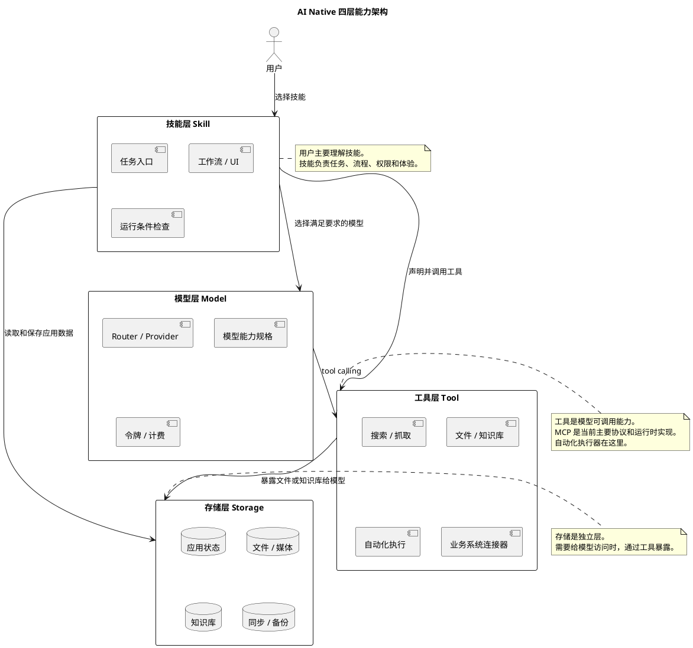

# AI Native 能力分层架构

本文档定义 Chat 后续迭代的核心能力模型。所有技能、工具、模型供应商、存储、市场发现和运行配置相关设计，都应优先对齐本文档。

## 1. 核心结论

Chat 的 AI Native 能力分为四层：

| 层级 | 中文名称 | 英文名称 | 核心职责 | 用户是否直接感知 |
| --- | --- | --- | --- | --- |
| 1 | 技能层 | Skill | 用户入口、任务定义、工作流、UI、运行条件 | 是 |
| 2 | 工具层 | Tool | 模型可调用的外部能力、自动化执行器、数据连接器 | 间接感知 |
| 3 | 模型层 | Model | 推理、生成、多模态、实时语音、模型能力和计费 | 间接感知 |
| 4 | 存储层 | Storage | 应用数据、文件、知识库、同步、备份和记忆 | 间接感知 |

产品上，用户主要使用的是**技能**。技能声明自己需要哪些工具、模型能力和存储能力。工具、模型和存储是技能运行的底层依赖，不应取代技能成为主要用户入口。

## 2. 分层职责

### 2.1 技能层

技能是用户选择和启动任务的产品入口。

技能负责：

- 定义任务目标，例如网页调研、阅读总结、AI 绘画、实时聊天、策略交易。
- 定义模型 instructions、默认输出结构、失败处理策略。
- 定义会话或工作区 UI，例如通用聊天页、图片工作区、实时语音工作区。
- 声明需要的模型能力、工具能力和存储能力。
- 做运行前条件检查，例如模型不可用、工具未配置、存储未授权。
- 约束高风险流程，例如实盘下单、文件写入、外部系统操作前必须确认。

技能不应该直接实现底层执行动作。比如“策略交易”技能不直接写券商下单逻辑，而是依赖券商工具。

### 2.2 工具层

工具层提供模型可调用的外部能力。

工具负责：

- 搜索、网页抓取、文件读写、Git、本地命令、浏览器自动化。
- 行情查询、券商下单、企业系统 API、SaaS 操作。
- 把存储层的数据暴露给模型，例如文件库 MCP、知识库 MCP、云盘 MCP。
- 承担可审计、可限制、可关闭的执行边界。

工具不负责定义完整任务。它只回答“能不能做某个动作”，不回答“什么时候该做、为什么做、做到什么程度”。

示例：

- `brave-search` 提供网页搜索能力。
- `fetch` 提供网页抓取能力。
- `ifind-data` 提供行情和财务数据能力。
- `qmt-broker` 提供券商交易能力。
- `knowledge-base` 可以把存储层知识库暴露给模型检索。

### 2.3 模型层

模型层提供推理和生成能力。

模型层负责：

- 模型供应商和令牌，例如社区 Router、OpenAI、Qwen、Anthropic。
- 模型能力，例如文本、视觉、图片生成、图片编辑、实时语音、推理、工具调用。
- 端点能力，例如 `/v1/responses`、`/v1/messages`、`/v1/chat/completions`、图片和实时端点。
- 价格、上下文长度、参数约束和模型规格。
- Skill 的模型候选筛选和默认模型纠偏。

模型供应商不属于工具层。模型是“谁来推理和生成”，工具是“模型能调用哪些外部能力”；MCP 是当前工具层的主要协议和运行时实现。

### 2.4 存储层

存储层负责数据持久化和数据治理。

存储层负责：

- 聊天记录、技能配置、用户偏好、模型选择。
- 文件、图片、音频、视频和生成结果。
- 知识库资料、索引、向量和引用来源。
- WebDAV、本地 IndexedDB、对象存储、后续云端存储服务。
- 同步、备份、清理、配额和数据迁移。

存储层是独立层，但可以被包装成工具，让模型访问。

示例：

- WebDAV 作为存储层，用于同步聊天和技能配置。
- WebDAV MCP 作为工具，让模型读取指定目录或写入报告。
- 知识库作为存储层，保存文档和索引。
- 知识库 MCP 作为工具，让模型检索和引用资料。

## 3. 层间关系

核心关系：

- `Skill -> Model`：技能要求什么模型能力。
- `Skill -> Tool`：技能可调用哪些外部能力。
- `Skill -> Storage`：技能保存和读取哪些应用数据。
- `Tool -> Storage`：存储能力需要被模型访问时，通过工具暴露。
- `Model -> Tool`：模型通过 tool calling 调用工具。

## 4. Marketplace 和运行时配置边界

Marketplace 管理“可发现定义”，不管理用户私有运行时配置。

Marketplace 可以保存：

- Skill 包定义。
- 工具包定义。
- 模型供应商公开元数据。
- 存储能力公开元数据。
- 名称、描述、分类、标签、启动命令、配置项 schema、权限声明。

Marketplace 不能保存：

- 用户 API Key。
- 用户本地路径。
- 私有 endpoint。
- 用户是否启用了某个能力。
- 当前实例的运行状态。

Chat 运行时配置保存“当前实例或当前用户实际怎么运行”。

在 standalone 或本地 Next 进程中：

- MCP 启用状态和用户自带 Key 写入 `data/mcp_config.json` 或 `MCP_CONFIG_PATH`。
- Skill 安装状态写入本地 `skill-store`。
- 会话、模型偏好和同步配置写入对应本地 store。

在 Tauri 中：

- 当前 MCP 显式禁用。
- 后续如果支持 MCP，应使用 Tauri 用户数据目录。
- 不应复用 standalone 的部署目录配置文件。

在公网多用户 Web 中：

- 不能用实例级 `data/mcp_config.json` 保存每个用户的 Key。
- 用户级密钥必须进入用户级加密配置或平台托管能力。
- 高风险 MCP 应做权限、审计和配额控制。

## 5. 自动化执行的归属

自动化执行能力属于工具层，自动化执行方案属于技能层。

| 场景 | 技能层职责 | 工具层职责 |
| --- | --- | --- |
| 自动下单 | 判断策略、风控、仓位、确认流程 | 调用券商下单接口 |
| 浏览器操作 | 规划步骤、判断敏感动作、输出结果 | 点击、输入、截图、读取页面 |
| 文件整理 | 定义整理规则、输出摘要、确认删除 | 读取、移动、写入、删除文件 |
| 报表生成 | 定义报表结构、质量检查、发送策略 | 读取数据、写文件、调用系统 API |

这样做的原因：

- 工具能力可以被多个技能复用。
- 权限、审计、限流和命令白名单可以集中治理。
- 技能保持任务语义，不直接承载执行器实现。

## 6. 横向治理能力

四层是能力架构，还需要横向治理能力才能生产化。

| 治理能力 | 作用 |
| --- | --- |
| 身份与权限 | 判断用户、组织、角色能使用哪些技能和底层能力 |
| 密钥与安全 | 管理 API Key、令牌、私有路径、命令执行风险 |
| 计费与配额 | 管理模型调用、工具服务、存储空间、第三方 API 成本 |
| 审计与观测 | 记录谁调用了什么能力、是否执行了高风险动作、失败原因 |
| 版本与发布 | 管理 Skill/Tool 的发布、升级、回滚、下架 |
| 部署模式 | 区分 standalone、Tauri、公网多用户 Web 的能力边界 |

治理能力不作为用户侧一级入口，但必须影响运行检查和配置流程。

## 7. 命名规范

推荐中文命名：

- Skill 层：技能层。
- Tool 层：工具层。MCP 是当前工具层的主要协议和运行时实现，不作为四层之一。
- Model 层：模型层。
- Storage 层：存储层。

术语约束：

- 用户侧不再使用“插件”作为产品概念。
- “工具”只在两种语境使用：工具能力，或模型接口层的 tool calling。
- 旧代码里的 `plugin`、`mask`、`tools` 字段只作为兼容和技术字段，不继续扩展成新产品概念。
- 新文档和新 UI 应优先使用“技能、工具、模型、存储”。

## 8. 迭代原则

后续新增能力时，先回答四个问题：

1. 它是不是用户要直接选择的任务入口？如果是，放到技能层。
2. 它是不是模型可调用的外部能力或执行器？如果是，放到工具层。
3. 它是不是推理、生成或模型服务接入问题？如果是，放到模型层。
4. 它是不是数据持久化、同步、知识库或文件问题？如果是，放到存储层。

再回答三个治理问题：

1. 这个能力的公开定义放在哪里？通常放 marketplace。
2. 用户私有配置放在哪里？不能放 marketplace。
3. standalone、Tauri、公网多用户 Web 下是否有不同边界？

只有这七个问题清楚后，才进入代码实现。
