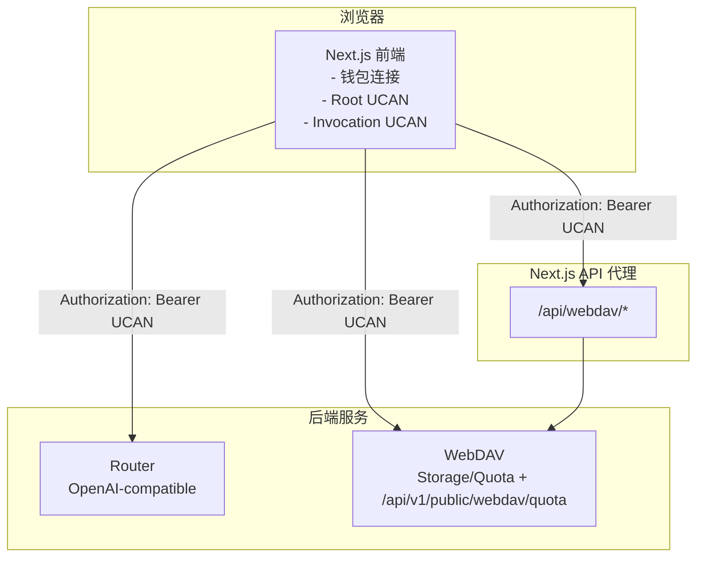

# Router 与 WebDAV 集成说明

> 登录/授权/钱包/UCAN 的统一说明已收口到 [用户登录](./用户登录.md)。若你要先理解当前机制，请优先阅读该文档。

本文档说明当前 Chat 如何通过 UCAN 同时集成 Router 与 WebDAV，以及关键调用链路与配置点。

## 集成目标

- 通过一次钱包授权（UCAN Root），同时访问多个后端（Router + WebDAV）。
- 在无钱包插件场景，支持中心化 UCAN（node issuer）按后端动态签发。
- Router 提供 OpenAI-compatible API；WebDAV 提供存储与配额服务。
- Next.js 承担前端与部分 API 代理层（WebDAV 同步代理）。

## 调用链路

## Router 集成

- **入口**：`app/client/platforms/openai.ts` / `router.ts` / `anthropic.ts`。
- **请求头**：`Authorization: Bearer <UCAN>`。
- **访问方式**：前端直连 Router，不经过 Chat 的 auth 代理路由。
- **受众 (audience)**：自动按 Router 地址推导 `did:web:<router-host>`。
- **钱包模式**：基于钱包 session 创建 Invocation UCAN。
- **中心化模式**：通过 `getCentralUcanAuthorizationHeaderForAudience()` 向 node issuer 按 Router audience 申请短时 UCAN。

## WebDAV 集成

- **配额接口**：`app/plugins/webdav.ts` 直连 `WEBDAV_BACKEND_BASE_URL + /api/v1/public/webdav/quota`（不经过 Next 代理）。
- **同步接口**：`/api/webdav/*` 负责 WebDAV 文件同步，代理到 `WEBDAV_BACKEND_BASE_URL + WEBDAV_BACKEND_PREFIX`，限制方法与目标路径，避免 SSRF。
- **请求头**：配额请求由浏览器直接发起，需由 WebDAV 服务端正确配置 CORS 与鉴权头放行。
- **受众 (audience)**：自动按 WebDAV 地址推导 `did:web:<webdav-host>`。
- **应用能力**：默认携带 `app:all:<appId>`（`appId` 默认当前域名）。
- **钱包模式**：
  - 配额：`authUcanFetch`（钱包 session + invocation）
  - 同步：`initWebDavStorage`（Root + invocation）
- **中心化模式**：
  - 配额：按 WebDAV audience 向 node issuer 签发 UCAN 后请求
  - 同步：按 WebDAV audience 申请 UCAN 后注入 WebDAV client（不再禁用中心化模式）
> 说明：`WEBDAV_BACKEND_PREFIX` 仅用于 WebDAV 协议接口路径，便于兼容第三方 WebDAV 客户端。
> quota / SIWE / UCAN 等 HTTP 接口不加前缀，仍走基础地址。

## UCAN 能力模型（当前实现）

- Root UCAN 统一使用 `app:all:<appId>` 资源命名空间。
- 对 Router 的调用能力：`app:all:<appId> + invoke`。
- 对 WebDAV 的存储能力：`app:all:<appId> + write`。
- `appId` 来源于当前前端域名并做标准化（如 `localhost:3020 -> localhost-3020`）。
- Root UCAN 的 SIWE 声明中会附带 `service_hosts`：
  - `service_hosts.router = <router-host>`
  - `service_hosts.webdav = <webdav-host>`
- 钱包审批页会基于 `service_hosts` 展示“访问服务”文案；如果旧 Root 不含该字段，前端会要求重新授权。
- 中心化模式下不依赖钱包 `service_hosts`，改为服务端按请求目标后端签发对应 `audience` 的 UCAN。

## 中心化 UCAN 签发链路（服务模式）

当 `UCAN_LOGIN_FORCE_MODE=central` 或自动回退到中心化模式时：

1. 登录页完成地址 + TOTP 授权，回调兑换得到 `accessToken`。
2. 前端访问目标后端前，若本地 UCAN 池不存在匹配 token，则向 node 申请：
   - `POST /api/v1/public/auth/central/session`
   - `POST /api/v1/public/auth/central/issue`（携带目标 `audience + capabilities`）
3. 前端将签发结果缓存到本地 UCAN 池（按 `audience + capabilities` 为 key）。
4. 后续请求复用该 token，过期后自动重新签发。

这保证了：

- Router 与 WebDAV 都拿到各自 audience 的 token。
- 第三方服务端校验逻辑无感（依旧只做 UCAN 标准校验）。
- 避免“单 token 调多后端”导致的 `UCAN audience mismatch`。

## WebDAV 直连（不走代理）

当关闭同步代理时，浏览器会直接请求 WebDAV 服务，不再经过 `/api/webdav/*`：

### 启用方式

1) 设置 `WEBDAV_BACKEND_BASE_URL` 为可公网访问的 WebDAV 基础地址（含协议，不含路径）。
2) 设置「同步配置」中的 **Proxy** 为关闭（`useProxy = false`）。
3) 如服务挂载在路径下，设置 `WEBDAV_BACKEND_PREFIX`（例如 `/dav`）。
4) 确保 WebDAV 服务支持 UCAN 鉴权与 CORS。

### 直连要求（必须满足）

- WebDAV 端允许跨域，并放行 `Authorization`、`Depth`、`Content-Type` 等头。
- WebDAV 端开放 `MKCOL/PUT/GET/PROPFIND` 等必要方法。
- WebDAV 端的 UCAN `aud` 与前端配置一致。

### 注意事项

- 直连会暴露 WebDAV 地址，安全与风控要求更高。
- 本地地址（如 `127.0.0.1`）只对本机有效，远端浏览器无法访问。

## 与登录文档的边界

本文档只保留 Router / WebDAV 集成实现本身：

- Router 如何生成并附带 Invocation UCAN
- WebDAV 是直连还是走 `/api/webdav/*` 代理
- `audience` / `capabilities` / 代理边界 / CORS 约束

以下通用内容不在本文重复展开，请统一参考 [用户登录](./用户登录.md)：

- Root / Session / Invocation 的概念
- UCAN 的本地存储位置
- 为什么会提示“解锁钱包”
- 什么时候只解锁，什么时候必须重新授权

## 关键配置项

- `ROUTER_BACKEND_URL`: Router 默认后端地址（可选，前端默认值）
- `WEBDAV_BACKEND_BASE_URL`: WebDAV 后端基础地址（必填，不含路径）
- `WEBDAV_BACKEND_PREFIX`: WebDAV 路径前缀（默认 `/dav`，可选修改）
- `WebDAV app action`: 固定为 `write`
- `Router UCAN 能力`: `app:all:<appId> + invoke`
- `WebDAV UCAN 能力`: `app:all:<appId> + write`

## 安全要点

- WebDAV 同步代理限制方法与目标路径，避免 SSRF。
- 配额接口为浏览器直连，必须在 WebDAV 端严格限制跨域来源与头部。
- UCAN `aud` 必须与后端配置保持一致。
