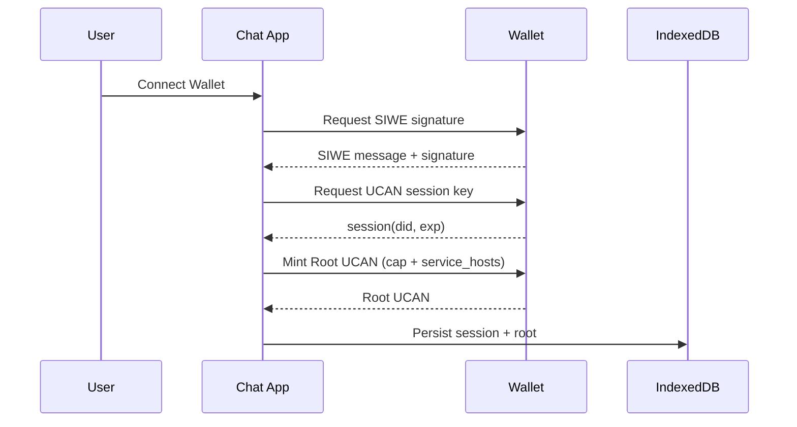
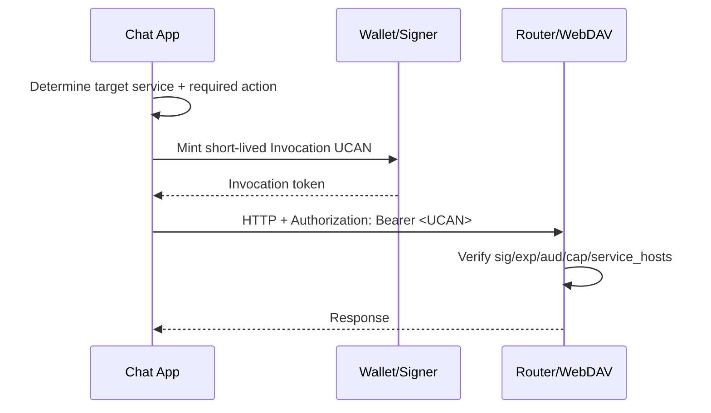

# UCAN / SIWE 权限设计（可扩展版）

> 更新时间：2026-03-23  
> 目标：统一“身份认证 + 能力授权 + 服务校验 + UI 展示”的设计口径，支持 Router、WebDAV、应用集市等服务持续接入，避免继续以零散改动推进。

## 1. 设计目标

- 统一资源命名、动作命名、声明字段，降低跨服务接入成本。
- 明确 SIWE 与 UCAN 的职责边界：SIWE 负责“谁在授权”，UCAN 负责“授权了什么”。
- 保证最小权限、可审计、可扩展、可迁移。
- 保持现网兼容：可平滑从 `app:<appId>` 迁移到 `app:all:<appId>`。

## 2. 非目标

- 不定义具体计费策略（仅提供能力映射建议）。
- 不替代业务层 ACL（UCAN 是入口权限，不是全部业务规则）。
- 不绑定某个钱包实现细节（仅要求满足 SIWE + UCAN 语义）。

## 3. 核心原则

- 最小权限：默认只签发完成当前场景所需的最小动作。
- 资源与动作解耦：`resource` 定位授权对象，`action` 表达操作意图。
- 服务绑定显式化：通过 `service_hosts` 绑定目标服务域名，避免“同能力跨服务滥用”。
- 向前兼容：新语义可以扩展，不破坏旧客户端。
- 可观测：所有鉴权失败都要落结构化日志（resource/action/aud/service）。

## 4. 统一权限模型

### 4.1 资源命名（Resource）

推荐标准：

- `app:<scope>:<appId>`

字段定义：

- `app`：固定命名空间。
- `scope`：资源粒度，默认 `all`，后续可扩展为 `profile`、`chat-history`、`media`、`plugin-registry` 等。
- `appId`：被授权应用标识（建议为域名派生并归一化，如 `localhost:3020 -> localhost-3020`）。

当前默认：

- 若无细粒度资源拆分，统一使用 `scope = all`。
- 即：`app:all:<appId>`。

兼容策略：

- 服务端同时接受：
  - 旧格式：`app:<appId>`
  - 新格式：`app:all:<appId>`
- 客户端展示优先使用新格式。

### 4.2 动作命名（Action）

基础动作集：

- `read`：读取
- `write`：写入/修改
- `invoke`：调用执行（典型是模型推理接口）

可选扩展动作：

- `delete`：删除
- `admin`：管理类操作（高风险，默认禁用）

约束：

- 新服务优先复用基础动作；确需新增动作时，必须在服务文档中定义语义和风险等级。

### 4.3 能力对象（Capability）

标准结构：

```json
{
  "resource": "app:all:localhost-3020",
  "action": "invoke",
  "constraints": {
    "path_prefix": "/v1/chat/completions",
    "max_tokens": 16000
  }
}
```

说明：

- `constraints` 可选，用于细粒度限制（路径、配额、模型白名单、MIME 类型等）。
- 服务端必须把 `constraints` 当作“收紧条件”，不能当放宽条件。

## 5. SIWE 声明与 UCAN Root 载荷

建议在 SIWE statement 中封装结构化 payload（示意）：

```json
{
  "version": "UCAN-AUTH-1",
  "aud": "did:web:localhost:3020",
  "service_hosts": {
    "router": "localhost:3011",
    "webdav": "localhost:6065"
  },
  "cap": [
    { "resource": "app:all:localhost-3020", "action": "invoke" },
    { "resource": "app:all:localhost-3020", "action": "write" }
  ],
  "exp": 1767225600,
  "iat": 1767139200
}
```

字段要求：

- `version`：协议版本，便于灰度升级。
- `aud`：当前应用 DID。
- `service_hosts`：声明本次授权针对的服务域名（Router/WebDAV/...）。
- `cap`：能力清单。
- `exp/iat`：签发时间和过期时间。

安全要求：

- `service_hosts` 缺失或与当前请求目标不一致时，应触发重新授权。

## 6. 时序与令牌生命周期

### 6.1 登录与 Root 签发



### 6.2 请求时 Invocation 签发



生命周期建议：

- Root：24h（可配）
- Invocation：5min（可配）
- Session key：与 Root 同步或更短，过期需刷新

## 7. 服务端校验规范

所有 UCAN 保护服务应执行统一校验链：

1. 验签通过（issuer 链可信）。
2. `exp/nbf/iat` 合法。
3. `aud` 与当前服务受众匹配。
4. 从 `cap` 中匹配最小满足项：
   - `resource` 匹配（兼容 `app:<appId>` 与 `app:all:<appId>`）
   - `action` 匹配
5. 校验 `service_hosts` 与当前服务 host 匹配。
6. 校验 `constraints`（路径、模型、大小、类型、频率）。

伪代码：

```text
allow(request):
  token = parse_ucan(request.auth)
  verify_signature(token)
  verify_time(token)
  verify_audience(token.aud, this_service)

  required = map_request_to_required_capability(request)
  cap = find_matching_cap(token.cap, required)
  if cap is null: deny("capability denied")

  verify_service_host(token.service_hosts, this_service.host)
  verify_constraints(cap.constraints, request)
  allow
```

## 8. 服务接入模板

### 8.1 Router（模型服务）

- 推荐能力：`app:all:<chatAppId> + invoke`
- 典型约束：模型白名单、单请求 token 上限、频率限制
- 鉴权失败日志关键字段：`app_id`, `resource`, `action`, `model`, `request_id`

### 8.2 WebDAV（存储服务）

- 推荐能力：`app:all:<chatAppId> + write`（可按需拆分 `read`）
- 典型约束：路径前缀 `/dav/apps/<chatAppId>/`、文件大小、MIME 类型
- 鉴权失败日志关键字段：`username`, `path`, `resource`, `action`, `request_id`

### 8.3 应用集市 / Profile 服务（未来）

- 可在 `scope` 维度扩展：
  - `app:profile:<chatAppId> + read`
  - `app:plugin-registry:<chatAppId> + read`
- 原则：优先新增 scope，不优先新增 action。

## 9. 钱包授权页展示规范

展示层要求：

- 能力行统一显示 `resource · action(中文)`。
- 资源展示采用新标准（如 `app:all:localhost-3020`）。
- 影响说明使用结构化句式：
  - `授权当前应用 <currentAppId> 访问服务: <serviceHost>，执行<action>操作。`

提示要求：

- 明确告知调用模型可能产生 token 消耗。
- 明确告知写入存储会落到指定服务目录。

## 10. 迁移方案（从零散改动到可持续演进）

阶段 0（当前可立即执行）：

- UI 展示切换到 `app:all:<appId>`。
- 服务端继续兼容旧资源格式 `app:<appId>`。

阶段 1：

- Chat 在新签发中改为写入 `app:all:<appId>`。
- Router/WebDAV 校验器增加标准资源解析器（统一库）。

阶段 2：

- 按服务逐步引入 scope 粒度（`all -> profile/media/...`）。
- 在不破坏基础动作集的前提下增加 constraints。

阶段 3：

- 应用集市接入后，建立能力登记中心（文档 + Schema + 自动校验）。

## 11. 测试矩阵

至少覆盖：

- 旧资源 `app:<appId>`、新资源 `app:all:<appId>` 兼容。
- `service_hosts` 缺失/错配触发拒绝。
- `aud` 不匹配拒绝。
- `invoke` 调 Router 成功，调 WebDAV 拒绝。
- `write` 调 WebDAV 成功，越权路径拒绝。
- 过期 Root / Invocation 拒绝并触发重授权流程。

## 12. 落地建议

- 把“资源解析 + 能力匹配 + service_hosts 校验”抽成共享库，避免 Router/WebDAV 各自维护一套规则。
- 所有服务在 PR 模板中新增“权限变更评审”检查项。
- 文档变更与代码变更必须同 PR 提交，保持一致性。
