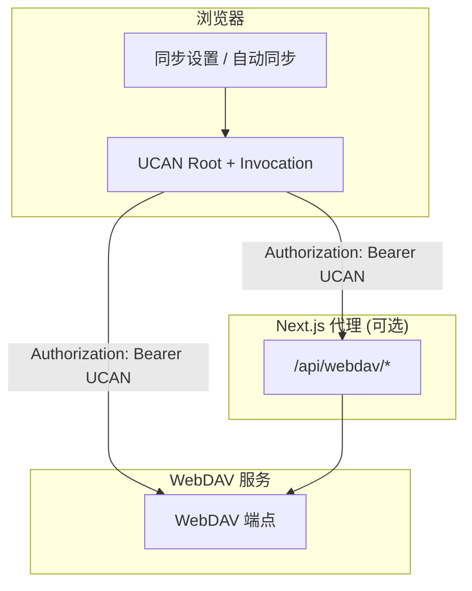
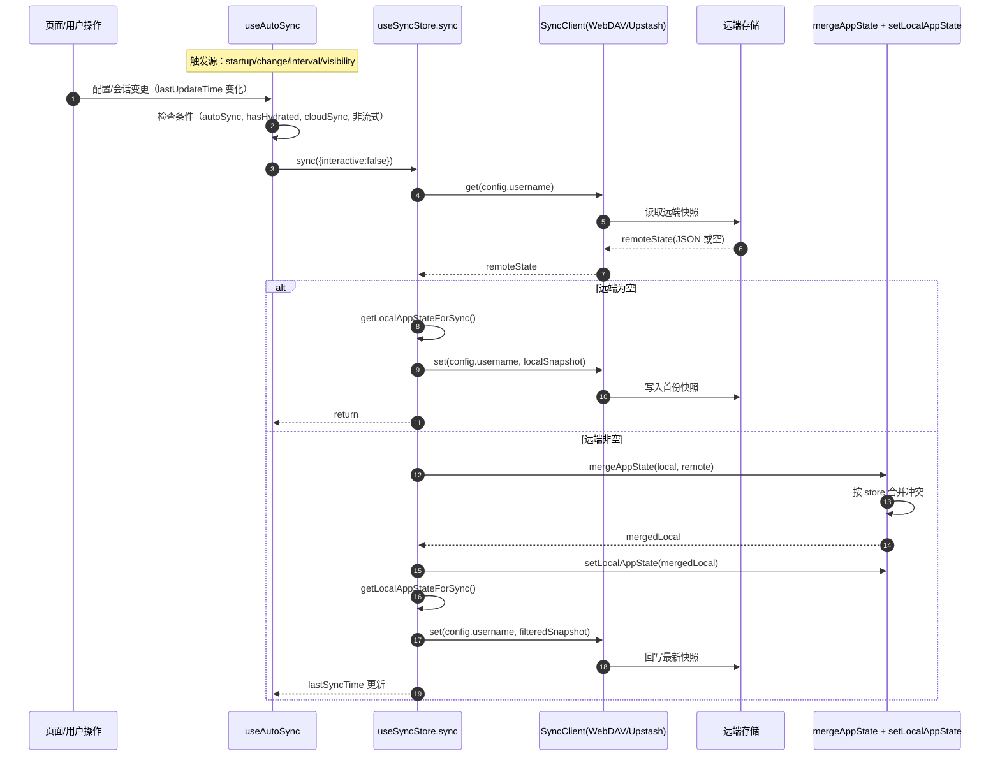

# WebDAV 同步方案（UCAN）

> 登录/授权/钱包/UCAN 的统一说明已收口到 [用户登录](./用户登录.md)。若你要先理解 Root / Session / Invocation、钱包解锁或统一登录边界，请优先阅读该文档。

本文档说明当前 WebDAV 同步方案的流程、直连/代理模式差异、冲突处理策略与待办事项。

## 目标

- 复用现有 UCAN 授权链路进行 WebDAV 同步。
- 支持 WebDAV 同步（拉取/上传/检查可用性）。
- 支持代理模式与浏览器直连模式。
- 防止“删除后被远端复活”。

## 同步流程

## `sync.ts` 实际同步了什么

`app/store/sync.ts` 调用 `getLocalAppState()`/`getLocalAppStateForSync()`，会把以下 5 个 store 的**非函数字段**作为一份完整快照同步：

1. `StoreKey.Chat`（会话、消息、统计、删除墓碑等）
2. `StoreKey.Access`（访问配置，如 provider、OpenAI URL、API Key、Access Code 等）
3. `StoreKey.Config`（全局设置，如默认模型、温度、主题、字体等）
4. `StoreKey.Mask`（提示词模板/面具）
5. `StoreKey.Prompt`（提示词库）

说明：

- 同步是“**整包快照** + 合并”，不是单字段增量同步。
- `Chat` 在上传前会做过滤：剔除流式消息、剔除 `empty response`、保留 tombstone 规则。
- `Access` 和 `Config` 同样会进入同步快照，因此多端会互相覆盖/合并这些设置。

## 同步到哪里（远端落点）

### WebDAV（`ProviderType.WebDAV`）

#### Basic Auth

- 文件名固定：`backup.json`
- 目录固定：`chatgpt-next-web`
- 远端文件路径：`chatgpt-next-web/backup.json`
- 若开启代理：浏览器请求 `/api/webdav/chatgpt-next-web/backup.json?endpoint=...`
- 若直连：浏览器直接请求 `WEBDAV_BACKEND_BASE_URL + WEBDAV_BACKEND_PREFIX + /chatgpt-next-web/backup.json`

#### UCAN Auth

- 仍是单文件 `backup.json`
- 实际路径由 SDK 返回的 `appDir` 决定，通常是 `/apps/<appId>/backup.json`
- 若 `appDir` 为空，则退化为 `/backup.json`
- 代理模式同样走 `/api/webdav/*`，直连模式直接访问 WebDAV 服务

### Upstash（`ProviderType.UpStash`）

- 不是单文件，而是分片 KV：
- `<storeKey>-chunk-count`
- `<storeKey>-chunk-0`
- `<storeKey>-chunk-1`
- ...
- `storeKey = upstash.username`，为空时使用 `STORAGE_KEY`（默认 `chatgpt-next-web`）

## 与登录文档的边界

本文档只保留同步实现本身：

- `sync.ts` 同步哪些 store、如何合并、何时回写远端
- WebDAV 代理与直连的差异
- UCAN 在同步请求中的 `aud`、`capability`、路径要求

以下通用内容不在本文重复展开，请统一参考 [用户登录](./用户登录.md)：

- 钱包登录整体流程
- Root / Session / Invocation 的定义和生命周期
- 本地 IndexedDB / localStorage / 内存缓存分别存什么
- 为什么会提示“解锁钱包”，什么时候必须重新授权

## 自动同步序列图（实现级）

## 合并规则（关键）

1. `Chat`：自定义合并
   - 先合并 `deletedSessions/deletedMessages` tombstone（TTL 30 天）
   - 再按会话/消息级规则合并
   - 同一消息以 `updatedAt`（或 `date`）较新者为准

2. `Config` / `Access`：`lastUpdateTime` 决策
   - 谁更新更晚，谁覆盖
   - 属于“最后写入胜出”（LWW）

3. `Mask` / `Prompt`：按对象 key 合并
   - 以本地优先覆盖同名项（remote 先铺，local 再覆盖）

## 手动操作与自动同步的关系

1. `Check`（检查可用性）：只做连通性校验，不改本地状态
2. `Export`（导出）：仅导出本地快照到文件
3. `Import`（导入）：把本地文件与当前本地状态合并后写回本地，不走远端
4. `Sync`（同步）：才会读远端、合并本地、再写远端

## 安全提示

- `Access` store 会被同步（可能包含 API Key、Access Code 等敏感配置）。
- 建议仅在可信的私有 WebDAV/Upstash 环境开启自动同步。

## 两种模式

### 1) 代理模式（可选）

- 浏览器请求 `http://<chat>/api/webdav/*`。
- Next.js 代理转发到 `WEBDAV_BACKEND_BASE_URL + WEBDAV_BACKEND_PREFIX`。
- 适合：避免 CORS、隐藏后端地址、统一安全策略。

### 2) 直连模式（默认，useProxy=false）

- 浏览器直接请求 `WEBDAV_BACKEND_BASE_URL + WEBDAV_BACKEND_PREFIX`。
- 需要 WebDAV 服务端允许跨域与 `Authorization` 头。
- 适合：降低代理压力、大流量场景。

> 说明：**仅 WebDAV 协议接口**（MKCOL/PUT/GET/PROPFIND 等）需要拼接 `WEBDAV_BACKEND_PREFIX`，
> 以兼容第三方 WebDAV 客户端的挂载路径。WebDAV 服务的**其他 HTTP 接口**
> （如 quota、SIWE、UCAN 等）不应该加前缀，仍使用基础地址访问。

## UCAN 关键要求

- `aud` 必须与 WebDAV 服务端配置一致：
  - `did:web:<host>`（由 `WEBDAV_BACKEND_BASE_URL` 推导）。
- `capability` 需包含服务端配置要求（如 `app:all:<appId> + write`）。
- 当服务端开启 `required_resource=app:*` 时，前端必须携带 `app:all:<appId>` 能力，
  并保证访问路径落在 `/apps/<appId>/...`。
- Root UCAN 的 SIWE 声明会带 `service_hosts.router/webdav`，用于审批页展示目标服务。
- 当前配置与 Root 声明中的 `service_hosts` 不一致时，前端会触发重新授权。

## 聊天同步规则（方案 A）

- **只同步已完成的消息**：`status=done` / `status=error` 才会进入云端。
- **流式阶段不上传**：`status=streaming` 的消息不会同步。
- **会话级过滤**：若会话内存在流式消息，该会话不会被上传（避免半成品）。
- **空响应过滤**：`empty response` 会被过滤，不会上传到云端。
- **合并覆盖规则**：同一消息以 `updatedAt`（或 `date`）更晚者为准。
- **自动同步延后**：检测到流式消息时，自动同步会延后直到完成。

## 删除不复活（tombstone）

当前已加入 tombstone 方案：

- 删除会话时写入 `deletedSessions`（id -> timestamp）。
- 合并远端时先合并 tombstone，再过滤被标记删除的 session。
- 墓碑默认保留 30 天（可调整）。

**冲突策略：更新优先**  
当同一会话在远端有新更新（`lastUpdate` 更新晚于删除时间）时，更新会覆盖删除并保留会话。

## 配置项（核心）

- `WEBDAV_BACKEND_BASE_URL`: WebDAV 基础地址（必填，不含路径）
- `WEBDAV_BACKEND_PREFIX`: WebDAV 路径前缀（默认 `/dav`，可选修改）
- `WebDAV app action`: 固定为 `write`
- `Router UCAN 能力`: `app:all:<appId> + invoke`
- `WebDAV UCAN 能力`: `app:all:<appId> + write`
- `appId`：由当前前端域名派生（如 `localhost:3020 -> localhost-3020`）
- 同步设置：`useProxy`（关闭即直连）
- 同步设置页会展示并可修改 WebDAV Base URL/Prefix，用于覆盖环境变量

默认值（本项目）：

- WebDAV Auth = UCAN
- Proxy = 关闭
- 自动同步 = 开启

## 待办事项 / 风险评估

### 必做

- **CORS 放行**：直连模式需允许来源 `http://localhost:3020` 等。
- **UCAN 校验一致**：服务端 `audience + with/can`（兼容 `resource/action`）必须与前端一致。
- **直连验证**：Network 中必须看到请求直达 `WEBDAV_BACKEND_BASE_URL + WEBDAV_BACKEND_PREFIX`。

### 建议

- **可观测性**：在客户端打印 `useProxy/authType/backendUrl`（已加 debug）。
- **删除冲突策略**：如果多端同时编辑，需要明确“删除优先”或“更新优先”。
- **墓碑清理**：TTL 是否需要更长/更短，避免过度积累。
- **大文件传输**：直连场景需配置服务端限流与审计。
- **方案 C（增量日志/Outbox）**：后续可只同步“完成消息事件”，降低冲突与带宽。
