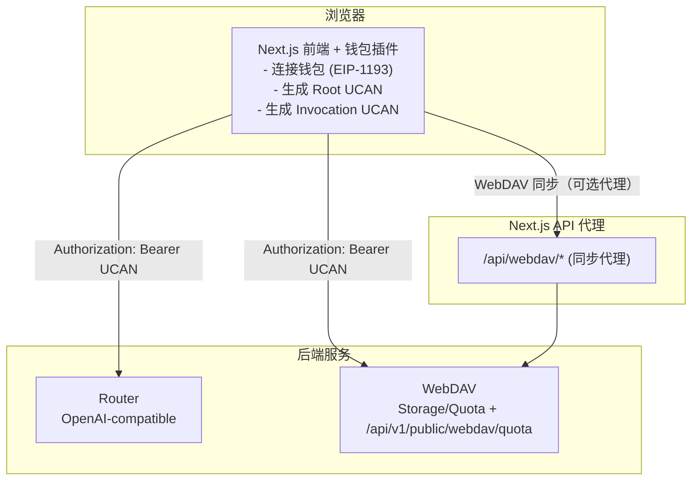

# 架构图 / 部署说明 / 安全清单

本文档描述当前系统的整体架构、部署方式与安全建议。

## 架构图



## 部署说明

### 1) 环境变量

- `ROUTER_BACKEND_URL`：Router 默认后端地址（可选，前端默认值）
- `WEBDAV_BACKEND_BASE_URL`：WebDAV 后端基础地址（必填，不含路径）
- `WEBDAV_BACKEND_PREFIX`：WebDAV 路径前缀（默认 `/dav`，可选修改）
- 通用 UCAN 能力：固定为 `profile/read`

### 2) 启动

```bash
cp .env.template .env
npm install
npm run dev
```

默认端口：`3020`

### 3) 生产构建

```bash
npm install
npm run build
npm run start
```

### 4) 代理服务

建议将 Router 与 WebDAV 放在可信网络，浏览器直接访问 Router/WebDAV 的业务接口；WebDAV 文件同步可按需使用 `/api/webdav/*` 代理。对直连接口需在服务端配置 CORS 与来源白名单。

## 安全清单

### 必做

- [ ] **路径白名单**：仅允许转发需要的 API 路由
- [ ] **过滤敏感头**：不透传 `host/origin/referer`
- [ ] **最小权限 UCAN**：仅授予必须的 `resource/action`
- [ ] **audience 绑定**：确保 `aud` 与后端 `UCAN_AUD` 匹配
- [ ] **Root UCAN 过期控制**：过期必须重新授权

### 建议

- [ ] Router/WebDAV 仅内网可访问
- [ ] HTTPS 部署，确保钱包签名安全上下文
- [ ] Nginx 只暴露 `:3020`
- [ ] 监控异常鉴权失败/频繁授权重试

## 相关文档

- MCP 开关与运行机制：`docs/mcp-enable-cn.md`
