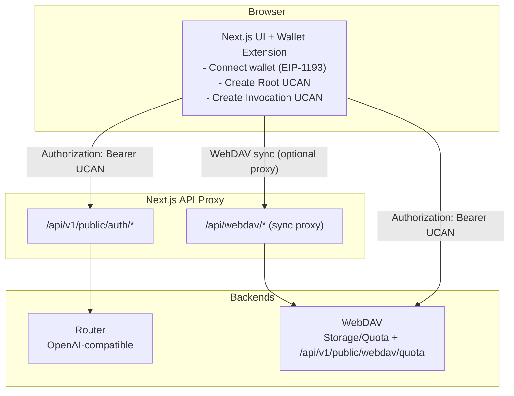

# Architecture / Deployment / Security Checklist

This document describes the system architecture, deployment steps, and security recommendations.

## Architecture



## Deployment

### 1) Environment Variables

- `ROUTER_BACKEND_URL`: Router backend URL (required)
- `WEBDAV_BACKEND_BASE_URL`: WebDAV base URL (required, no path)
- `WEBDAV_BACKEND_PREFIX`: path prefix (default `/dav`, optional to change)
- Shared UCAN caps: fixed to `profile/read`
- `NEXT_PUBLIC_ROUTER_UCAN_AUD`: Router audience override (optional)
- `NEXT_PUBLIC_WEBDAV_UCAN_AUD`: WebDAV audience override (optional)

If `*_UCAN_AUD` is not set, the system derives `did:web:<host>` automatically.

### 2) Local Dev

```bash
cp .env.template .env
npm install
npm run dev
```

Default port: `3020`

### 3) Production

```bash
npm install
npm run build
npm run start
```

### 4) Proxy Strategy

Deploy Router in private network and keep auth endpoints behind Next API proxy. WebDAV quota is browser-direct, so configure strict CORS/origin policy on WebDAV. WebDAV file sync can still use `/api/webdav/*` proxy if needed.

## Security Checklist

### Must-have

- [ ] **Path allowlist**: only proxy required endpoints
- [ ] **Strip sensitive headers**: do not forward `host/origin/referer`
- [ ] **Least-privilege UCAN**: minimal `resource/action`
- [ ] **Audience binding**: ensure `aud` matches backend `UCAN_AUD`
- [ ] **Root UCAN expiry**: enforce re-authorization on expiry

### Recommended

- [ ] Router/WebDAV are private/internal
- [ ] HTTPS everywhere
- [ ] Expose only `:3020` via reverse proxy
- [ ] Monitor auth failures and retry spikes
