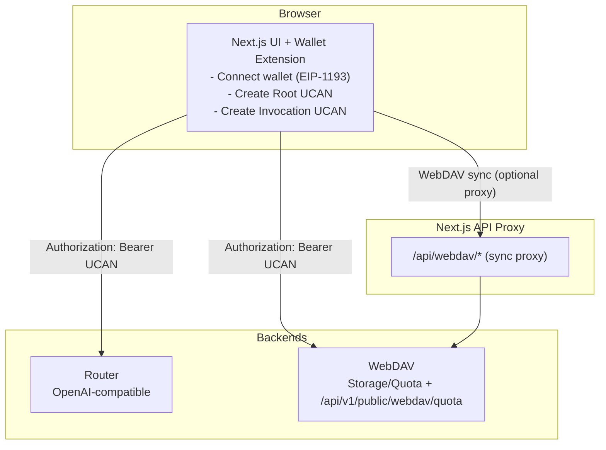

# Architecture / Deployment / Security Checklist

> The unified explanation for login, wallet, UCAN, and mobile-auth behavior has been moved to [User Login](./user-login-en.md). Read that first if you need the full authorization model.

This document describes the system architecture, deployment steps, and security recommendations.

## Architecture


```mermaid
flowchart TB
  subgraph Browser["Browser"]
    UI["Next.js UI + Wallet Extension<br/>- Connect wallet (EIP-1193)<br/>- Create Root UCAN<br/>- Create Invocation UCAN"]
  end
  subgraph Proxy["Next.js API Proxy"]
    WEBDAVSYNC["/api/webdav/* (sync proxy)"]
  end
  subgraph Backends["Backends"]
    ROUTER["Router<br/>OpenAI-compatible"]
    WEBDAV["WebDAV<br/>Storage/Quota + /api/v1/public/webdav/quota"]
  end
  UI -->|"Authorization: Bearer UCAN"| ROUTER
  UI -->|"Authorization: Bearer UCAN"| WEBDAV
  UI -->|"WebDAV sync (optional proxy)"| WEBDAVSYNC
  WEBDAVSYNC --> WEBDAV
```

## Deployment

### 1) Environment Variables

- `ROUTER_BACKEND_URL`: default Router backend URL (optional, frontend default)
- `WEBDAV_BACKEND_BASE_URL`: WebDAV base URL (required, no path)
- `WEBDAV_BACKEND_PREFIX`: path prefix (default `/dav`, optional to change)
- Root UCAN capability model (frontend default):
  - Router: `app:all:<appId> + invoke`
  - WebDAV: `app:all:<appId> + write`
  - `appId` is derived from the frontend host (for example, `localhost:3020 -> localhost-3020`)
- Root UCAN statement includes `service_hosts`:
  - `service_hosts.router = <router-host>`
  - `service_hosts.webdav = <webdav-host>`
  - if `service_hosts` is missing or mismatched with current config, the frontend forces re-authorization

### 2) Local Dev

```bash
cp .env.template .env
npm install
npm run dev
```

Default port: `3020`

### 3) Production

```bash
npm install
npm run build
npm run start
```

### 4) Proxy Strategy

Deploy Router and WebDAV in trusted networks. Browser-facing business APIs are direct, and `/api/webdav/*` can still be used as an optional sync proxy. Configure strict CORS/origin policy on direct endpoints.

## Boundary with the Login Document

This document keeps only the authorization constraints that matter to architecture and deployment:

- how the browser attaches Bearer UCAN to Router / WebDAV
- where direct calls end and proxy calls begin
- deployment requirements around `aud`, CORS, HTTPS, and least privilege

The following cross-cutting topics are intentionally kept in [User Login](./user-login-en.md):

- wallet login vs Access Code / API Key vs WebDAV Basic Auth
- Root / Session / Invocation concepts
- local storage layout and wallet unlock behavior

## Security Checklist

### Must-have

- [ ] **Path allowlist**: only proxy required endpoints
- [ ] **Strip sensitive headers**: do not forward `host/origin/referer`
- [ ] **Least-privilege UCAN**: minimal `with/can` (compat with `resource/action`)
- [ ] **Audience binding**: ensure `aud` matches backend `UCAN_AUD`
- [ ] **Root UCAN expiry**: enforce re-authorization on expiry

### Recommended

- [ ] Router/WebDAV are private/internal
- [ ] HTTPS everywhere
- [ ] Expose only `:3020` via reverse proxy
- [ ] Monitor auth failures and retry spikes
