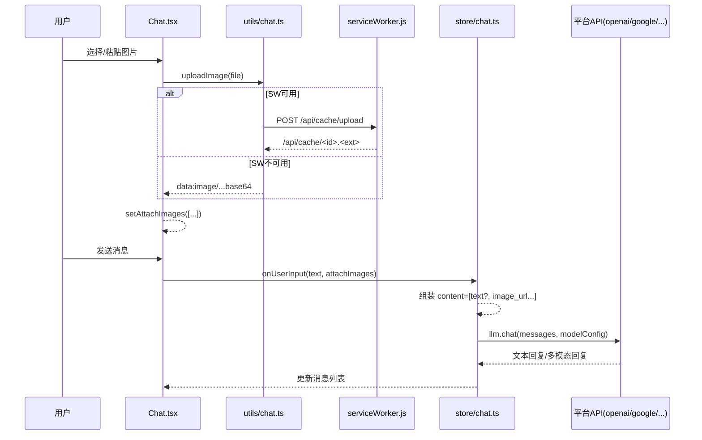
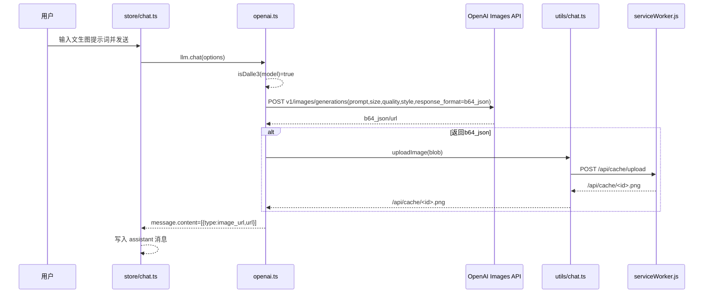

# 文生图与上传图片聊天工作流（实现说明）

本文说明当前代码中两类能力的实现路径：

1. 文生图（Text-to-Image）
2. 上传图片聊天（Vision Chat / Multimodal Chat）

目标是把「入口 -> 消息结构 -> 请求发送 -> 平台差异 -> 渲染结果」串起来，便于排查与二次开发。

---

## 1. 总体架构

### 1.1 核心分层

- UI 与交互：`app/components/chat.tsx`
- 会话与消息组装：`app/store/chat.ts`
- 图片上传与预处理：`app/utils/chat.ts`
- 模型能力判定：`app/utils.ts`（`isVisionModel`、`isDalle3`、`getModelSizes`）
- 平台请求实现：
  - OpenAI/Azure：`app/client/platforms/openai.ts`
  - Google：`app/client/platforms/google.ts`
  - Anthropic：`app/client/platforms/anthropic.ts`
  - ChatGLM（含 cogview）：`app/client/platforms/glm.ts`
  - Alibaba / SiliconFlow 等也有各自分支
- 图片本地缓存存储（浏览器）：`public/serviceWorker.js`

### 1.2 统一消息结构

前端会把用户输入包装为 `RequestMessage`：

- 纯文本：`content: string`
- 多模态：`content: MultimodalContent[]`
  - 文本片段：`{ type: "text", text: "..." }`
  - 图片片段：`{ type: "image_url", image_url: { url: "..." } }`

定义位置：`app/client/api.ts`

---

## 2. 上传图片聊天（Vision Chat）如何工作

## 2.1 前端入口与附件状态

入口在 `chat.tsx`：

- 点击上传按钮（`UploadImage`）
- 在输入框粘贴图片（`onPaste`）

附件状态保存在页面局部状态：

- `attachImages: string[]`
- 最多 3 张（超过会截断）

关键行为：

- 只在 `isVisionModel(currentModel)` 为 `true` 时显示上传入口。
- 切换到非视觉模型时，会清空附件：`setAttachImages([])`。

## 2.2 上传后 URL 从哪里来

上传调用：`uploadImageRemote(file)`，即 `app/utils/chat.ts` 的 `uploadImage(file)`。

分两种模式：

1. Service Worker 可用（`window._SW_ENABLED === true`）
   - `POST /api/cache/upload`
   - 该请求被 `public/serviceWorker.js` 拦截
   - 文件落到浏览器 `CacheStorage`（`chatgpt-next-web-file`）
   - 返回形如：`/api/cache/<随机名>.<ext>`

2. Service Worker 不可用
   - 直接压缩图片为 base64 data URL 返回（`compressImage`）
   - 不经过 `/api/cache/upload`

因此，`attachImages` 中的元素可能是：

- `/api/cache/...` URL（SW 模式）
- `data:image/...;base64,...`（降级模式）

## 2.3 提交时如何组装消息

`chatStore.onUserInput(userInput, attachImages)` 在 `app/store/chat.ts` 中会组装消息：

- 有图片时，`content` 变成多模态数组
- 文本片段来自原始输入 `content`（注意：此处不走模板展开）
- 图片片段逐条写入 `image_url`

示意：

```ts
[
  { type: "text", text: "请描述这张图" },
  { type: "image_url", image_url: { url: "/api/cache/xxx.png" } },
]
```

## 2.4 请求前图片预处理

平台层会调用 `preProcessImageContent`（`app/utils/chat.ts`）：

- 如果图片 URL 是 `/api/cache/...`
  - 先 `GET` 取回 blob
  - 压缩到约 `256KB`（jpeg）
  - 转为 base64 data URL 缓存到内存 map
- 如果是其他 URL（例如外链），保持原样

这一步让平台适配更稳定，尤其是需要 base64 的供应商。

## 2.5 各平台如何吃图片

### OpenAI / OpenAI 兼容（视觉模型）

- 在 `openai.ts` 内，视觉模型时把每条 message 的 `content` 作为多模态发送
- `image_url.url` 可是 data URL 或普通 URL
- 请求走 `v1/chat/completions`

### Google Gemini

- 把图片转成 `inline_data`：
  - `mime_type`
  - `data`（base64）
- 请求体 `contents[].parts[]`

### Anthropic Claude

- 把图片转成：
  - `type: "image"`
  - `source: { type, media_type, data }`

### 其他平台

- Alibaba、SiliconFlow、ChatGLM 等也有视觉分支，做法类似：
  - 先统一多模态结构
  - 再转为平台专属 payload

## 2.6 聊天中如何渲染图片

消息渲染在 `chat.tsx`：

- 文本：`Markdown` 渲染 `getMessageTextContent(message)`
- 图片：`getMessageImages(message)` 取 `image_url`，并用 `` 显示

因此，一个消息可以同时显示文本和多张图。

---

## 3. 文生图（Text-to-Image）如何工作

当前主要有两类“文生图”路径：

## 3.1 OpenAI `dall-e-3` 原生图片生成

触发条件：当前模型 `isDalle3(model) === true`（当前实现为严格等于 `dall-e-3`）。

流程在 `openai.ts`：

1. 取最后一条用户消息文本作为 `prompt`
2. 调 `v1/images/generations`
3. 请求参数包含：
   - `size`
   - `quality`
   - `style`
   - `response_format: "b64_json"`
4. 收到 `b64_json` 后，转 blob 再调用 `uploadImage(...)` 上传到 `/api/cache/...`
5. 最终把 bot 消息写成 `image_url` 多模态内容

渲染阶段会直接按“聊天图片消息”展示。

## 3.2 ChatGLM `cogview-*` 路径

触发条件：模型名 `startsWith("cogview-")`（`glm.ts`）。

流程：

1. `glm.ts` 判定 `ModelType = "image"`
2. 构造图片生成 payload（`prompt + size`）
3. 请求 `ChatGLM.ImagePath`
4. 响应解析成 Markdown 图片链接：``

这条路径不是 `image_url` 多模态消息，而是 Markdown 图片。

## 3.3 面具“AI文生图”路径（提示词驱动）

`app/masks/cn.ts` 内置的“AI文生图”面具，本质是提示词策略：

- 要求模型输出特定 Markdown 图片链接（如 pollinations）
- 不调用 OpenAI/GLM 的原生 image generation endpoint

所以它属于“文本聊天 + 图片 URL 输出”的工作流，不是接口级原生文生图。

---

## 4. 序列图

## 4.1 上传图片聊天



## 4.2 OpenAI `dall-e-3` 文生图



---

## 5. 关键配置与判定

## 5.1 什么模型被视为 Vision

`isVisionModel` 由两层判定：

1. 服务端下发的 `VISION_MODELS`（`/api/config` -> `accessStore.visionModels`）
2. 代码内置正则（`VISION_MODEL_REGEXES`）

内置规则包含（示例）：`gpt-4o`、`gpt-4.1`、`claude`、`gemini-1.5`、`qwen-vl`、`dall-e-3`、`gpt-5` 等。

## 5.2 文生图参数入口

在聊天工具栏里：

- `supportsCustomSize(model)`：显示尺寸选择（例如 `dall-e-3`、`cogview-*`）
- `isDalle3(model)`：显示 `quality`、`style`

---

## 6. 现状限制与注意事项

1. 附图数量上限是 3 张（UI 层硬限制）。
2. `dall-e-3` 路径只取文本 `prompt`，不会消费上传图片。
3. 如果只上传图片、不写文本，且当前模型是 `dall-e-3`，请求可能因空 prompt 失败。
4. `dall-e-3` 会话不参与摘要压缩（`summarizeSession` 里跳过）。
5. `/api/cache/*` 是 Service Worker + CacheStorage 机制，不是 Next.js 后端路由。
6. Service Worker 不可用时会走 base64 直传，体积可能更大，兼容性依赖目标模型接口。

---

## 7. 排查建议（开发）

建议按以下顺序查：

1. 先看模型是否被判定为 Vision（上传按钮是否出现）。
2. 再看 `attachImages` 是否写入（预览缩略图是否出现）。
3. 看发送前 `onUserInput` 的 `content` 结构是否为多模态数组。
4. 看平台层最终 request payload 是否含图片字段（`image_url` / `inline_data` / `source.image`）。
5. 看返回消息内容是文本、Markdown 图片链接，还是 `image_url` 多模态数组。

如果只需要快速验证链路，OpenAI 视觉模型 + 上传一张本地图片是最短路径。

