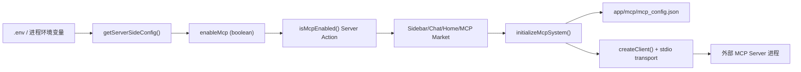

# ENABLE_MCP 工作机制与后续演进

本文档用于说明 `ENABLE_MCP` 在当前项目中的真实生效链路、运行依赖、排查方式，以及后续（暂不立即执行）的清理/优化方向。

## 1. 结论先行

- `ENABLE_MCP` 是**服务端开关**，不是纯前端变量。
- 只有当它严格等于字符串 `"true"` 时，MCP 被判定为启用。
- MCP 启用后，前端页面会通过 Server Action 读取状态，并触发 MCP 系统初始化、工具展示、工具调用等流程。

对应实现：

- `app/config/server.ts`：`enableMcp: process.env.ENABLE_MCP === "true"`
- `app/mcp/actions.ts`：`isMcpEnabled()`

## 2. 生效条件

`ENABLE_MCP` 的判定是严格比较：

- `ENABLE_MCP=true` -> 启用
- `ENABLE_MCP=1` / `TRUE` / `yes` / 空值 -> 都视为未启用

## 3. 运行时数据流

### 关键点

1. `isMcpEnabled()` 在 `app/mcp/actions.ts` 中是 `"use server"` Server Action。  
2. 前端组件并不直接读 `process.env`，而是调用这个 Server Action 获取开关状态。  
3. MCP 客户端初始化和执行请求都发生在服务端（Next 进程）侧。  

## 4. 开关影响范围

### 4.1 UI 展示层

- `app/components/sidebar.tsx`：控制侧栏是否显示 MCP 入口。
- `app/components/chat.tsx`：控制 Chat 工具栏 MCP 按钮及可用客户端数量。
- `app/components/mcp-market.tsx`：未启用时跳回首页。

### 4.2 系统初始化

- `app/components/home.tsx`：
  - 启用时执行 `initializeMcpSystem()`。
  - 按 `mcp_config.json` 内服务器配置初始化客户端。

### 4.3 对话行为

- `app/store/chat.ts`：
  - 在拼装系统提示词时，启用 MCP 会插入可用工具信息（`getMcpSystemPrompt()`）。
  - 识别 `json:mcp` 请求时会尝试执行 MCP action。

## 5. 与配置文件和进程权限的关系

### 5.1 MCP 配置文件位置

- 读取/写入路径：`process.cwd()/app/mcp/mcp_config.json`
- 不存在时会回落默认空配置（`DEFAULT_MCP_CONFIG`）

### 5.2 客户端启动方式

- `app/mcp/client.ts` 使用 `StdioClientTransport`
- 会启动外部命令（`command + args`），并合并环境变量：
  - 当前进程环境 `process.env`
  - 服务器条目中的 `env`

### 5.3 这意味着什么

- 启用 MCP 后，Next 进程需要具备：
  - 可执行外部命令的能力
  - 对 `app/mcp/` 的写权限（创建/更新配置）

## 6. 不同启动方式下的变量来源

- `npm run dev` / `npm run build`：Next 默认加载 `.env`。
- `scripts/starter.sh`：脚本会显式 `source .env` 后再启动 `node server.js`。

因此无论本地开发还是部署，只要目标进程拿到 `ENABLE_MCP=true`，MCP 开关都会生效。

## 7. 排查清单（启用但看不到 MCP）

1. 检查环境变量是否严格为 `true`：`ENABLE_MCP=true`
2. 检查服务端日志中是否出现：
   - `[MCP] initializing...`
   - `[MCP] initialized`
3. 检查 `app/mcp/mcp_config.json` 是否可读写
4. 检查服务器是否允许启动外部 MCP 命令（stdio 模式）

## 8. 安全与治理建议

- 不要把不可信命令写入 `mcp_config.json`
- 生产环境建议仅允许受控白名单命令
- 将 MCP 运行用户权限最小化（避免高权限系统用户）

## 9. 未来待办（先沉淀，不立即改）

以下是建议的下一阶段改造清单：

1. **修复异步判定一致性**  
   `app/store/chat.ts` 的 `checkMcpJson()` 当前直接调用 `isMcpEnabled()`，建议改为 `await` 后再决策，避免 Promise 真值导致逻辑偏差。

2. **减少重复 Server Action 往返**  
   侧栏、聊天页、首页都在独立请求 `isMcpEnabled()`；可在客户端做一次缓存或通过单一配置接口下发。

3. **配置文件位置外置**  
   将 `app/mcp/mcp_config.json` 迁移到专用数据目录（例如 `data/`），避免与源码目录耦合。

4. **MCP 预设源可配置**  
   当前预设列表来自固定远端地址（`https://nextchat.club/mcp/list`），建议增加可配置项/镜像能力。

5. **前后端边界收敛**  
   若未来继续推进“前端直连化”，需要明确 MCP 属于“必须服务端能力”模块，并从文档层面单独标注为例外链路。
