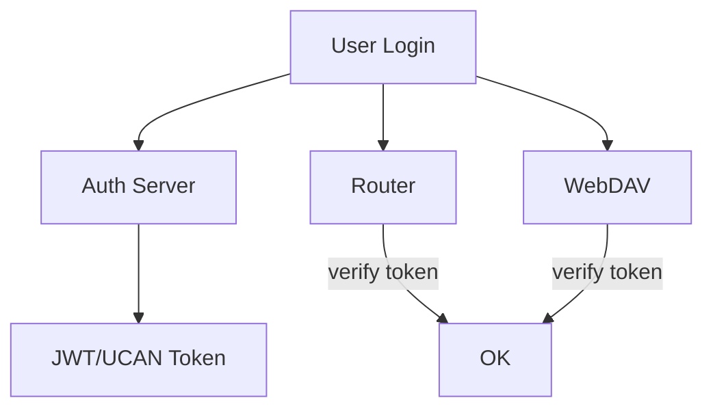

# 移动端登录与双后端鉴权问题分析与方案

## 问题描述

PC 端可通过钱包签名生成 UCAN，一次授权后同时访问 Router 和 WebDAV。  
移动端暂无钱包 App，无法 UCAN 登录；改用“用户名 + 密码”时，不清楚应该使用哪一套凭证：

- Router（大模型 API）一套？
- WebDAV（存储）一套？

目标是明确当前机制、解释“为什么会困惑”，并给出可落地的解决思路。

## 现状机制（结论先行）

当前 Router 与 WebDAV 是两个独立服务，默认不共享用户名/密码。

- Router：支持 UCAN（钱包）或 Access Code / API Key（由前端配置或后端策略决定）。
- WebDAV：支持 UCAN（钱包）或 Basic Auth（用户名/密码）。

因此：

- 用户名/密码登录仅适用于 WebDAV Basic Auth（用于聊天记录同步）。
- Router 仍需 Access Code / API Key 或 UCAN（用于模型请求）。

如果要实现“单一用户名/密码同时登录 Router + WebDAV”，必须引入统一认证服务/SSO，当前默认没有。

## 为什么会困惑

- PC 上 UCAN 是“跨后端”的授权凭证，用户自然以为“用户名/密码也应该跨后端”。
- 但实际上用户名/密码只属于 WebDAV 服务的 Basic Auth，并不对 Router 生效。
- Router 的 Access Code / API Key 与 WebDAV 的 Basic Auth 是两套不同凭证体系。

## 短期可行方案（最低改动）

### 方案 A：明确“双凭证体系”

适用场景：需要快速上线，允许用户配置两套凭证。

- Router：继续使用 Access Code / API Key（可在 /auth 或设置页输入）。
- WebDAV：使用 WebDAV 服务的 Basic 用户名/密码（在同步设置中配置）。

配套动作：

- 在登录页/设置页明确说明“Router 凭证”和“WebDAV 凭证”是两套。
- 引导移动端用户使用 Access Code / API Key 访问 Router，使用 Basic Auth 同步 WebDAV。

优点：改动最少  
缺点：用户体验差，仍是两套账号

## 中期方案（单入口登录 + 代理注入）

### 方案 B：新增“统一登录”并由服务端代理注入

思路：

- 在 Next.js 增加一个“账号登录”接口（用户名/密码）。
- 登录成功后，在服务端保存会话（cookie / session）。
- Router 请求和 WebDAV 请求统一走 Next.js 代理，由代理在服务端注入 Router Token / WebDAV Basic。

这样移动端只需登录一次，前端不直接持有 WebDAV 的用户名/密码。

流程示意：

```mermaid
flowchart TB
  M[Mobile Login Page] --> L[Next.js /api/login]
  L --> S[(Server Session)]
  M --> R[/api/openai...]
  M --> D[/api/webdav/*]
  R --> P1[Proxy adds Router auth]
  D --> P2[Proxy adds WebDAV Basic]
  P1 --> Router
  P2 --> WebDAV
```

优点：移动端体验统一  
缺点：需要服务端持久会话，且代理必须保存 WebDAV 凭证（对多租户要谨慎）

## 长期方案（统一认证中心 / SSO）

### 方案 C：Router 作为 Auth Server（或引入独立 Auth）

思路：

- 新增“用户名/密码登录”接口（Router 或独立 Auth 服务）。
- 登录后下发统一 Token（JWT / UCAN / OAuth2 Token）。
- Router 和 WebDAV 统一验证该 Token。

关键点：

- WebDAV 需要支持 Authorization: Bearer <token>（或兼容 UCAN）。
- Router 已有 UCAN / Token 验证能力，可复用。
- 统一用户表，权限控制一致。

流程示意：



优点：真正单点登录  
缺点：需要后端改造，短期成本高

## 另一个可选方向（移动端钱包）

### 方案 D：移动端钱包 + WalletConnect / DeepLink

如果后续有移动端钱包 App 或支持 WalletConnect，可直接复用 UCAN 流程：

- 移动端授权后生成 UCAN Root；
- Router / WebDAV 继续走 UCAN；
- 体验与 PC 端一致。

## 推荐策略

1) 短期：明确“双凭证体系”，避免误解；
2) 中期：若移动端使用量高，优先上“服务端代理 + 统一登录”；
3) 长期：建设 SSO / Auth 服务，统一 Router + WebDAV 的鉴权方式。

## FAQ（给用户说明）

Q：移动端用户名/密码登录到底用哪套？  
A：WebDAV 的用户名/密码仅用于同步；Router 仍需 Access Code / API Key。除非引入统一认证服务，否则无法用同一套用户名/密码同时登录。

Q：为什么 PC 钱包能“一次登录全通”？  
A：UCAN 是跨后端的授权机制；用户名/密码不是。
