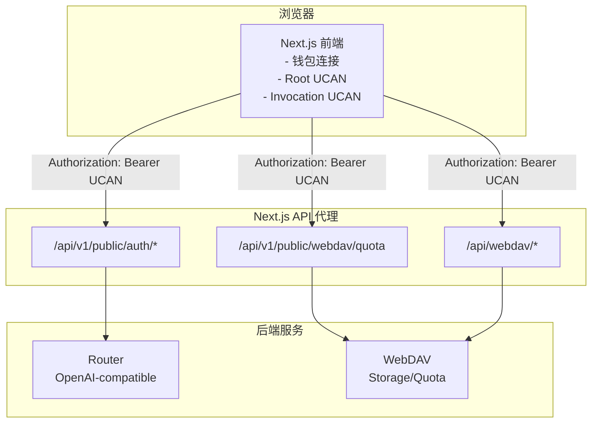

# Router 与 WebDAV 集成说明

本文档说明当前 Chat 如何通过 UCAN 同时集成 Router 与 WebDAV，以及关键调用链路与配置点。

## 集成目标

- 通过一次钱包授权（UCAN Root），同时访问多个后端（Router + WebDAV）。
- Router 提供 OpenAI-compatible API；WebDAV 提供存储与配额服务。
- Next.js 同时承担前端与 API 代理层，统一跨域与鉴权。

## 调用链路

## Router 集成

- **入口**：`app/client/platforms/openai.ts` 在请求 Router 相关接口时生成 Invocation UCAN。
- **请求头**：`Authorization: Bearer <UCAN>`。
- **代理路径**：`/api/v1/public/auth/*`，并限制允许的后端路径（白名单）。
- **受众 (audience)**：优先使用 `NEXT_PUBLIC_ROUTER_UCAN_AUD`，未设置时自动推导 `did:web:<router-host>`。

## WebDAV 集成

- **配额接口**：`app/plugins/webdav.ts` 使用 `authUcanFetch` 调用 `/api/v1/public/webdav/quota`。
- **同步接口**：`/api/webdav/*` 负责 WebDAV 文件同步，代理到 `WEBDAV_BACKEND_BASE_URL + WEBDAV_BACKEND_PREFIX`，限制方法与目标路径，避免 SSRF。
- **请求头**：配额代理使用允许头白名单，仅透传必要头部。
- **受众 (audience)**：优先使用 `NEXT_PUBLIC_WEBDAV_UCAN_AUD`，未设置时自动推导 `did:web:<webdav-host>`。
- **应用能力**：默认携带 `app:<appId>`（`appId` 默认当前域名）。

## WebDAV 直连（不走代理）

当关闭同步代理时，浏览器会直接请求 WebDAV 服务，不再经过 `/api/webdav/*`：

### 启用方式

1) 设置 `WEBDAV_BACKEND_BASE_URL` 为可公网访问的 WebDAV 基础地址（含协议，不含路径）。
2) 设置「同步配置」中的 **Proxy** 为关闭（`useProxy = false`）。
3) 如服务挂载在路径下，设置 `WEBDAV_BACKEND_PREFIX`（例如 `/dav`）。
4) 确保 WebDAV 服务支持 UCAN 鉴权与 CORS。

### 直连要求（必须满足）

- WebDAV 端允许跨域，并放行 `Authorization`、`Depth`、`Content-Type` 等头。
- WebDAV 端开放 `MKCOL/PUT/GET/PROPFIND` 等必要方法。
- WebDAV 端的 UCAN `aud` 与前端配置一致。

### 注意事项

- 直连会暴露 WebDAV 地址，安全与风控要求更高。
- 本地地址（如 `127.0.0.1`）只对本机有效，远端浏览器无法访问。

## UCAN 会话与本地存储

- Root UCAN 与 Session 保存在 IndexedDB：`yeying-web3 / ucan-sessions`。
- 关键状态缓存于 `localStorage`：
  - `currentAccount`
  - `ucanRootExp`
  - `ucanRootIss`
- 每次请求按后端生成 Invocation UCAN，做到“一次授权，多后端访问”。

## 关键配置项

- `ROUTER_BACKEND_URL`: Router 后端地址（必填）
- `WEBDAV_BACKEND_BASE_URL`: WebDAV 后端基础地址（必填，不含路径）
- `WEBDAV_BACKEND_PREFIX`: WebDAV 路径前缀（默认 `/dav`，可选修改）
- `WebDAV app action`: 固定为 `write`
- `通用 UCAN 能力`: 固定为 `profile/read`
- `NEXT_PUBLIC_ROUTER_UCAN_AUD`: Router audience（可选）
- `NEXT_PUBLIC_WEBDAV_UCAN_AUD`: WebDAV audience（可选）

## 安全要点

- Router 代理使用路径白名单，拒绝非授权路由。
- WebDAV 同步代理限制方法与目标路径，避免 SSRF。
- 配额代理使用允许头白名单，避免透传敏感头。
- UCAN `aud` 必须与后端配置保持一致。
