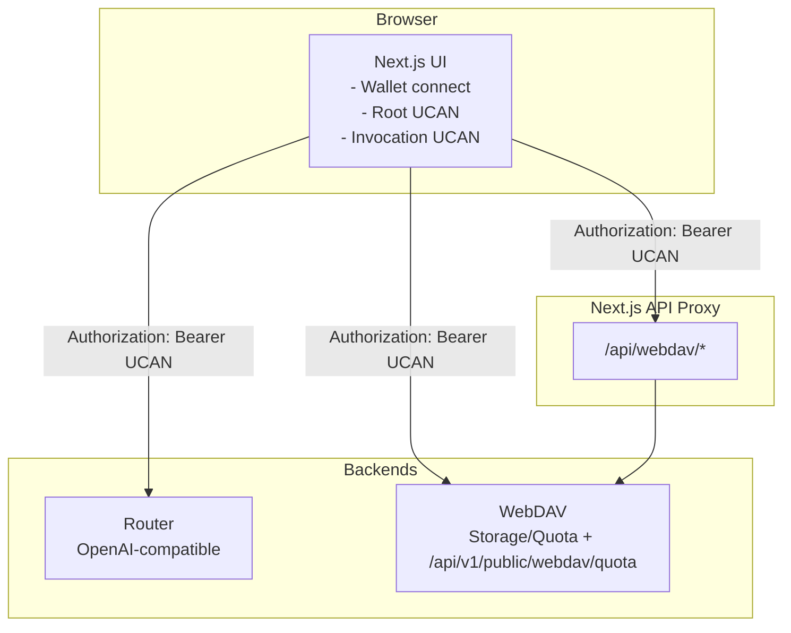

# Router and WebDAV Integration

> The unified explanation for login, wallet, UCAN, and mobile-auth behavior has been moved to [User Login](./user-login-en.md). Read that first if you need the full authorization model.

This document explains how the current Chat integrates Router and WebDAV using UCAN, including request flow and key configuration points.

## Goals

- One wallet authorization (UCAN Root) enables access to multiple backends (Router + WebDAV).
- Router provides OpenAI-compatible APIs; WebDAV provides storage and quota services.
- Next.js acts as UI plus selective proxy (WebDAV sync proxy).

## Request Flow

```mermaid
flowchart TB
  subgraph Browser["Browser"]
    UI["Next.js UI\n- Wallet connect\n- Root UCAN\n- Invocation UCAN"]
  end
  subgraph Proxy["Next.js API Proxy"]
    WEBDAVSYNC["/api/webdav/*"]
  end
  subgraph Backends["Backends"]
    ROUTER["Router\nOpenAI-compatible"]
    WEBDAV["WebDAV\nStorage/Quota + /api/v1/public/webdav/quota"]
  end

  UI -->|"Authorization: Bearer UCAN"| ROUTER
  UI -->|"Authorization: Bearer UCAN"| WEBDAV
  UI -->|"Authorization: Bearer UCAN"| WEBDAVSYNC
  WEBDAVSYNC --> WEBDAV
```

## Router Integration

- **Entry point**: `app/client/platforms/openai.ts` generates Invocation UCAN for Router requests.
- **Header**: `Authorization: Bearer <UCAN>`.
- **Access path**: browser calls Router directly; no Chat auth proxy route.
- **Audience**: auto-derived as `did:web:<router-host>`.

## WebDAV Integration

- **Quota**: `app/plugins/webdav.ts` calls `WEBDAV_BACKEND_BASE_URL + /api/v1/public/webdav/quota` directly via `authUcanFetch` (no Next proxy).
- **Sync**: `/api/webdav/*` proxies WebDAV file sync to `WEBDAV_BACKEND_BASE_URL + WEBDAV_BACKEND_PREFIX`, with method/path restrictions to prevent SSRF.
- **Headers**: quota is browser-direct; WebDAV backend must allow required CORS/auth headers.
- **Audience**: auto-derived as `did:web:<webdav-host>`.
- **App capability**: defaults to `app:<appId>` (`appId` defaults to current host).
> Note: `WEBDAV_BACKEND_PREFIX` applies only to WebDAV protocol paths (for third‑party WebDAV client compatibility).
> Other HTTP APIs (quota / SIWE / UCAN) must not include the prefix and use the base URL directly.

## Direct WebDAV (No Proxy)

When proxy is disabled, the browser will call the WebDAV server directly (no `/api/webdav/*`).

### How to enable

1) Set `WEBDAV_BACKEND_BASE_URL` to a publicly reachable WebDAV base URL (with scheme, no path).
2) Turn off **Proxy** in Sync settings (`useProxy = false`).
3) If the service is mounted under a path, set `WEBDAV_BACKEND_PREFIX` (e.g. `/dav`).
4) Ensure the WebDAV service supports UCAN and CORS.

### Requirements

- CORS allows `Authorization`, `Depth`, `Content-Type`, etc.
- WebDAV allows `MKCOL/PUT/GET/PROPFIND` and related methods.
- UCAN `aud` matches the backend configuration.

### Notes

- Direct mode exposes the WebDAV origin publicly.
- `127.0.0.1` is only reachable from the local machine, not remote browsers.

## Boundary with the Login Document

This document only keeps Router / WebDAV integration details:

- how Router requests mint and attach Invocation UCAN
- when WebDAV goes direct vs `/api/webdav/*` proxy
- audience, app capability, proxy boundary, and CORS requirements

The following cross-cutting topics are intentionally kept in [User Login](./user-login-en.md):

- Root / Session / Invocation concepts
- local storage layout and wallet-side state
- why wallet unlock prompts appear
- when unlock is enough vs full re-authorization

## Key Environment Variables

- `ROUTER_BACKEND_URL`: default Router backend URL (optional, frontend default)
- `WEBDAV_BACKEND_BASE_URL`: WebDAV base URL (required, no path)
- `WEBDAV_BACKEND_PREFIX`: path prefix (default `/dav`, optional to change)
- `WebDAV app action`: fixed to `write`
- `Shared UCAN caps`: fixed to `profile/read`

## Security Notes

- WebDAV sync proxy restricts methods and target paths to prevent SSRF.
- Quota is direct browser access; enforce strict CORS origin/header policy on WebDAV side.
- Ensure UCAN `aud` matches backend configuration.
