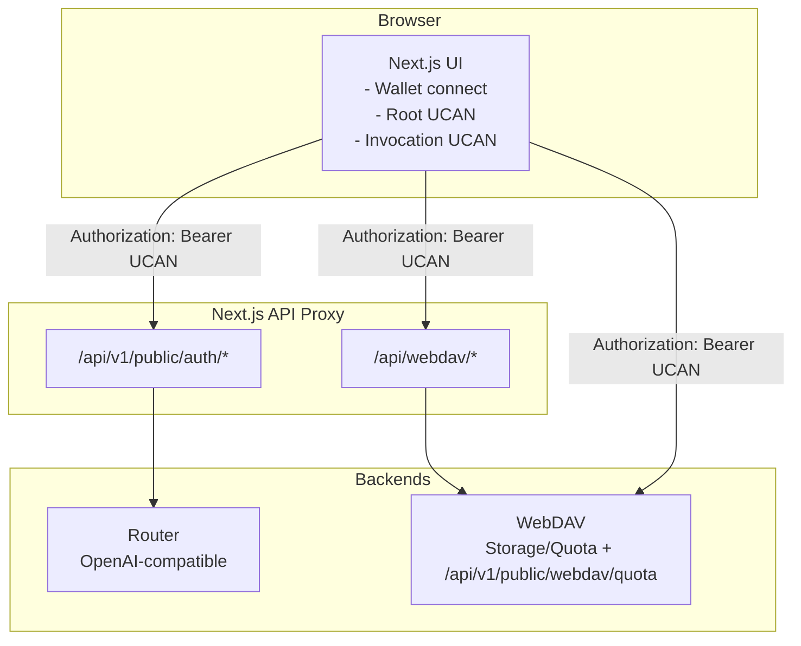

# Router and WebDAV Integration

This document explains how the current Chat integrates Router and WebDAV using UCAN, including request flow and key configuration points.

## Goals

- One wallet authorization (UCAN Root) enables access to multiple backends (Router + WebDAV).
- Router provides OpenAI-compatible APIs; WebDAV provides storage and quota services.
- Next.js acts as UI plus selective proxy (Router auth proxy + WebDAV sync proxy).

## Request Flow

## Router Integration

- **Entry point**: `app/client/platforms/openai.ts` generates Invocation UCAN for Router requests.
- **Header**: `Authorization: Bearer <UCAN>`.
- **Proxy path**: `/api/v1/public/auth/*` with an allowlist for permitted backend routes.
- **Audience**: `NEXT_PUBLIC_ROUTER_UCAN_AUD` if set; otherwise derived as `did:web:<router-host>`.

## WebDAV Integration

- **Quota**: `app/plugins/webdav.ts` calls `WEBDAV_BACKEND_BASE_URL + /api/v1/public/webdav/quota` directly via `authUcanFetch` (no Next proxy).
- **Sync**: `/api/webdav/*` proxies WebDAV file sync to `WEBDAV_BACKEND_BASE_URL + WEBDAV_BACKEND_PREFIX`, with method/path restrictions to prevent SSRF.
- **Headers**: quota is browser-direct; WebDAV backend must allow required CORS/auth headers.
- **Audience**: `NEXT_PUBLIC_WEBDAV_UCAN_AUD` if set; otherwise derived as `did:web:<webdav-host>`.
- **App capability**: defaults to `app:<appId>` (`appId` defaults to current host).
> Note: `WEBDAV_BACKEND_PREFIX` applies only to WebDAV protocol paths (for third‑party WebDAV client compatibility).
> Other HTTP APIs (quota / SIWE / UCAN) must not include the prefix and use the base URL directly.

## Direct WebDAV (No Proxy)

When proxy is disabled, the browser will call the WebDAV server directly (no `/api/webdav/*`).

### How to enable

1) Set `WEBDAV_BACKEND_BASE_URL` to a publicly reachable WebDAV base URL (with scheme, no path).
2) Turn off **Proxy** in Sync settings (`useProxy = false`).
3) If the service is mounted under a path, set `WEBDAV_BACKEND_PREFIX` (e.g. `/dav`).
4) Ensure the WebDAV service supports UCAN and CORS.

### Requirements

- CORS allows `Authorization`, `Depth`, `Content-Type`, etc.
- WebDAV allows `MKCOL/PUT/GET/PROPFIND` and related methods.
- UCAN `aud` matches the backend configuration.

### Notes

- Direct mode exposes the WebDAV origin publicly.
- `127.0.0.1` is only reachable from the local machine, not remote browsers.

## UCAN Session and Local Storage

- Root UCAN and session are stored in IndexedDB: `yeying-web3 / ucan-sessions`.
- Key cached fields in `localStorage`:
  - `currentAccount`
  - `ucanRootExp`
  - `ucanRootIss`
- Each backend request creates a fresh Invocation UCAN, enabling multi-backend access after a single authorization.

### Lifetime and refresh model

- Root UCAN default TTL is 24 hours (SDK default).
- Invocation UCAN default TTL is 5 minutes and is re-minted per request.
- Wallet session lifetime is controlled by wallet-side `expiresAt`; frontend refreshes near expiry.

### Why wallet unlock may be required

- After auto-lock (idle/background), wallet cannot provide signing capability.
- When session expires, Chat must request a new wallet session or signature, which requires unlock.
- If Root UCAN expired or account changed, re-authorization is required (unlock alone is not enough).

## Key Environment Variables

- `ROUTER_BACKEND_URL`: Router backend URL (required)
- `WEBDAV_BACKEND_BASE_URL`: WebDAV base URL (required, no path)
- `WEBDAV_BACKEND_PREFIX`: path prefix (default `/dav`, optional to change)
- `WebDAV app action`: fixed to `write`
- `Shared UCAN caps`: fixed to `profile/read`
- `NEXT_PUBLIC_ROUTER_UCAN_AUD`: Router audience (optional)
- `NEXT_PUBLIC_WEBDAV_UCAN_AUD`: WebDAV audience (optional)

## Security Notes

- Router proxy enforces an allowlist of routes.
- WebDAV sync proxy restricts methods and target paths to prevent SSRF.
- Quota is direct browser access; enforce strict CORS origin/header policy on WebDAV side.
- Ensure UCAN `aud` matches backend configuration.
