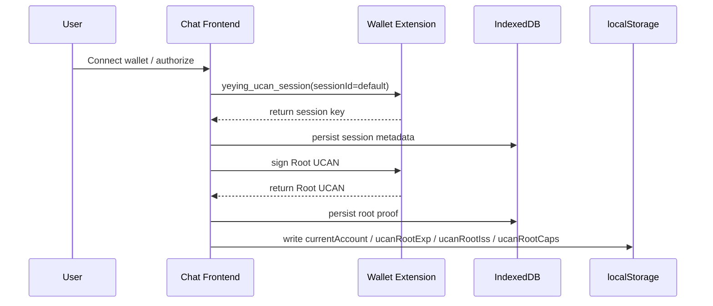
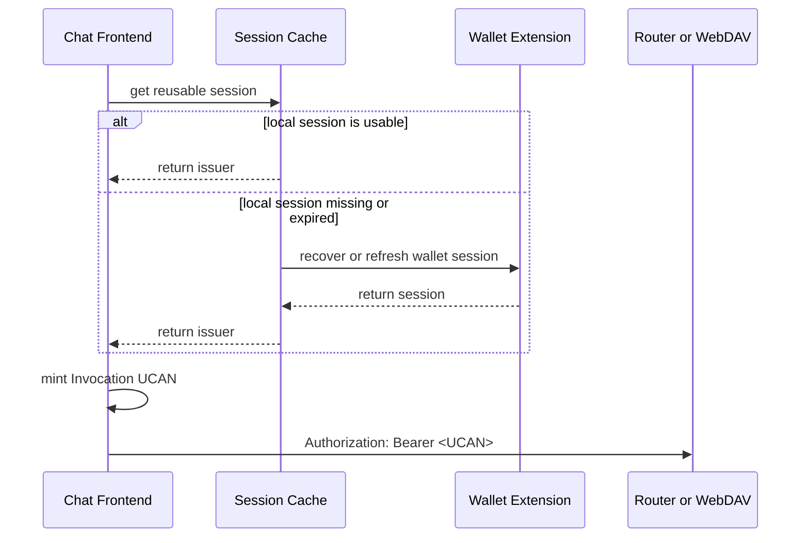

# User Login

> This document is the single English overview for the current Chat login, authorization, wallet, UCAN, and mobile-auth behavior.
> Its purpose is to consolidate the login-related background that was previously scattered across multiple documents.

## 1. Scope

This document answers the following questions:

- What login or authorization methods does the system support today?
- How does wallet login relate to Access Code / API Key?
- Why can Router and WebDAV share one wallet authorization?
- What do `Root UCAN`, `session`, and `Invocation UCAN` actually mean?
- Where is this data stored locally?
- Why does the app sometimes ask to unlock the wallet?
- When is wallet unlock enough, and when is full re-authorization required?
- Why can mobile not simply reuse the current desktop wallet-login flow?

If you already understand the overall model and want implementation details, continue with these companion docs:

- [Architecture / Deployment / Security Checklist](./architecture-en.md)
- [Router and WebDAV Integration](./router-webdav-integration-en.md)
- [WebDAV Sync Plan (UCAN)](./webdav-sync-plan-en.md)
- [User Manual](./user-manual-en.md)

## 2. Current Login Methods

The current system does not use one unified login stack. It supports three parallel authorization paths:

| Scenario | What the user sees | Scope | Unified today |
|---|---|---|---|
| Wallet authorization | Connect YeYing Wallet and create UCAN | Router + WebDAV | Yes |
| Access Code / API Key | Entered on `/auth` or in settings | Mostly Router / model requests | No |
| WebDAV Basic Auth | Username + password | WebDAV sync only | No |

Key conclusions:

- Wallet login on desktop is the only current cross-backend authorization path.
- Access Code / API Key is not the same thing as WebDAV login.
- WebDAV username/password is not a universal app login.

## 3. User Identity

In the wallet-login flow, the effective user identity is the current wallet address:

- `wallet_address`

That leads to two practical rules:

- Changing wallets means changing accounts.
- Operations and support should identify users by wallet address, not nickname or browser profile text.

## 4. UCAN Authorization Model

Wallet login is a layered authorization model rather than a single JWT-like token.

### 4.1 Root UCAN

The Root UCAN is the top-level authorization proof. It captures:

- issuer: `iss`
- audience: `aud`
- capabilities: `cap`
- expiration: `exp`
- proof of wallet signature: `siwe.message` + `siwe.signature`
- service targets in statement payload: `service_hosts.router` and `service_hosts.webdav`

Default TTL:

- 24 hours

### 4.2 UCAN Session

Here, `session` does not mean chat session. It means the wallet-side UCAN session capability used by the frontend to keep minting invocation tokens.

Typical fields include:

- `id`
- `did`
- `createdAt`
- `expiresAt`
- signer material managed through the wallet flow

Project default session id:

- `default`

### 4.3 Invocation UCAN

Invocation UCAN is the short-lived token minted for a specific backend request.

Characteristics:

- per request or short time window
- bound to the correct backend `audience`
- carries the capabilities needed by that backend
- sent as `Authorization: Bearer <UCAN>`

Default TTL:

- 5 minutes

## 5. Why One Wallet Authorization Can Access Multiple Backends

Because the implementation separates reusable root authorization from request-level tokens:

1. The user connects the wallet.
2. The frontend requests a UCAN session from the wallet.
3. The frontend creates a Root UCAN.
4. For later requests:
   - one Invocation UCAN is minted for Router
   - another Invocation UCAN is minted for WebDAV

Current capability model:

- Router capability: `app:all:<appId> + invoke`
- WebDAV capability: `app:all:<appId> + write`
- `appId` is derived from frontend host (for example, `localhost:3020 -> localhost-3020`)

So the user experience is "log in once, use both backends", but the actual mechanism is:

- reusable Root UCAN
- backend-specific Invocation UCANs

## 6. Local Storage and Runtime State

This is easiest to understand in four layers.

### 6.1 In-memory cache

Runtime cache in the frontend:

- `cachedSession`
- `cachedAt`
- `sessionPromise`

File:

- `app/plugins/ucan-session.ts`

This cache is process-local and disappears on refresh or tab restart.

### 6.2 localStorage

The frontend stores lightweight root summary fields in `localStorage`:

- `currentAccount`
- `ucanRootExp`
- `ucanRootIss`
- `ucanRootCaps`

These are used for fast UI-level authorization checks. They are not the full root proof.

### 6.3 IndexedDB

The SDK persists UCAN-related records in IndexedDB:

- DB: `yeying-web3`
- Store: `ucan-sessions`

This typically includes:

- session id
- `did`
- timestamps
- root proof

### 6.4 Wallet-side state

The wallet provider still controls actual signing capability. The frontend may need wallet RPC methods such as:

- `yeying_ucan_session`
- `yeying_ucan_sign`

So local browser records do not guarantee that requests can continue forever without wallet interaction.

## 7. Request Sequence

### 7.1 Wallet login

### 7.2 Normal backend request

## 8. Why Wallet Unlock Prompts Happen

Seeing a wallet unlock prompt is not automatically a bug. Common reasons:

1. Wallet extension auto-lock after idle time.
2. UCAN session expired or can no longer be silently recovered.
3. A request path needs new signing capability.
4. The current wallet account changed.

## 9. Unlock Only vs Re-authorize

### 9.1 Unlock only

Usually enough when:

- Root UCAN is still valid
- current account did not change
- capabilities still match
- wallet is merely locked

### 9.2 Full re-authorization required

Required when:

- `ucanRootExp` already expired
- current account no longer matches the root issuer
- capabilities changed
- session identity no longer matches the active authorization chain
- `service_hosts` in root statement is missing or no longer matches current Router/WebDAV backend hosts

## 10. Why "UCAN Is Still Valid" May Still Trigger Wallet Interaction

If "UCAN is still valid" only refers to the Root UCAN, that means only one layer is still valid.

It does not guarantee:

- a reusable wallet session is still available
- the next request can proceed without contacting the wallet

What actually determines whether the wallet is touched is the combination of:

- Root validity
- session availability
- whether the request path unnecessarily forces session refresh

The safe implementation rule is:

- prefer silent reuse on non-interactive requests
- do not wake up the wallet in ordinary request paths unless required

## 11. Mobile Limitation

Desktop wallet login works well because UCAN is cross-backend. Mobile currently lacks the same wallet-extension environment, so the system falls back to split credentials:

- Router: UCAN or Access Code / API Key
- WebDAV: UCAN or Basic Auth

That is why there is no natural single username/password login across both backends today.

## 12. FAQ

### Q1. Is `session` a chat session?

No. In this document, `session` means UCAN session capability, not `ChatSession`.

### Q2. Where is the session stored?

Three places matter:

- memory cache in the frontend
- `localStorage` for root summary fields
- IndexedDB for UCAN session records

### Q3. Why does IndexedDB not eliminate wallet unlock?

Because IndexedDB stores records and proofs, not unrestricted wallet signing power.

### Q4. Why does changing the wallet require re-authorization?

Because the identity chain is no longer the same:

- root issuer
- session identity
- current account

These must remain consistent.

## 13. Recommended Reading Order

If you want the fast path:

1. Read Section 2 for the login methods.
2. Read Section 4 for Root / Session / Invocation.
3. Read Section 6 for storage layout.
4. Read Sections 8 to 10 for wallet unlock behavior.

If you want implementation details next:

1. [Architecture / Deployment / Security Checklist](./architecture-en.md)
2. [Router and WebDAV Integration](./router-webdav-integration-en.md)
3. [WebDAV Sync Plan (UCAN)](./webdav-sync-plan-en.md)
