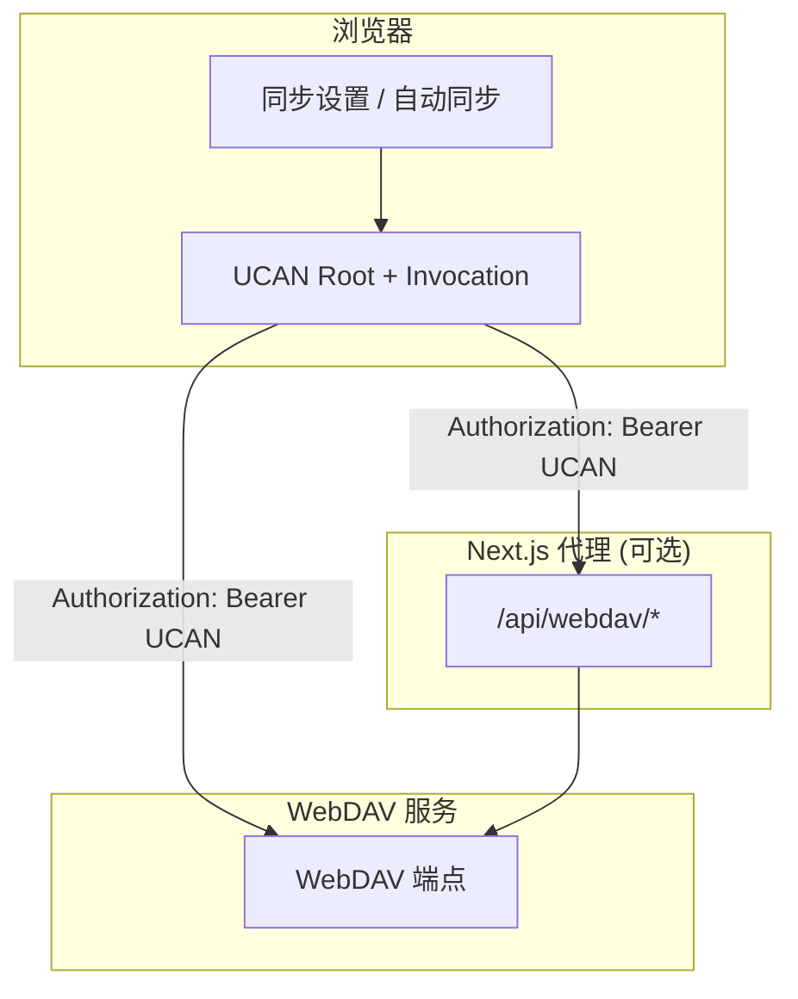

# WebDAV 同步方案（UCAN）

本文档说明当前 WebDAV 同步方案的流程、直连/代理模式差异、冲突处理策略与待办事项。

## 目标

- 支持 UCAN 授权的一次登录多后端访问。
- 支持 WebDAV 同步（拉取/上传/检查可用性）。
- 支持代理模式与浏览器直连模式。
- 防止“删除后被远端复活”。

## 同步流程

## 两种模式

### 1) 代理模式（可选）

- 浏览器请求 `http://<chat>/api/webdav/*`。
- Next.js 代理转发到 `WEBDAV_BACKEND_BASE_URL + WEBDAV_BACKEND_PREFIX`。
- 适合：避免 CORS、隐藏后端地址、统一安全策略。

### 2) 直连模式（默认，useProxy=false）

- 浏览器直接请求 `WEBDAV_BACKEND_BASE_URL + WEBDAV_BACKEND_PREFIX`。
- 需要 WebDAV 服务端允许跨域与 `Authorization` 头。
- 适合：降低代理压力、大流量场景。

## UCAN 关键要求

- `aud` 必须与 WebDAV 服务端配置一致：
  - 默认：`did:web:<host>`（由 `WEBDAV_BACKEND_BASE_URL` 推导）。
  - 可覆盖：`NEXT_PUBLIC_WEBDAV_UCAN_AUD`。
- `capability` 需包含服务端配置要求（如 `app:<appId>/write`）。
- 当服务端开启 `required_resource=app:*` 时，前端必须携带 `app:<appId>` 能力，
  并保证访问路径落在 `/apps/<appId>/...`。

## 聊天同步规则（方案 A）

- **只同步已完成的消息**：`status=done` / `status=error` 才会进入云端。
- **流式阶段不上传**：`status=streaming` 的消息不会同步。
- **会话级过滤**：若会话内存在流式消息，该会话不会被上传（避免半成品）。
- **空响应过滤**：`empty response` 会被过滤，不会上传到云端。
- **合并覆盖规则**：同一消息以 `updatedAt`（或 `date`）更晚者为准。
- **自动同步延后**：检测到流式消息时，自动同步会延后直到完成。

## 删除不复活（tombstone）

当前已加入 tombstone 方案：

- 删除会话时写入 `deletedSessions`（id -> timestamp）。
- 合并远端时先合并 tombstone，再过滤被标记删除的 session。
- 墓碑默认保留 30 天（可调整）。

**冲突策略：更新优先**  
当同一会话在远端有新更新（`lastUpdate` 更新晚于删除时间）时，更新会覆盖删除并保留会话。

## 配置项（核心）

- `WEBDAV_BACKEND_BASE_URL`: WebDAV 基础地址（必填，不含路径）
- `WEBDAV_BACKEND_PREFIX`: WebDAV 路径前缀（默认 `/dav`，可选修改）
- `NEXT_PUBLIC_WEBDAV_UCAN_AUD`: WebDAV audience（可选）
- `WebDAV app action`: 固定为 `write`
- `通用 UCAN 能力`: 固定为 `profile/read`（主要用于 Router）
- 同步设置：`useProxy`（关闭即直连）
- 同步设置页会展示并可修改 WebDAV Base URL/Prefix，用于覆盖环境变量

默认值（本项目）：

- WebDAV Auth = UCAN
- Proxy = 关闭
- 自动同步 = 开启

## 待办事项 / 风险评估

### 必做

- **CORS 放行**：直连模式需允许来源 `http://localhost:3020` 等。
- **UCAN 校验一致**：服务端 `audience/resource/action` 必须与前端一致。
- **直连验证**：Network 中必须看到请求直达 `WEBDAV_BACKEND_BASE_URL + WEBDAV_BACKEND_PREFIX`。

### 建议

- **可观测性**：在客户端打印 `useProxy/authType/backendUrl`（已加 debug）。
- **删除冲突策略**：如果多端同时编辑，需要明确“删除优先”或“更新优先”。
- **墓碑清理**：TTL 是否需要更长/更短，避免过度积累。
- **大文件传输**：直连场景需配置服务端限流与审计。
- **方案 C（增量日志/Outbox）**：后续可只同步“完成消息事件”，降低冲突与带宽。
