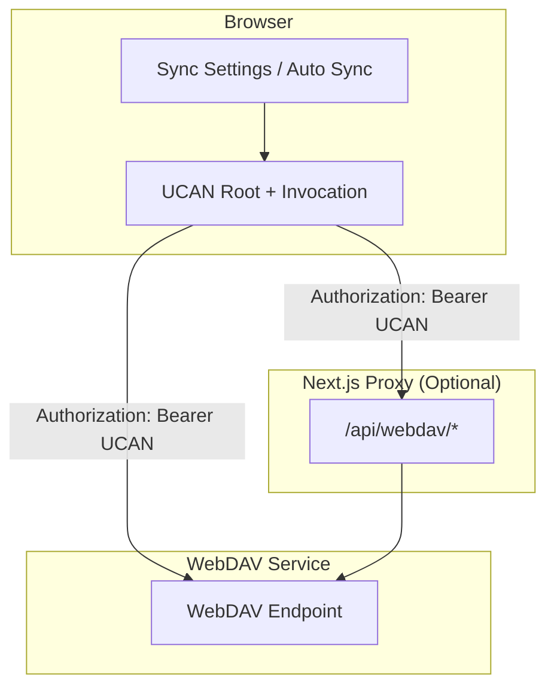

# WebDAV Sync Plan (UCAN)

This document describes the current WebDAV sync plan, proxy vs direct mode, conflict strategy, and remaining tasks.

## Goals

- UCAN-based single authorization for multi-backend access.
- WebDAV sync (check / download / upload).
- Support proxy mode and direct browser mode.
- Prevent deleted sessions from reappearing.

## Sync Flow

## Modes

### 1) Proxy mode (optional)

- Browser calls `http://<chat>/api/webdav/*`.
- Next.js forwards to `WEBDAV_BACKEND_BASE_URL + WEBDAV_BACKEND_PREFIX`.
- Good for CORS avoidance and hiding backend URL.

### 2) Direct mode (default, useProxy=false)

- Browser calls `WEBDAV_BACKEND_BASE_URL + WEBDAV_BACKEND_PREFIX` directly.
- WebDAV must support CORS and `Authorization` header.
- Good for large traffic and lower proxy load.

## UCAN Requirements

- `aud` must match the backend configuration:
  - Default: `did:web:<host>` (derived from `WEBDAV_BACKEND_BASE_URL`).
  - Override with `NEXT_PUBLIC_WEBDAV_UCAN_AUD`.
- `capability` must include backend-required `resource/action` (e.g. `app:<appId>/write`).
- When the backend enforces `required_resource=app:*`, the client must include `app:<appId>`
  and keep requests under `/apps/<appId>/...`.

## Chat Sync Rule (Plan A)

- **Only sync completed messages**: `status=done` / `status=error` are uploaded.
- **Streaming is excluded**: `status=streaming` messages are not synced.
- **Session-level filter**: if a session contains any streaming message, the session is not uploaded (avoid partial state).
- **Empty response filtered**: `empty response` messages are not uploaded.
- **Merge precedence**: for the same message ID, newer `updatedAt` (or `date`) wins.
- **Auto sync is delayed** while any streaming message exists.

## Delete Tombstone

Tombstone is enabled to prevent deleted sessions from reappearing:

- Deleting a session writes `deletedSessions` (id -> timestamp).
- Merge applies tombstones before merging sessions.
- Tombstones are kept for 30 days by default.

**Conflict policy: update-wins**  
If a session has a newer `lastUpdate` than the delete timestamp, the update overrides deletion and the session is kept.

## Key Configs

- `WEBDAV_BACKEND_BASE_URL`: WebDAV base URL (required, no path)
- `WEBDAV_BACKEND_PREFIX`: path prefix (default `/dav`, optional to change)
- `NEXT_PUBLIC_WEBDAV_UCAN_AUD`: audience override (optional)
- `WebDAV app action`: fixed to `write`
- `Shared UCAN caps`: fixed to `profile/read` (mainly for Router)
- Sync setting: `useProxy` (off = direct mode)
- Sync settings page shows and allows editing of WebDAV Base URL/Prefix to override env defaults

Default values (this project):

- WebDAV Auth = UCAN
- Proxy = off
- Auto Sync = on

## Remaining Tasks / Risks

### Must

- **CORS allowlist** for direct mode (e.g. `http://localhost:3020`).
- **UCAN alignment** between frontend and backend (aud/resource/action).
- **Direct-mode verification** (Network shows direct requests to `WEBDAV_BACKEND_BASE_URL + WEBDAV_BACKEND_PREFIX`).

### Recommended

- **Observability**: log `useProxy/authType/backendUrl` (debug is in place).
- **Conflict policy**: decide delete-vs-update precedence for multi-device.
- **Tombstone cleanup**: adjust TTL if needed.
- **Large file handling**: add rate limit / audit on WebDAV.
- **Plan C (Outbox / incremental events)**: only sync completed message events to reduce conflicts and bandwidth.
