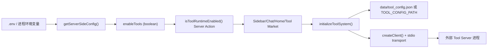

# ENABLE_TOOLS 工作机制与后续演进

本文档是 [AI Native 能力分层架构](./AI-Native能力分层架构.md) 中工具层的运行机制补充。工具运行时是产品层能力；MCP 是当前主要协议和服务端实现方式，不是技能本身，也不承载模型供应商和应用存储的全部职责。

本文档用于说明 `ENABLE_TOOLS` 在当前项目中的真实生效链路、运行依赖、排查方式，以及后续（暂不立即执行）的清理/优化方向。

## 1. 结论先行

- `ENABLE_TOOLS` 是**服务端开关**，不是纯前端变量。
- 当它等于字符串 `"1"` 或 `"true"` 时，工具运行时被判定为启用。
- 工具运行时当前只在 `standalone` 部署或本地 `npm run dev` 这类有 Next Node 进程的模式下可用。
- Tauri 桌面端当前走 Next 静态导出，构建时会把 `app/tools/actions.ts` 替换为 `app/tools/actions.export.ts`，工具运行时被显式禁用。
- standalone 中工具运行时启用后，前端页面会通过 Server Action 读取状态，并触发工具系统初始化、工具展示、工具调用等流程。

对应实现：

- `app/config/server.ts`：统一布尔解析，`ENABLE_TOOLS=1` / `true` 都会启用
- `app/tools/actions.ts`：`isToolRuntimeEnabled()`

## 2. 生效条件

`ENABLE_TOOLS` 的判定当前支持以下写法：

- `ENABLE_TOOLS=1` -> 启用
- `ENABLE_TOOLS=true` -> 启用
- `ENABLE_TOOLS=0` / `false` / 空值 -> 不启用

推荐统一使用 `0` / `1`。

## 3. 运行时数据流

### 关键点

1. `isToolRuntimeEnabled()` 在 `app/tools/actions.ts` 中是 `"use server"` Server Action。
2. 前端组件并不直接读 `process.env`，而是调用这个 Server Action 获取开关状态。
3. Tool client 初始化和执行请求都发生在服务端（Next 进程）侧。
4. Tauri 静态导出没有 Next Server Action 运行环境，因此当前不读取 `data/tool_config.json`。

## 4. 开关影响范围

### 4.1 UI 展示层

- `app/components/sidebar.tsx`：控制侧栏是否显示工具入口。
- `app/components/chat.tsx`：控制 Chat 工具栏工具按钮及可用客户端数量。
- `app/components/tool-market.tsx`：未启用时跳回首页。

### 4.2 系统初始化

- `app/components/home.tsx`：
  - 启用时执行 `initializeToolSystem()`。
  - 按 `tool_config.json` 内服务器配置初始化客户端。

### 4.3 对话行为

- `app/store/chat.ts`：
  - 在拼装系统提示词时，启用工具运行时会插入可用工具信息（`getToolSystemPrompt()`）。
  - 识别 `json:mcp` 协议请求时会尝试执行工具 action。

## 5. 与配置文件和进程权限的关系

### 5.1 工具配置文件位置

- 默认读取/写入路径：`process.cwd()/data/tool_config.json`
- 可通过环境变量 `TOOL_CONFIG_PATH` 覆盖，支持绝对路径或相对 `process.cwd()` 的路径
- 不存在时会回落默认空配置（`DEFAULT_TOOL_CONFIG`）
- 该文件只适用于 standalone / 本地 Next Node 进程；Tauri 当前不使用该文件

`marketplace` 仓库只管理 Tool/Skill 的可发现定义，例如名称、描述、启动命令、配置项 schema 和分类标签。standalone 当前实例是否启用某个工具、用户自带 API Key、允许访问的本地路径等运行时配置属于当前 Chat 实例，只写入 `data/tool_config.json` 或 `TOOL_CONFIG_PATH` 指定文件，不进入 marketplace。

### 5.2 standalone 与 Tauri 的区别

| 模式                         | 工具运行时当前状态                        | 配置保存位置                                | 适用场景                                                          |
| ---------------------------- | ----------------------------------------- | ------------------------------------------- | ----------------------------------------------------------------- |
| `standalone` / `npm run dev` | 可用，依赖 Next Node 进程和 Server Action | `data/tool_config.json` 或 `TOOL_CONFIG_PATH` | 本地开发、私有部署、单实例受控服务                                |
| Tauri 桌面端                 | 当前禁用，构建时使用 `actions.export.ts`  | 暂无                                        | 后续如果支持，应使用 Tauri 用户数据目录，而不是源码目录或打包目录 |

### 5.3 客户端启动方式

- `app/tools/client.ts` 使用 `StdioClientTransport`
- 会启动外部命令（`command + args`），并合并环境变量：
  - 当前进程环境 `process.env`
  - 服务器条目中的 `env`

### 5.4 这意味着什么

- 启用工具运行时后，Next 进程需要具备：
  - 可执行外部命令的能力
  - 对 `data/` 或 `TOOL_CONFIG_PATH` 指定目录的写权限（创建/更新配置）

## 6. 不同启动方式下的变量来源

- `npm run dev` / standalone：Next 默认加载 `.env`。
- `scripts/starter.sh`：脚本会显式 `source .env` 后再启动 `node server.js`。
- Tauri：当前 tool actions 被禁用，`ENABLE_TOOLS` 和 `TOOL_CONFIG_PATH` 不会让桌面端获得工具运行时能力。

因此只有在有 Next Node 进程的运行方式下，目标进程拿到 `ENABLE_TOOLS=1` 或 `ENABLE_TOOLS=true`，工具开关才会生效。

## 7. 排查清单（启用但看不到工具）

1. 检查环境变量是否已正确开启：`ENABLE_TOOLS=1` 或 `ENABLE_TOOLS=true`
2. 检查服务端日志中是否出现：
   - `[Tool] initializing...`
   - `[Tool] initialized`
3. 检查 `data/tool_config.json` 或 `TOOL_CONFIG_PATH` 指定文件是否可读写
4. 检查服务器是否允许启动外部工具命令（stdio 模式）

## 8. 安全与治理建议

- 不要把不可信命令写入 `tool_config.json`
- 不要把包含 API Key 的运行时配置放进源码目录或提交到 Git
- 生产环境建议仅允许受控白名单命令
- 将工具运行用户权限最小化（避免高权限系统用户）

## 9. 未来待办（先沉淀，不立即改）

以下是建议的下一阶段改造清单：

1. **修复异步判定一致性**
   `app/store/chat.ts` 的 `checkToolJson()` 必须 `await isToolRuntimeEnabled()` 后再决策，避免 Promise 真值导致逻辑偏差。

2. **减少重复 Server Action 往返**
   侧栏、聊天页、首页都在独立请求 `isToolRuntimeEnabled()`；可在客户端做一次缓存或通过单一配置接口下发。

3. **工具预设源可配置**
   当前预设列表应优先对齐官方 `modelcontextprotocol/servers` reference servers；若未来仍需要远端源，建议增加可配置项/镜像能力。

4. **Tauri 工具产品方案单独设计**
   如果桌面端后续要支持工具运行时，应基于 Tauri 用户数据目录和本机权限模型设计，不复用 standalone 的 `data/tool_config.json`。

5. **前后端边界收敛**
   若未来继续推进“前端直连化”，需要明确工具运行时属于“必须服务端能力”模块，并从文档层面单独标注为例外链路。
