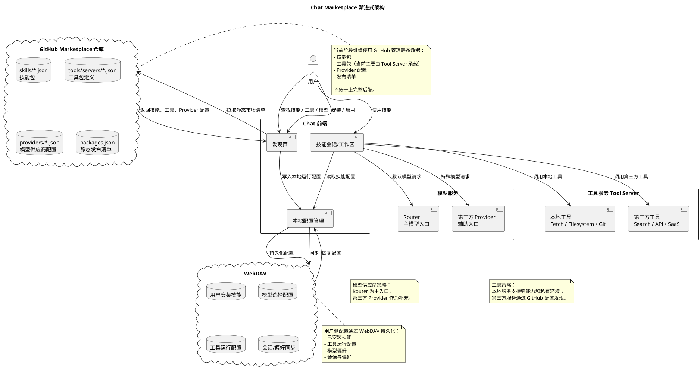

# 市场后端与技能运行配置方案

本文档服从 [AI Native 能力分层架构](./AI-Native能力分层架构.md)。市场和运行配置后续统一围绕“技能、工具、模型、存储”四层设计；插件等旧概念不再作为用户侧一级对象扩展。

## 1. 背景

当前 Chat 已经具备基础市场能力：

- 从社区市场仓库加载技能包和工具包。当前工具包主要由 Tool Server 承载。
- 在发现页展示技能、工具、模型服务商和存储能力。
- 用户可以安装技能，进入技能会话或工作区。
- 技能可以声明模型、工具、存储和权限。
- 本地可以保存技能配置和工具运行配置。

这个模式适合 MVP，但继续扩展付费技能、第三方发布、组织可见范围、私有工具服务、模型服务商配置时，纯前端加静态 JSON 会变得不可控。

核心问题：

- 前端不能可靠判断用户是否已购买、是否有组织授权。
- 前端不应保存和分发第三方密钥、私有 endpoint、本地路径等敏感配置。
- 静态 JSON 无法承载审核、下架、版本灰度、统计、投诉和风控。
- 用户点击技能后，如果缺模型、缺工具、缺存储授权或缺购买授权，当前流程容易跳转分散，用户不知道下一步做什么。

结论：发现市场需要从“静态列表”演进为“市场发现 + 安装授权 + 运行配置”的完整闭环。

## 2. 产品目标

用户视角只需要理解三件事：

- 我想完成什么任务。
- 这个技能现在能不能用。
- 如果不能用，下一步补什么配置。

产品目标：

- 用户从发现页点击技能后，系统自动判断可用性。
- 可用时直接进入会话或工作区。
- 不可用时进入清晰的配置向导，而不是让用户自己找设置项。
- 付费、试用、组织授权、第三方发布都能在同一套状态模型下表达。
- Chat 前端仍然可以离线或本地使用基础能力，但正式市场能力由后端托管。

## 3. 当前阶段过渡架构

现阶段不急于一次性引入完整后端。为了确保产品持续可用，可以采用渐进式方案：

- 静态市场数据继续通过 GitHub 仓库管理。
- 模型供应商以 Router 为主入口，第三方 Provider 作为补充。
- 工具层当前通过 Tool Server 同时支持本地服务和第三方服务，通过 GitHub 配置发现；底层可以使用 MCP 协议。
- 用户本地安装、模型选择、工具运行配置和会话偏好通过本地 store 或 WebDAV 持久化。

这个方案的价值：

- 不阻塞当前迭代。
- 继续利用 GitHub PR 做社区审核和发布。
- 不把密钥和用户私有配置放进公开仓库。
- 给后续后端化保留清晰迁移边界。



过渡阶段的边界：

- GitHub 只保存公开、可审核、可复用的市场配置。
- WebDAV 保存用户自己的安装状态、配置选择和同步数据。
- Router 承担主要模型接入和能力路由。
- 本地工具承担需要本地环境、文件或私有网络的能力，当前主要通过 Tool Server 承载。
- 第三方工具和第三方 Provider 先作为可配置补充，不作为默认强依赖。

当出现付费、企业授权、第三方发布后台和密钥托管需求时，再把 GitHub 静态市场逐步迁移到后端市场服务。

## 4. 核心对象

### 4.1 MarketItem

市场项。用于描述一个可发现、可安装或可开通的能力。

MarketItem 可以是：

- `skill`：技能。
- `tool`：工具能力。当前可以由 Tool Server 承载。
- `provider`：模型服务商。
- `storage`：存储能力。

关键字段：

```ts
type MarketItem = {
  id: string;
  type: "skill" | "tool" | "provider" | "storage";
  version: string;
  name: LocalizedText;
  description: LocalizedText;
  icon?: SkillIcon;
  category?: string;
  tags: string[];
  publisher: {
    id: string;
    name: string;
    verified: boolean;
  };
  pricing: {
    type: "free" | "paid" | "subscription" | "usage" | "enterprise";
    trial?: boolean;
  };
  visibility: {
    scope: "public" | "organization" | "private";
    organizationIds?: string[];
    roles?: string[];
  };
  release: {
    status: "draft" | "published" | "deprecated" | "removed";
    review: "pending" | "approved" | "rejected";
  };
  manifest: SkillPackage | ToolPackage | ProviderPackage | StoragePackage;
};
```

产品规则：

- 发现页展示 MarketItem，而不是直接展示底层 JSON 文件。
- 第三方只能提交 MarketItem，不能直接进入全量用户市场。
- `published + approved` 才能进入公共市场。

### 4.2 Installation

安装项。表示某个用户或组织已经安装了某个市场项。

```ts
type Installation = {
  id: string;
  itemId: string;
  itemType: MarketItem["type"];
  itemVersion: string;
  ownerType: "user" | "organization";
  ownerId: string;
  installedBy: string;
  installedAt: string;
  status: "installed" | "disabled" | "removed";
  configId?: string;
};
```

产品规则：

- 安装不等于可用。
- 安装只说明用户或组织选择了这个能力。
- 是否能运行，要看授权、模型、工具、权限和 RuntimeConfig。
- 已安装技能不应被市场版本静默覆盖。版本升级需要显式确认或组织策略。

### 4.3 RuntimeConfig

运行配置。表示某个安装项实际运行时使用的配置。

```ts
type RuntimeConfig = {
  id: string;
  installationId: string;
  ownerType: "user" | "organization";
  ownerId: string;
  model?: {
    providerName?: string;
    model?: string;
    endpointPath?: "/v1/responses" | "/v1/messages" | "/v1/chat/completions";
    candidateCapabilities?: string[];
  };
  toolServers?: Record<
    string,
    {
      enabled: boolean;
      status?: "active" | "paused" | "error" | "not_installed";
      configRef?: string;
    }
  >;
  tools?: Record<
    string,
    {
      enabled: boolean;
      configRef?: string;
    }
  >;
  permissions: {
    network: boolean;
    filesystem: boolean;
    wallet: boolean;
    externalTools: string[];
  };
  secrets?: Record<string, { ref: string }>;
  updatedAt: string;
};
```

产品规则：

- RuntimeConfig 可以来自组织默认配置，也可以被用户本地覆盖。
- 密钥只保存引用，不把明文下发到前端。
- 本地工具服务仍由本机启动，但后端可以告诉前端缺什么、怎么配置。

### 4.4 Entitlement

授权项。表示用户或组织是否有权使用某个市场项。

```ts
type Entitlement = {
  id: string;
  itemId: string;
  ownerType: "user" | "organization";
  ownerId: string;
  source: "free" | "trial" | "purchase" | "subscription" | "enterprise_grant";
  status: "active" | "expired" | "revoked" | "pending";
  startsAt?: string;
  endsAt?: string;
  usageLimit?: {
    requests?: number;
    tokens?: number;
    period: "day" | "month" | "total";
  };
};
```

产品规则：

- 免费技能也可以有 Entitlement，source 为 `free`。
- 付费技能点击使用前必须检查 Entitlement。
- 企业授权可以直接给组织，组织内用户继承。

## 5. 用户流程

### 5.1 发现技能

1. 用户进入发现页。
2. 前端请求 `GET /marketplace/items`。
3. 后端返回当前用户可见的 MarketItem，以及安装状态、授权状态、运行状态摘要。
4. 前端按状态展示：
   - `可使用`
   - `需配置`
   - `需购买`
   - `不可用`
   - `已安装`

### 5.2 点击技能

点击技能后，不直接创建会话，而是先做运行检查。

```txt
点击技能
  -> 检查授权
  -> 检查安装
  -> 检查模型
  -> 检查工具
  -> 检查权限
  -> 生成运行计划
```

运行检查返回三类结果：

```ts
type RuntimeCheckResult = {
  status: "ready" | "needs_config" | "needs_purchase" | "unavailable";
  issues: RuntimeIssue[];
  actions: RuntimeAction[];
  launch?: {
    type: "chat" | "workspace" | "external";
    target?: string;
    sessionConfig?: RuntimeConfig;
  };
};
```

用户体验：

- `ready`：直接进入会话或工作区。
- `needs_purchase`：打开购买或试用。
- `needs_config`：打开配置向导。
- `unavailable`：说明原因，例如组织未授权、本机不支持、市场项已下架。

### 5.3 配置向导

配置向导按缺口分步，不展示工程概念堆叠。

推荐顺序：

1. 授权：免费开通、试用、购买、企业授权。
2. 模型：选择满足能力要求的模型。
3. 工具：安装、启动、填写密钥或参数。当前工具运行时主要由 Tool Server 承载。
4. 权限：确认网络、文件、钱包、外部工具权限。
5. 完成：进入会话或工作区。

示例：

```txt
网页调研
当前缺少：
- Brave Search API Key
- Fetch 工具未启动

[配置 Brave Search] [启动 Fetch] [稍后再说]
```

### 5.4 使用技能

进入会话后，Chat 应固定本次会话的运行配置：

- 固定技能版本。
- 固定 instructions。
- 固定模型候选规则。
- 固定工具范围。当前包括 Tool Server 范围。
- 固定权限快照。

市场项后续升级不应改变历史会话行为。

## 6. API 设计

### 6.1 发现市场

```http
GET /marketplace/items?type=skill&lang=cn
```

返回：

```ts
type MarketplaceItemView = {
  item: MarketItem;
  installed: boolean;
  entitlementStatus: Entitlement["status"] | "none";
  runtimeStatus: RuntimeCheckResult["status"];
  runtimeSummary?: string;
};
```

### 6.2 查看详情

```http
GET /marketplace/items/:itemId
```

用途：

- 展示详情页。
- 查看版本、发布者、价格、权限、依赖。
- 做安装前确认。

### 6.3 安装

```http
POST /installations
```

请求：

```json
{
  "itemId": "web-research",
  "ownerType": "user"
}
```

返回 Installation。

### 6.4 我的安装

```http
GET /installations
```

返回当前用户或组织可用的安装项。

### 6.5 运行检查

```http
POST /runtime/check
```

请求：

```json
{
  "itemId": "web-research",
  "installationId": "inst_123",
  "context": {
    "platform": "web",
    "lang": "cn"
  }
}
```

返回 RuntimeCheckResult。

### 6.6 保存运行配置

```http
POST /runtime/configure
```

请求：

```json
{
  "installationId": "inst_123",
  "model": {
    "providerName": "Router",
    "model": "gpt-5.4",
    "endpointPath": "/v1/responses"
  },
  "toolServers": {
    "fetch": {
      "enabled": true
    }
  }
}
```

返回 RuntimeConfig。

### 6.7 授权和购买

```http
GET /entitlements?itemId=web-research
POST /entitlements/trial
POST /purchases
```

早期可以只实现 entitlement 状态，不立刻接支付。

### 6.8 第三方发布

```http
POST /publisher/submissions
GET /publisher/submissions/:id
POST /publisher/submissions/:id/review
```

早期第三方发布仍可走 GitHub PR，后端只同步审核后的清单。

## 7. 前端职责

Chat 前端负责：

- 展示发现页。
- 展示配置向导。
- 创建会话或打开工作区。
- 启动本地工具服务。
- 保存本地覆盖配置。
- 执行模型请求和本地工具调用。

Chat 前端不应该负责：

- 判断付费授权真伪。
- 审核第三方发布。
- 保存明文密钥到公共配置。
- 静态硬编码市场排序和推荐。
- 兜底所有运行依赖错误。

## 8. 后端职责

后端负责：

- 市场项聚合、审核、版本和上下架。
- 用户或组织安装记录。
- 授权、试用、购买状态。
- 组织可见范围和员工权限。
- 运行检查。
- 敏感配置引用和密钥托管。
- 市场统计、评分、推荐和风控。

## 9. 与当前实现的关系

当前实现可以保留：

- `public/skill-packages.json`：内置技能包。
- `public/marketplace/*.json`：社区市场内置快照，用于远程市场不可用时兜底。
- `yeying-community/marketplace`：社区公开发布源。
- 发现页当前 UI。
- 本地技能存储。
- 本地工具运行配置。

需要调整：

- 中期可以把发现页数据源从当前 `CDN -> GitHub raw -> 内置快照` 升级为后端 API 优先，GitHub/内置快照作为同步源或离线兜底。
- 点击技能先调用 runtime check，再决定直接使用、配置、购买或展示不可用。
- 安装社区技能后，如果需要配置，直接进入该技能的配置向导。
- 工具状态从“已配置”升级为“active / paused / error / not installed”。

## 10. 迁移路径

### 阶段 1：文档和前端状态收敛

- 定义 MarketItem、Installation、RuntimeConfig、Entitlement。
- 发现页按状态展示。
- runtime check 先在前端本地实现。
- 修复安装后不直达配置的问题。
- 工具检查 active 状态。

### 阶段 2：最小后端

- 实现市场列表 API。
- 实现安装 API。
- 实现运行检查 API。
- 实现运行配置 API。
- 后端从 GitHub marketplace 同步公开清单。

### 阶段 3：组织和授权

- 增加组织可见范围。
- 增加企业授权。
- 增加免费、试用、购买状态。
- 前端发现页展示授权状态。

### 阶段 4：第三方发布

- 发布者身份。
- 提交流程。
- 审核流程。
- 版本升级和下架。
- 安全扫描和风险提示。

### 阶段 5：商业化和推荐

- 支付接入。
- 用量统计。
- 评分和评论。
- 推荐排序。
- 收入分成。

## 11. 产品原则

- 发现页不展示工程复杂度，只展示用户能做什么。
- 配置向导只展示当前缺口，不展示全量设置。
- 技能安装不代表可用，必须经过 runtime check。
- 付费和授权由后端判断，前端只展示结果和引导。
- 市场项版本升级不能静默改变历史会话。
- 工具必须有明确权限边界，当前由 Tool Server 承载的工具实现也必须遵守同一套治理规则。
- 第三方发布必须先审核后上线。

## 12. 下一步

建议下一步先实现阶段 1：

1. 把 runtime check 抽成统一函数，输出 `ready / needs_config / needs_purchase / unavailable`。
2. 发现页点击技能时统一走 runtime check。
3. 社区技能安装后，如果缺配置，直接打开该技能配置。
4. 工具依赖检查使用 active 状态。当前由 Tool Server 承载的工具依赖不能只看配置是否存在。
5. 为后端 API 预留 adapter，未来从本地 runtime check 平滑迁移到后端 runtime check。
