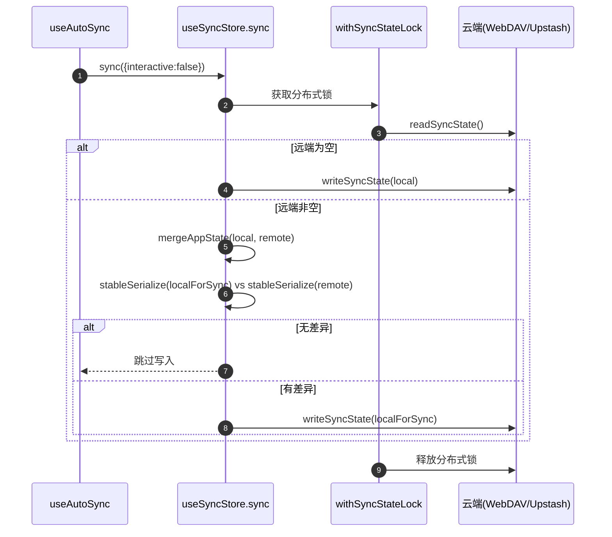

# 数据同步

> 登录/钱包/UCAN 授权机制请配合阅读 [用户登录](./用户登录.md)。

本文档基于当前代码实现，覆盖 WebDAV（Basic/UCAN）与 Upstash 两种后端，重点说明：

1. 同步哪些数据。
2. 自动同步如何触发。
3. 如何通过“分布式锁 + 事务头指针”保证一致性。
4. 为什么以前会产生大量 `__sync_txn_data_v1.*` 文件，以及当前如何收敛。

## 1. 同步范围

`app/store/sync.ts` 会同步应用完整快照（非函数字段），包含以下 store：

1. `StoreKey.Chat`
2. `StoreKey.Access`
3. `StoreKey.Config`
4. `StoreKey.Mask`
5. `StoreKey.Prompt`

说明：

1. `Chat` 上传前会过滤流式消息和空响应消息。
2. `Access`/`Config` 也在同步范围内，属于多端共享配置。
3. 同步不是单字段 patch，而是“拉远端 + 合并 + 回写”。

## 2. 自动同步触发机制

`app/hooks/useAutoSync.ts` 的触发源：

1. `startup`：页面启动后触发一次。
2. `change`：Chat/Access/Config/Mask/Prompt 的 `lastUpdateTime` 变化。
3. `interval`：默认每 5 分钟轮询一次。
4. `visibility`：页面从隐藏切回可见时触发。

触发前置条件：

1. `autoSync=true`。
2. 同步配置已 hydrate。
3. `cloudSync()` 判断当前 provider 配置可用。
4. 当前没有同步请求 in-flight。
5. 有流式消息时延后同步，避免半成品写入。
6. 中心化 UCAN 模式已支持 WebDAV 同步（不再因授权模式被禁用）。

## 3. 同步主流程（最新实现）

关键点：

1. 整个“读远端 + 合并 + 写回”在同一把远端锁内执行。
2. 已实现“无变化不写远端”，避免空闲状态持续生成事务数据文件。

## 4. 后端落点与键设计

### 4.1 状态基准键 `baseKey`

1. WebDAV：固定为 `backup`。
2. Upstash：`upstash.username`，为空则 `STORAGE_KEY`。

### 4.2 事务键（safe layout）

1. `headKey`: `<baseKey>.__sync_txn_head_v1`
2. `headBackupKey`: `<baseKey>.__sync_txn_head_v1_bak`
3. `dataKey`: `<baseKey>.__sync_txn_data_v1.<txId>`

### 4.3 WebDAV 文件路径

Basic Auth：

1. 目录：`chatgpt-next-web/`
2. 文件：`<key>.json`（仅把 `/` 替换为 `_`）
3. 示例：`backup.__sync_txn_head_v1` -> `chatgpt-next-web/backup.__sync_txn_head_v1.json`

UCAN Auth：

1. 目录由 SDK `appDir` 决定（通常 `/apps/<appId>/`）。
2. 文件名规则与 Basic 相同，仍是 `<key>.json`。
3. 中心化 UCAN 模式会按 WebDAV audience 动态签发 token 后再访问同一目录结构。

### 4.4 Upstash 存储格式

每个逻辑 key 按分片写入：

1. `<storeKey>-chunk-count`
2. `<storeKey>-chunk-0`
3. `<storeKey>-chunk-1`
4. ...

## 5. 分布式锁实现

锁逻辑入口：`app/utils/cloud/transaction.ts` 的 `withSyncStateLock()`。

锁 key：

1. `<baseKey>.__sync_mutex_v1`

WebDAV 锁实现：

1. 锁目录：`<lockKey>.__sync_lock_v1/`
2. 锁元数据：`lock.json`（`owner + expiresAt`）
3. 通过 `MKCOL` 抢锁，过期锁会被清理后重试。

Upstash 锁实现：

1. 抢锁：`SET key owner NX PX <ttl>`
2. 解锁：`EVAL` 脚本，只有 owner 相等才删除。

## 6. 事务结构与读写协议

### 6.1 事务头 `SyncTxnHead`

字段：

1. `version`
2. `txId`
3. `payloadHash`
4. `payloadBytes`
5. `committedAt`
6. `prevTxId`（用于回收旧事务数据）

### 6.2 事务数据 `SyncTxnEnvelope`

字段：

1. `version`
2. `txId`
3. `payload`
4. `payloadHash`
5. `payloadBytes`
6. `createdAt`

### 6.3 读取协议

1. 并行读取 `headKey/headBackupKey`。
2. 选最新有效 head。
3. 读取对应 `dataKey`。
4. 校验 `txId/hash/bytes`。
5. 通过后返回 payload。
6. 事务头不可用时回退读取旧单文件键（兼容历史数据）。

### 6.4 写入协议

1. 读取当前最新有效 head。
2. 生成 `txId`，计算 hash/bytes。
3. 写入 `dataKey`。
4. 回读 `dataKey` 并校验。
5. 写入 `headKey` 与 `headBackupKey`（`head.prevTxId = 上一代 txId`）。
6. 提交成功后回收更老一代事务数据（保留最近两代）。

## 7. 一致性与规模控制

当前可保证：

1. 多写者串行化：同一时刻只有一个写者进入同步临界区。
2. 无丢失更新：每个写者都在锁内读取最新远端后再合并写入。
3. 跨文件强一致（应用层语义）：先 `data` 后 `head`，读只认有效 `head`。
4. 崩溃安全：写入中断不会推进提交点。
5. 数据规模可控：成功提交后自动回收更老事务数据，避免 `__sync_txn_data_v1.*` 无界增长。
6. 向后兼容：事务头缺失时仍可读取历史单文件数据。

前提说明：

1. 上述保证以“所有写入端都使用当前锁实现”为前提。
2. 若存在旧客户端绕过锁直接写入，串行化语义会被破坏。

## 8. 代理与直连（WebDAV）

WebDAV 支持两种模式：

1. 直连：浏览器直接访问 WebDAV 服务地址。
2. 代理：经 `app/api/webdav/[...path]/route.ts` 转发。

代理层当前约束：

1. 仅允许访问 `STORAGE_KEY` 目录内路径。
2. 禁止路径穿越。
3. 允许方法：`MKCOL`/`GET`/`PUT`/`DELETE`。
4. 禁止删除根同步目录本身。

## 9. 常见问题排查

### 9.1 为什么会出现大量 `backup.__sync_txn_data_v1.<txId>.json`？

旧行为是“每次同步都写一次事务”，即使数据无变化也会产生新 tx 文件。

当前行为已修复：

1. 本地与远端稳定序列化对比无差异时，跳过写入。
2. 有差异时才写新事务。
3. 每次成功写入后会清理更老事务数据。

### 9.2 为什么仍可能看到一些历史 tx 文件？

1. 修复前已生成的历史文件不会自动一次性全量删除。
2. 当前逻辑是“从现在开始收敛”，后续会逐步保持在小范围。
3. 如需一次性清理旧文件，可单独执行离线清理脚本。

### 9.3 为什么会出现 `localhost-3020` 与 `127.0.0.1-3020` 两个目录？

根因是历史实现按浏览器 `window.location.host` 直接生成 `appId`，导致同一台机器用不同 loopback 地址访问时会落到不同目录。

当前实现已通过 `@yeying-community/web3-bs` 的 `deriveAppIdFromLocation` 做本地回环地址归一化（端口保留）：

1. `localhost`
2. `127.0.0.1`
3. `::1` / `[::1]`
4. `0.0.0.0`

以上地址都会统一映射为 `localhost`，例如：

1. `http://localhost:3020` -> `localhost-3020`
2. `http://127.0.0.1:3020` -> `localhost-3020`

说明：

1. 此改动避免后续继续分裂目录。
2. 旧目录不会被自动合并；如历史上已存在两套目录，需要按需做一次性迁移或清理。

## 10. 代码映射

1. 同步主流程：`app/store/sync.ts`
2. 自动同步触发：`app/hooks/useAutoSync.ts`
3. 事务协议与锁：`app/utils/cloud/transaction.ts`
4. WebDAV 客户端：`app/utils/cloud/webdav.ts`
5. Upstash 客户端：`app/utils/cloud/upstash.ts`
6. WebDAV 代理：`app/api/webdav/[...path]/route.ts`
7. Upstash 代理：`app/api/upstash/[action]/[...key]/route.ts`
