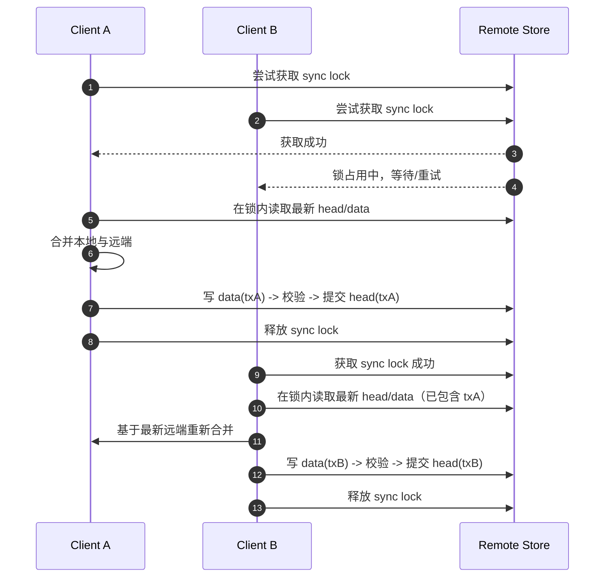

# 数据同步

本文档沉淀“聊天记录云端同步”的事务化方案，目标是解决磁盘/网络异常导致的远端半写入问题（典型表现：`JSON.parse` 报 `Unterminated string`）。

## 背景问题

旧方案是“单文件直接覆盖”：

1. 读取 `backup.json`
2. 合并本地状态
3. 直接 `PUT backup.json`

如果写入中途失败（磁盘满、连接中断、代理截断），远端会留下不完整 JSON。之后任何客户端启动自动同步都会在 `JSON.parse` 处报错并中断。

## 设计目标

1. 写入过程具备“提交点”，只暴露已完整写入的数据。
2. 读路径优先读取“已提交版本”，避免读到半成品。
3. 保持向后兼容，能读取历史单文件数据。
4. 同时支持 WebDAV 和 Upstash。

## 事务化方案（已实现）

核心思想是“双阶段提交 + 头指针”：

1. 先写事务数据对象（`data`）。
2. 回读并校验 `hash + bytes`。
3. 校验通过后再写事务头（`head`）作为提交点。
4. 读取时只认最新有效 `head` 指向的 `data`。

## 数据结构

### 事务头（`SyncTxnHead`）

- `version`
- `txId`
- `payloadHash`
- `payloadBytes`
- `committedAt`

### 事务数据（`SyncTxnEnvelope`）

- `version`
- `txId`
- `payload`（完整 JSON 字符串）
- `payloadHash`
- `payloadBytes`
- `createdAt`

## 写入流程

1. 生成 `txId`。
2. 计算 `payloadBytes` 与 `payloadHash(SHA-256)`。
3. 写入 `dataKey`。
4. 立即回读 `dataKey` 并再次校验 `hash + bytes`。
5. 校验通过后写 `headKey`。
6. 尝试写 `headBackupKey`（失败仅告警，不阻断主流程）。
7. 提交成功后清理更老的事务数据（保留最近两代提交数据，避免文件无限增长）。

如果步骤 4 失败，直接报错并终止，不会推进提交指针。

## 读取流程

1. 并行读取 `headKey` 与 `headBackupKey`。
2. 选择 `committedAt` 更新的有效头。
3. 按头中的 `txId` 读取对应 `dataKey`。
4. 校验 `txId + hash + bytes`。
5. 校验通过返回 `payload`。
6. 若事务头不可用或校验失败，回退读取历史单文件键（兼容旧数据）。

## 键设计

事务基准键 `baseKey`：

- WebDAV：固定为 `backup`
- Upstash：`upstash.username`，为空则 `STORAGE_KEY`

基于 `baseKey` 生成：

- `headKey`: `<baseKey>.__sync_txn_head_v1`
- `headBackupKey`: `<baseKey>.__sync_txn_head_v1_bak`
- `dataKey`: `<baseKey>.__sync_txn_data_v1.<txId>`

## 不同后端的落点

### WebDAV Basic

文件名按 key 落盘：`<key>.json`（仅把 `/` 替换为 `_`）。  
不再在应用侧做 URL 编码，避免 `%253A` 这类双重编码；底层 SDK 会统一做 `encodeURI`。  
目录仍是 `chatgpt-next-web/`。

示例：

- `backup` -> `chatgpt-next-web/backup.json`（兼容旧文件）
- `backup.__sync_txn_head_v1` -> `chatgpt-next-web/backup.__sync_txn_head_v1.json`

### WebDAV UCAN

同样按 key 生成文件名，目录由 `appDir` 决定（通常 `/apps/<appId>/`）。

### Upstash

按 key 分片存储，不再忽略 `get(key)/set(key)` 入参。

## 与旧方案兼容性

1. 旧单文件数据仍可读：事务头不存在时，回退读取旧键。
2. 新数据按事务键写入，后续读取优先使用事务头。
3. 不再采用“远端 JSON 损坏时自动覆盖远端”的策略，避免静默覆盖潜在有效数据。

## 关键实现映射

- 事务读写入口：`app/utils/cloud/transaction.ts`
- 同步主流程接入：`app/store/sync.ts`
- WebDAV 按 key 文件化：`app/utils/cloud/webdav.ts`
- Upstash 按 key 分片：`app/utils/cloud/upstash.ts`
- 分片算法修复（避免切片丢字符）：`app/utils/format.ts`

## 故障语义

1. 写事务数据失败：同步失败，不提交。
2. 写后校验失败：同步失败，不提交。
3. 写主头失败：同步失败，不提交。
4. 写备份头失败：记录告警，主提交流程仍成功。
5. 读到损坏头或损坏数据：尝试回退到旧单文件读取。

## 上线建议

1. 先备份现有远端 `backup.json`。
2. 部署事务版后，观察一次完整自动同步流程是否成功。
3. 确认远端出现事务文件后，再考虑清理历史损坏对象。
4. 观察日志关键字：`transaction head exists but payload is invalid`。

## 可继续优化项

1. 在 `head` 中增加 `schemaVersion`，支持未来状态结构升级。
2. 增加锁续约与锁持有者可观测信息（便于排查超时或异常退出场景）。
3. 增加后台“孤儿数据扫描清理”（针对异常中断时遗留但不再被引用的 `dataKey`）。

## 并发写时序图（当前实现）

下面的时序图描述“设备 A 和设备 B 同时自动同步”的典型路径。当前实现使用远端分布式锁，保证“同一时刻只有一个写者”。

## 一致性保证（当前实现）

1. 多写者串行化：通过远端分布式锁，任一时刻仅允许一个客户端执行“读远端 + 合并 + 写回”流程。
2. 无丢失更新：每个写者都在持锁状态下读取最新已提交版本后再合并提交，后续写者不会基于过期快照覆盖前序提交。
3. 跨文件强一致（应用层语义）：`data` 与 `head` 的提交只在持锁流程内发生，且先写并校验 `data`，后更新 `head`；读取仅以最新有效 `head` 为准，不会读到未提交事务。
4. 崩溃安全：写入中断时不会推进提交点，已提交版本保持可读。
5. 数据规模可控：每次成功提交后会回收更老的事务数据，避免 `__sync_txn_data_v1.*` 无界增长。
6. 向后兼容：事务头缺失时仍可读取历史单文件数据。

## 说明

上述强一致语义以“所有写入客户端都使用当前加锁实现”为前提。若存在旧版本客户端绕过锁直接写入，会破坏串行化保证。
