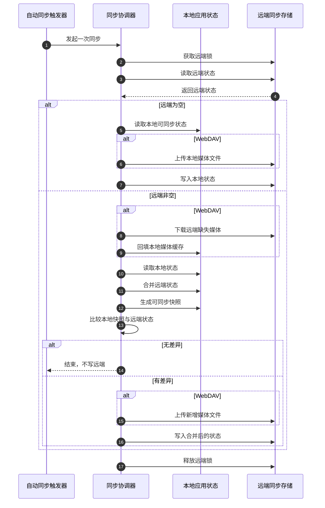

# 数据同步方案

> 登录、钱包和 UCAN 授权机制请配合阅读 [用户登录方案](./用户登录方案.md)。  
> 本文档解释 Chat 应用的数据同步对象、同步流程、一致性设计、媒体文件处理和后续扩展边界。

## 1. 设计目标

数据同步要解决的是“同一个用户在多个浏览器、设备或桌面端之间继续使用”的问题。

当前方案的目标是：

1. 同步聊天、配置、面具和提示词等核心资产。
2. 支持 WebDAV 和 Upstash 两类远端存储。
3. 多端同时写入时尽量避免丢数据。
4. WebDAV 场景下，让聊天里引用的图片和音频也能跟随状态恢复。
5. 控制远端文件数量，避免同步过程无限产生事务文件。

当前方案不是“实时协同编辑”，而是“多端快照合并”。它更适合个人多端使用，而不是多人同时编辑同一份会话。

## 2. 核心对象

### 2.1 自动同步触发器

自动同步触发器负责判断“什么时候应该同步”。

触发来源包括：

1. 应用启动
2. 关键本地状态变化
3. 定时轮询
4. 页面从后台切回前台

它只负责触发，不负责决定怎么合并。

### 2.2 同步协调器

同步协调器负责一次完整同步流程。

它要完成：

1. 检查当前同步配置是否可用
2. 获取远端锁
3. 读取远端状态
4. 合并本地与远端状态
5. 判断是否需要写回
6. 写回状态和媒体文件
7. 释放远端锁

### 2.3 本地应用状态

本地应用状态是浏览器或桌面端当前保存的用户资产。

当前同步范围包括 5 类：

1. `Chat`
   - 聊天主数据：会话、消息、删除记录、输入草稿
2. `Access`
   - 模型服务接入配置：API 地址、秘钥、权限开关
3. `Config`
   - 应用默认行为：UI 设置、默认模型参数、TTS/Realtime 配置
4. `Mask`
   - 可复用角色模板：人设、预置上下文、模型覆盖配置
5. `Prompt`
   - 可复用提示词条目：标题和正文

### 2.4 远端同步存储

远端同步存储是多个端之间交换状态的中转点。

当前支持：

1. WebDAV
2. Upstash

两者都保存应用状态快照。WebDAV 额外保存媒体文件。

### 2.5 媒体对象

媒体对象指聊天或面具上下文中引用的缓存图片和音频。

它们不会被内联进状态 JSON，而是作为单独文件保存。状态里只保留引用地址。

## 3. 同步资产边界

当前同步的是“应用可迁移资产”，不是所有运行态。

会同步：

1. 聊天会话和消息
2. 模型访问配置
3. 应用行为配置
4. 用户创建的面具
5. 用户保存的提示词
6. WebDAV 场景下的缓存图片和音频

不会作为主同步对象处理：

1. 同步配置自身
2. 插件运行态
3. 更新检查状态
4. 正在流式生成的半成品消息
5. 空响应消息

这样划分的原因是：

1. 同步核心用户资产
2. 避免把不稳定运行态写入远端
3. 降低多端合并复杂度

## 4. 主流程

流程要点：

1. 同步不是单字段 patch，而是“读远端、合并、必要时回写”。
2. 远端为空时，以本地状态作为初始远端状态。
3. 远端已有状态时，先合并到本地，再判断是否需要回写。
4. 本地与远端没有差异时不写远端，避免空同步持续产生新文件。
5. WebDAV 媒体同步跟随状态流程，但媒体文件和状态文件分开保存。

## 5. 合并策略

### 5.1 聊天数据

聊天数据是最复杂的一类，因为它包含新增、更新、删除和流式生成。

当前策略是：

1. 会话按 `id` 合并
2. 消息按 `id` 合并
3. 已删除的会话和消息通过删除记录参与合并
4. 流式消息不上传
5. 空响应消息不上传
6. 合并后按更新时间重新排序

这样做的目标是：

1. 尽量保留多端新增内容
2. 让删除动作能够跨端生效
3. 避免把半成品消息同步出去

### 5.2 配置类数据

Access 和 Config 属于配置类状态。

它们的特点是：

1. 字段多
2. 用户通常希望多端一致
3. 有些字段包含敏感信息，例如 API Key

当前策略是把它们纳入同步范围。开启云同步前，用户需要意识到这些配置会进入远端存储。

### 5.3 面具和提示词

Mask 和 Prompt 更接近用户资产库。

当前策略是：

1. 按对象集合合并
2. 保留本地已有条目
3. 吸收远端新增条目

这适合“多端创建，最终汇总”的使用方式。

## 6. WebDAV 媒体同步

WebDAV 比 Upstash 多处理一类对象：媒体文件。

### 6.1 为什么媒体不内联进状态

图片和音频通常比状态 JSON 大很多。如果直接内联，会带来几个问题：

1. 状态文件膨胀
2. 每次状态变更都可能重复上传大对象
3. 远端事务文件变大，失败概率更高
4. Upstash 这类键值存储不适合承载大量二进制媒体

因此当前方案把状态和媒体拆开：

1. 状态 JSON 保存引用
2. 媒体文件保存到 WebDAV 的媒体目录

### 6.2 哪些媒体会同步

当前只同步命中本地缓存地址的媒体，包括：

1. 消息音频
2. 消息图片
3. 会话面具上下文里的媒体
4. 用户面具库上下文里的媒体

外部 URL 不会被搬运到 WebDAV。

### 6.3 上传与回填

上传发生在写状态前：

1. 扫描本地状态里的媒体引用
2. 从本地缓存读取媒体内容
3. 上传到 WebDAV 媒体目录
4. 状态里继续保留规范化后的引用

回填发生在读到远端状态后：

1. 扫描远端状态里的媒体引用
2. 检查本地缓存是否已有
3. 本地缺失时从 WebDAV 下载
4. 写回本地缓存，让前端继续按原引用展示

## 7. 一致性设计

### 7.1 远端锁

同步开始时会先获取远端锁。

它解决的问题是：

1. 多个端同时同步时，避免同时写远端
2. 让“读远端、合并、写回”成为一个串行过程

这保证了同一时刻只有一个写者进入同步临界区。

### 7.2 事务头和事务数据

远端状态写入采用“事务头 + 事务数据”的结构。

它解决的问题是：

1. 大状态写入过程中可能中断
2. WebDAV / Upstash 都不是数据库事务
3. 读端不能读到半提交状态

写入顺序是：

1. 先写事务数据
2. 校验事务数据
3. 再推进事务头

读取时只认有效事务头指向的数据。

### 7.3 为什么保留最近两代

当前会保留当前版本和上一版本。

这样做的原因是：

1. 当前版本是正常读取入口
2. 上一版本提供回退空间
3. 更老版本会被清理，避免事务数据无限增长

### 7.4 一致性边界

当前能保证：

1. 使用当前同步实现的多个端会串行写入
2. 写入中断不会推进提交点
3. 无变化时不写远端
4. 历史单文件状态仍可被读取

当前不能保证：

1. 多人实时协同编辑
2. 旧客户端绕过锁写入时的正确性
3. WebDAV 媒体上传失败后状态与媒体一定同时成功

## 8. 远端存储布局

### 8.1 WebDAV

WebDAV 保存两类对象：

1. 状态文件
2. 媒体文件

Basic Auth 模式下，状态和媒体位于应用同步目录中。  
UCAN 模式下，目录由应用身份派生，确保不同应用和不同授权上下文隔离。

### 8.2 Upstash

Upstash 只保存状态 JSON。

由于值大小有限，状态会按分片形式存储。媒体文件不走 Upstash 同步。

### 8.3 代理与直连

WebDAV 支持两种访问方式：

1. 浏览器直连 WebDAV
2. 经应用后端代理访问 WebDAV

代理模式的价值是：

1. 统一路径限制
2. 减少浏览器跨域问题
3. 对可访问目录和方法做约束

直连模式的价值是：

1. 链路更短
2. 不依赖应用后端转发
3. 对 WebDAV 服务端 CORS 和安全配置要求更高

## 9. 方案合理性

### 9.1 为什么用快照合并

Chat 应用的数据结构跨多个 store，且会话、配置、面具、提示词之间存在组合关系。

使用快照合并的好处是：

1. 实现边界清晰
2. 易于支持多个后端
3. 不需要为每个字段设计远端 patch 协议
4. 对个人多端同步足够实用

代价是：

1. 不适合高频多人协同
2. 冲突语义需要由合并策略承担

### 9.2 为什么要有远端锁

如果没有锁，两个端可能同时执行：

1. 读取同一个旧远端状态
2. 分别合并自己的本地变化
3. 后写入的一端覆盖先写入的一端

锁让多个写者串行进入同步流程，降低丢更新风险。

### 9.3 为什么无变化不写

旧行为会在每次同步时都生成新事务文件，即使状态没有变化。

当前方案改为：

1. 合并后先比较
2. 有差异才写远端
3. 成功后清理更旧事务

这样能控制远端文件数量，也减少不必要网络请求。

## 10. 扩展性

### 10.1 新增同步资产

新增资产时，需要先判断它属于哪一类：

1. 用户长期资产
2. 配置
3. 临时运行态
4. 大型二进制对象

只有前两类适合进入状态快照。大型二进制对象应像媒体文件一样单独保存。

### 10.2 新增远端后端

新增远端后端时，需要具备：

1. 基本读写能力
2. 锁能力或可模拟锁的能力
3. 原子推进提交点的能力
4. 可控的数据大小限制

否则很难维持当前一致性语义。

### 10.3 更强冲突处理

如果未来要支持更复杂的冲突处理，可以演进为：

1. 给更多对象增加稳定更新时间
2. 引入字段级合并策略
3. 引入冲突日志
4. 为用户提供冲突恢复入口

当前暂不需要引入这类复杂度。

## 11. 常见问题

### 11.1 为什么会出现很多事务数据文件

旧版本每次同步都会写新事务，即使没有变化也会生成文件。

当前方案已经改为有差异才写，并在成功提交后清理更旧事务。

### 11.2 为什么历史事务文件不会立刻消失

当前清理策略是“从后续成功写入开始收敛”，不是启动时全量扫描删除。

这样做更稳妥，避免误删仍可能被旧状态引用的数据。

### 11.3 为什么图片或音频状态到了但内容缺失

状态和媒体是分开同步的，所以可能出现：

1. 状态成功写入，但某个媒体上传失败
2. 状态成功拉取，但某个媒体下载失败
3. 本地缓存不可用，无法回填

这种情况下，优先检查 WebDAV 媒体目录和浏览器控制台中的媒体同步错误。

### 11.4 为什么本地地址可能导致两个目录

历史上本地访问地址如果同时使用 `localhost` 和 `127.0.0.1`，可能派生出不同应用目录。

当前已对本地回环地址做归一化，后续不会继续分裂。旧目录如果已经存在，需要按需迁移或清理。

## 12. 实现映射

正文只讨论方案对象和流程。为了维护方便，这里保留最少量实现映射：

1. 自动同步触发：`app/hooks/useAutoSync.ts`
2. 同步协调器：`app/store/sync.ts`
3. 本地状态合并：`app/utils/sync.ts`
4. 锁与事务协议：`app/utils/cloud/transaction.ts`
5. WebDAV 客户端：`app/utils/cloud/webdav.ts`
6. Upstash 客户端：`app/utils/cloud/upstash.ts`
7. WebDAV 代理：`app/api/webdav/[...path]/route.ts`
8. Upstash 代理：`app/api/upstash/[action]/[...key]/route.ts`
