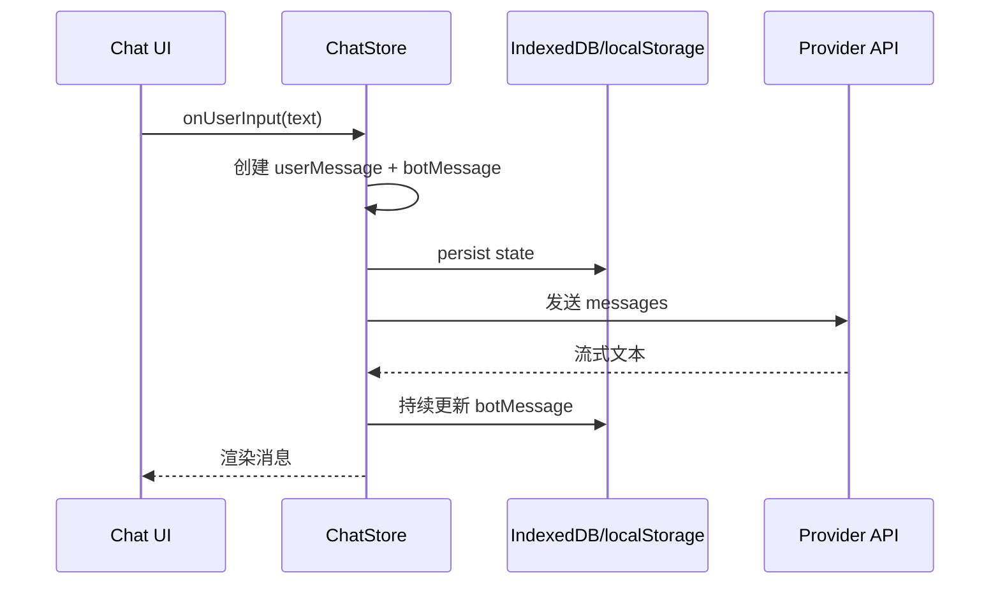
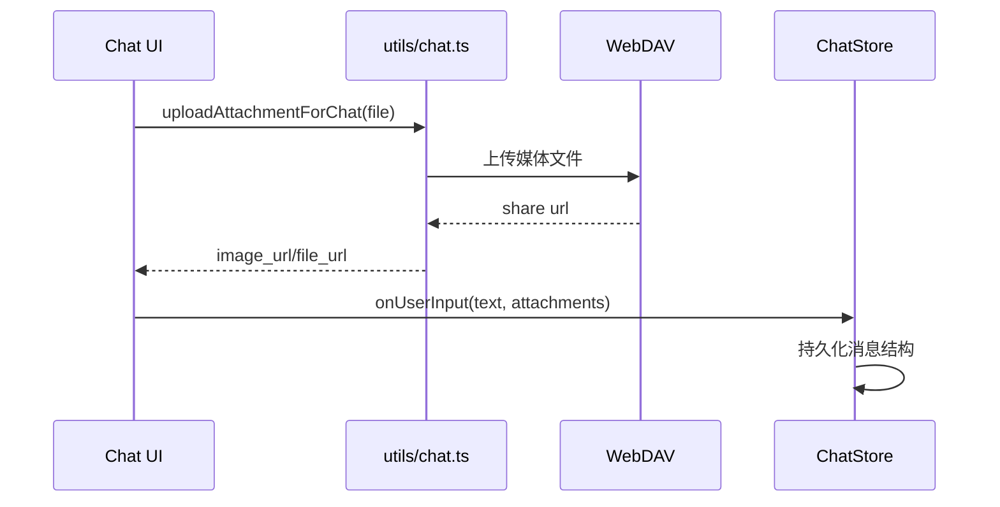
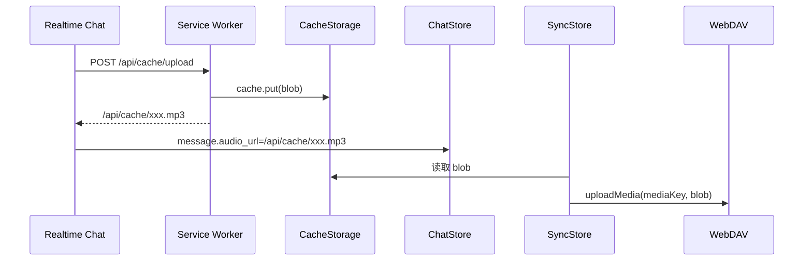

# Chat 应用数据存取方案

本文档基于当前仓库实现，梳理 Chat 应用在运行过程中产生的文本、图片、音频、视频及附件数据的存储与读取方式，并明确当前方案存在的问题。

目标不是描述理想架构，而是把“现在真实发生了什么”讲清楚，便于后续重构、排障和统一存储口径。

---

## 1. 范围与结论

当前应用没有单一的数据总线或统一媒体仓库，而是同时使用了以下几类存储介质：

1. `IndexedDB`
2. `localStorage`
3. 浏览器 `CacheStorage`
4. `WebDAV`
5. 第三方模型或外部服务返回的远端 URL

可先记住两个总原则：

1. `结构化聊天状态` 主要存本地 `IndexedDB`，失败时回退到 `localStorage`。
2. `二进制媒体` 没有统一落点，而是按来源分散到 `CacheStorage`、`WebDAV` 或第三方外链，消息体中通常只保存 URL 或多模态片段。

---

## 2. 数据分层

从当前代码看，应用内数据大致分为四层：

### 2.1 会话层

会话由 `ChatSession` 表示，包含：

1. `id`
2. `topic`
3. `messages`
4. `mask`
5. `memoryPrompt`
6. `stat`
7. `lastUpdate`

定义见 `app/store/chat.ts`。

### 2.2 消息层

消息由 `ChatMessage` 表示，核心字段包括：

1. `role`
2. `content`
3. `id`
4. `date`
5. `updatedAt`
6. `status`
7. `audio_url`
8. `tools`

其中：

1. `content` 可能是纯文本字符串；
2. 也可能是多模态数组 `MultimodalContent[]`；
3. `audio_url` 独立于 `content` 存放，没有纳入统一多模态结构。

### 2.3 媒体层

媒体数据当前分为几类：

1. 聊天图片附件
2. PDF 附件
3. 实时语音录音与播放结果
4. 模型生成图片
5. 模型返回视频 URL

这些数据并不都由同一个上传流程处理。

### 2.4 同步快照层

同步时上传的是应用状态快照 `AppState`，而不是消息增量。  
快照包含：

1. `Chat`
2. `Access`
3. `Config`
4. `Mask`
5. `Prompt`

另外，对本地 `/api/cache/...` 媒体还会额外做一轮 WebDAV 媒体补传。

---

## 3. 存储介质与职责

## 3.1 IndexedDB

职责：

1. 持久化保存主要业务 store
2. 作为聊天会话和配置的首选本地存储

实现方式：

1. `createPersistStore()` 统一给 zustand store 挂 `persist`
2. `persist.storage = createJSONStorage(() => indexedDBStorage)`
3. `indexedDBStorage` 基于 `idb-keyval`

对应代码：

1. `app/utils/store.ts`
2. `app/utils/indexedDB-storage.ts`

## 3.2 localStorage

职责：

1. IndexedDB 失败时的兜底存储
2. 保存部分轻量状态，例如未发送输入草稿

说明：

1. 当前它既是持久化 fallback，也是零散状态存储点。
2. 这意味着不同数据的生存周期和一致性策略并不统一。

## 3.3 CacheStorage

职责：

1. 保存通过 `Service Worker` 接管的本地媒体文件
2. 主要承载 `/api/cache/...` 形式的图片和音频

实现方式：

1. `POST /api/cache/upload` 由 `public/serviceWorker.js` 拦截
2. 将 `file/blob` 写入 `chatgpt-next-web-file`
3. 返回 `/api/cache/<随机名>.<ext>`

说明：

1. 这不是服务端对象存储，而是浏览器本地缓存。
2. 只有当前浏览器环境能直接读取，除非后续同步到 WebDAV。

## 3.4 WebDAV

职责：

1. 保存同步快照文件
2. 保存附件文件
3. 保存从本地 cache 补传的媒体文件
4. 通过公开分享链接暴露可访问 URL

说明：

1. 对于聊天上传图片/PDF，WebDAV 是主落点。
2. 对于 `/api/cache/...` 图片和音频，WebDAV 是同步时的补偿落点，而不是首次写入落点。

## 3.5 第三方远端 URL

职责：

1. 承载某些模型生成图片地址
2. 承载某些模型生成视频地址

说明：

1. 当前应用并不会总是把第三方 URL 接管到自己的存储。
2. 因此，媒体可用性受外部服务生命周期影响。

---

## 4. 数据模型

## 4.1 文本消息

纯文本消息：

```ts
{
  role: "user" | "assistant" | "system",
  content: "纯文本",
}
```

多模态消息：

```ts
{
  role: "user" | "assistant",
  content: [
    { type: "text", text: "请描述这张图" },
    { type: "image_url", image_url: { url: "..." } },
    { type: "file_url", file_url: { url: "...", name: "...", mime_type: "..." } },
  ],
}
```

### 4.2 音频消息

当前音频没有并入 `content[]`，而是作为消息顶层字段：

```ts
{
  role: "user" | "assistant",
  content: "语音转写文本",
  audio_url: "/api/cache/xxx.mp3"
}
```

这是现状中的一个重要建模分裂点。

### 4.3 视频消息

当前没有统一的 `video_url` 结构。  
部分视频结果是直接以 HTML 字符串写入消息文本，例如：

```html
<video controls src="https://remote.example/video.mp4"></video>
```

也就是说，视频更多是“文本渲染协议”的一部分，而不是应用内部显式建模的媒体对象。

---

## 5. 各类数据的写入与读取

## 5.1 文本数据

### 5.1.1 写入

用户发送消息时：

1. `app/components/chat.tsx` 收集输入
2. `app/store/chat.ts` 的 `onUserInput()` 组装 `userMessage`
3. 立即创建占位 `botMessage`
4. 两条消息一起写入当前 `session.messages`
5. 流式返回时不断更新 `botMessage.content`
6. 完成后状态固定为 `done`

### 5.1.2 落地

聊天 store 通过 zustand persist 持久化：

1. 首选写入 `IndexedDB`
2. 异常时回退到 `localStorage`

### 5.1.3 读取

1. 应用启动时自动 hydrate store
2. UI 渲染时用 `getMessageTextContent()` 提取文本
3. 最终由 `Markdown` 组件渲染

---

## 5.2 图片数据

当前图片至少有三条来源链路，不能混为一谈。

### 5.2.1 用户上传图片附件

入口：

1. 点击上传
2. 输入框粘贴图片

处理：

1. `uploadAttachmentForChat(file)` 校验文件类型
2. 调 `uploadFileToWebDavAndCreateShareLink(...)`
3. 文件上传到 WebDAV `media` 目录
4. 创建分享链接
5. 返回 `image_url`

消息中保存的是：

```ts
{
  type: "image_url",
  image_url: {
    url: "https://webdav-share/...",
    detail: "low"
  }
}
```

读取方式：

1. UI 从 `content[]` 中取 `image_url.url`
2. 使用 `` 渲染
3. 发给模型时按 provider 协议转成图片输入

### 5.2.2 本地缓存图片

来源：

1. `uploadImage(file)` 且 `Service Worker` 可用
2. OpenAI 图像生成返回 `b64_json` 后转 blob 再走 `uploadImage`

处理：

1. `POST /api/cache/upload`
2. `Service Worker` 写入 `CacheStorage`
3. 返回 `/api/cache/<id>.<ext>`

消息中保存的是：

```ts
{
  type: "image_url",
  image_url: {
    url: "/api/cache/xxx.png"
  }
}
```

读取方式：

1. 浏览器请求 `/api/cache/...`
2. `Service Worker` 从 `CacheStorage` 返回 blob

### 5.2.3 降级内联图片

当 `Service Worker` 不可用时：

1. 图片先压缩
2. 转成 `data:image/...;base64,...`
3. 直接塞进消息 `image_url.url`

特点：

1. 不依赖本地缓存和后端文件服务
2. 但会显著抬高消息体大小和上下文成本

### 5.2.4 图片发送给模型前的处理

如果消息中是 `/api/cache/...` 本地图片：

1. 先 fetch 取回 blob
2. 压缩到约 `256KB`
3. 转为 base64
4. 按各模型协议改写 payload

这一步说明：

1. 本地缓存 URL 对模型并不总是可直接消费
2. 当前应用额外承担了图片二次编码的工作

---

## 5.3 PDF 附件

### 5.3.1 写入

PDF 和图片附件共用 `uploadAttachmentForChat(file)`，但返回结构不同：

```ts
{
  type: "file_url",
  file_url: {
    url: "https://webdav-share/...",
    name: "xxx.pdf",
    mime_type: "application/pdf"
  }
}
```

文件本体同样落到 WebDAV。

### 5.3.2 读取

读取场景分两类：

1. UI 中作为附件元信息显示文件名
2. 发给支持文件输入的模型时转为 `input_file`

说明：

1. 当前 UI 里对 PDF 的处理偏轻，主要是“显示已附加”和“参与模型请求”。
2. 它没有统一的附件预览、生命周期管理和下载管理。

---

## 5.4 音频数据

### 5.4.1 来源

当前音频主要来自实时对话：

1. 用户录音片段
2. 模型语音回复的播放结果

### 5.4.2 写入

流程：

1. 前端录音或接收流式音频
2. 汇总为 `Blob`
3. 复用 `uploadImage(blob)` 上传
4. 若 `Service Worker` 可用，则进入 `CacheStorage`
5. 返回 `/api/cache/xxx.<ext>`
6. 写入 `message.audio_url`

这里要注意，音频没有专门的 `uploadAudio()`，而是复用了图片上传入口。

### 5.4.3 读取

1. UI 判断 `message.audio_url`
2. 用 `<audio src={message.audio_url} controls />` 播放

### 5.4.4 同步

若 `audio_url` 指向 `/api/cache/...`：

1. 同步前会扫描出来
2. 读取本地 blob
3. 补传到 WebDAV `media`
4. 其他端同步后再回填本地 `CacheStorage`

---

## 5.5 视频数据

### 5.5.1 写入

以 GLM 视频模型为例：

1. 模型返回 `json.data[0].url`
2. 客户端直接拼出 `<video controls src="..."></video>`
3. 最终把这段 HTML 字符串写进消息文本

### 5.5.2 读取

1. `Markdown` 渲染消息文本
2. 自定义渲染组件解析出 `<video>`
3. 浏览器直接播放远端地址

### 5.5.3 特点

1. 应用没有本地视频对象模型
2. 没有视频上传通道
3. 没有视频同步通道
4. 没有视频元数据索引

---

## 6. 同步与备份方案

## 6.1 应用状态同步

同步入口在 `app/store/sync.ts`。

核心流程：

1. 读取本地 `AppState`
2. 从远端读已有快照
3. 合并远端与本地
4. 有差异则回写远端

同步内容包括：

1. 聊天会话与消息
2. Access 配置
3. App 配置
4. Mask
5. Prompt

### 6.2 本地媒体同步

同步不会只上传状态 JSON，还会额外扫描媒体引用。

扫描对象：

1. `session.messages`
2. `session.mask.context`
3. `mask.context`

当前只识别两类 cache 媒体：

1. `message.audio_url`
2. `content[].image_url.url`

处理方式：

1. 如果 URL 属于 `/api/cache/...`
2. 从本地 `CacheStorage` 或 fetch 拿到 blob
3. 调 `client.uploadMedia(...)` 上传到 WebDAV

### 6.3 远端回填本地 cache

远端同步恢复时：

1. 从远端状态扫描出 `/api/cache/...` 引用
2. 若本地无对应 cache
3. 从 WebDAV 下载 blob
4. 重新写入本地 `CacheStorage`

这个设计保证了多端同步后，本地音频和本地缓存图片仍可继续通过 `/api/cache/...` 读取。

### 6.4 导入导出

当前提供应用快照导入导出：

1. 导出：将 `AppState` 序列化为 JSON
2. 导入：读取 JSON 后合并进本地状态

注意：

1. 导出的核心是状态 JSON，不是完整媒体包。
2. 其中若包含外部 URL 或 `/api/cache/...` URL，本身不等于媒体文件一定一并可用。

---

## 7. 端到端数据流

## 7.1 文本会话



## 7.2 图片附件



## 7.3 本地音频



---

## 8. 当前方案存在的问题

下面的问题按“结构性问题优先、实现细节问题次之”来列。

## 8.1 媒体模型不统一

现状：

1. 图片放在 `content[].image_url`
2. PDF 放在 `content[].file_url`
3. 音频放在顶层 `audio_url`
4. 视频直接塞进 HTML 文本

问题：

1. 同一种“媒体”没有统一数据模型。
2. UI、同步、导出、provider 适配都要分别写分支。
3. 后续若要支持附件检索、批量导出、媒体治理，会非常分散。

影响：

1. 功能扩展成本高
2. 类型系统难收敛
3. 容易遗漏某一类媒体

## 8.2 二进制文件落点分裂

现状：

1. 图片附件和 PDF 首次写入 WebDAV
2. 音频和部分图片首次写入 CacheStorage
3. 视频通常只保留第三方 URL

问题：

1. “上传即持久化”没有统一语义。
2. 同一个消息里的不同附件，可能分别存在浏览器本地、WebDAV、第三方服务。
3. 某些引用是否长期可访问，不由应用自身保证。

影响：

1. 排障困难
2. 备份恢复语义不清楚
3. 多端一致性依赖额外补偿逻辑

## 8.3 `Service Worker` 可用性决定存储行为

现状：

1. `uploadImage()` 是否走 `/api/cache/upload` 取决于当前页面是否被 `Service Worker` 控制。
2. 不可用时直接降级为 Data URL。

问题：

1. 相同功能在不同浏览器状态下写入结果不同。
2. 这会导致同类消息有时存 URL，有时存 base64。
3. 数据体积、性能、同步成本都不稳定。

影响：

1. 难以形成可预测的数据规范
2. 容易触发超长消息、超大快照和上下文膨胀

## 8.4 Data URL 会放大状态体积

现状：

1. 当 SW 不可用时，图片直接变成 base64 Data URL 存在消息内。

问题：

1. Data URL 会显著增大 `Chat` store 的 JSON 大小。
2. 会直接推高 IndexedDB 存储量、同步 payload 大小和模型上下文成本。
3. 文本消息与二进制编码混在同一个消息字段中。

影响：

1. 本地持久化更重
2. 同步更慢
3. 导入导出文件更大
4. 更容易触发模型 token 和请求大小问题

## 8.5 音频复用图片上传接口，语义不清

现状：

1. 音频 blob 通过 `uploadImage(blob)` 进入 `/api/cache/upload`

问题：

1. 接口命名与数据类型不匹配。
2. 未来若加入图片专属预处理、MIME 校验或安全限制，音频链路可能被误伤。
3. 调试日志和异常语义都会误导维护者。

影响：

1. 可维护性差
2. 难以演进成清晰的媒体网关

## 8.6 视频没有进入统一媒体存储体系

现状：

1. 视频通常只以远端 URL + HTML 片段形式存在

问题：

1. 没有显式视频对象
2. 没有同步补传
3. 没有元数据管理
4. 第三方 URL 失效后，本地消息仍保留展示代码但无法播放

影响：

1. 视频能力不可控
2. 备份恢复不完整

## 8.7 同步只扫描了部分媒体字段

现状：

同步扫描当前只覆盖：

1. `audio_url`
2. `image_url.url`

问题：

1. `file_url` 不在 cache 媒体扫描范围内。
2. 视频 URL 不在扫描范围内。
3. 未来新增媒体类型如果不补扫描逻辑，会直接漏同步。

说明：

1. 对 `file_url` 来说，因为首次已在 WebDAV，问题没图片/音频严重；
2. 但这也反过来说明同步层并没有统一媒体注册表，而是在靠字段约定硬编码识别。

## 8.8 导出/导入不是完整媒体归档

现状：

1. 导出的是 `AppState` JSON
2. 媒体文件本体并不总随导出文件一起打包

问题：

1. 导出的 JSON 不等于“完整聊天资产包”。
2. 若里面含第三方 URL，恢复后依赖外链仍然可访问。
3. 若里面含 `/api/cache/...`，没有对应媒体文件时仅靠 JSON 本身无法恢复。

影响：

1. 用户对“备份”的预期可能与真实能力不一致

## 8.9 删除治理不完整

现状：

1. 删除会话或消息主要删除状态引用
2. 本地 cache 文件和 WebDAV 媒体文件没有统一的引用计数和回收机制

问题：

1. 删除消息后，媒体文件可能仍残留。
2. 可能出现“消息已删，媒体仍占空间”的情况。
3. 同一个媒体若被多处引用，当前也没有引用关系表。

影响：

1. 空间不可控
2. 存储清理难做

## 8.10 状态快照同步过粗

现状：

1. 同步以整个 `AppState` 快照为单位

问题：

1. 单条消息里的大附件引用变化，也会推动整包快照比较和回写。
2. 缺少消息级、附件级增量同步语义。
3. 当聊天数据继续增长时，快照同步成本会越来越高。

影响：

1. 同步放大效应明显
2. 后续历史会话很多时，性能压力会逐渐上来

## 8.11 本地状态和媒体状态没有统一事务边界

现状：

1. 先生成 URL/上传媒体
2. 再写消息状态
3. 或先写消息，再异步补齐某个 `audio_url`

问题：

1. 媒体写入与消息状态写入不是一个原子事务。
2. 中途中断时可能出现“有消息没媒体”或“有媒体没引用”。
3. Realtime 音频就是先落文本，再异步补 `audio_url`。

影响：

1. 出现半成品状态时，恢复逻辑更复杂

## 8.12 存储职责和接口命名不清晰

现状：

1. `uploadImage()` 实际可传图片、音频 blob
2. `uploadAttachmentForChat()` 只支持图片和 PDF
3. 同步层又有独立 `uploadMedia()`

问题：

1. 接口按“历史用途”长出来，而不是按“媒体能力边界”设计。
2. 业务层很难判断应该选哪条链路。
3. 未来继续加视频、Office 文档、通用文件时会继续分叉。

---

## 9. 建议的收敛方向

本文不展开完整重构设计，但从现状看，后续至少应收敛以下几个方向：

1. 统一媒体对象模型：图片、音频、视频、文件都进 `content[]` 或单独的统一 `attachments[]`。
2. 统一媒体上传网关：明确区分“本地临时缓存”和“持久化存储”。
3. 明确导出语义：区分“状态导出”和“全量资产导出”。
4. 统一媒体索引：让同步、渲染、清理、导出都走同一份媒体注册信息。
5. 弱化对 `Service Worker` 可用性的行为分叉，减少 Data URL 作为正式存储格式的使用。
6. 给媒体建立生命周期治理机制，包括删除、回收、失效检测和引用关系。

---

## 10. 总结

当前实现能工作，但它更像是多条功能链路逐步叠加后的结果，而不是一个统一规划过的数据存取体系。

它的优点是：

1. 功能已经覆盖文本、图片、PDF、音频、视频等多种场景
2. 本地可离线持久化
3. 多端可通过 WebDAV 做状态与部分媒体同步

它的主要问题是：

1. 数据模型不统一
2. 媒体落点不统一
3. 备份与恢复语义不统一
4. 同步和清理逻辑依赖字段约定与补偿代码

所以，当前文档适合作为后续数据层重构的基线说明：  
先统一事实，再统一方案。
