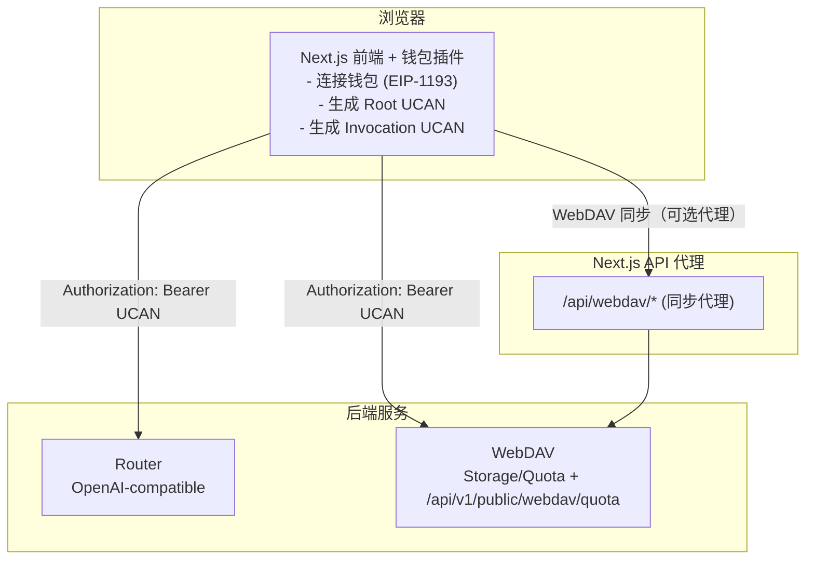

# 架构图 / 部署说明 / 安全清单

> 登录/授权/钱包/UCAN 的统一说明已收口到 [用户登录方案](./用户登录方案.md)。若你要先理解授权模型、会话存储与解锁钱包原因，请优先阅读该文档。

本文档描述当前系统的整体架构、部署方式与安全建议。

## 架构图



## 部署说明

### 1) 环境变量

- `ROUTER_BACKEND_URL`：Router 默认后端地址（可选，前端默认值）
- `WEBDAV_BACKEND_BASE_URL`：WebDAV 后端基础地址（必填，不含路径）
- `WEBDAV_BACKEND_PREFIX`：WebDAV 路径前缀（默认 `/dav`，可选修改）
- Root UCAN 能力模型（前端默认）：
  - Router：`app:all:<appId> + invoke`
  - WebDAV：`app:all:<appId> + write`
  - 其中 `appId` 由当前前端域名派生（如 `localhost:3020 -> localhost-3020`）
- Root UCAN 声明中会附带 `service_hosts`：
  - `service_hosts.router = <router-host>`
  - `service_hosts.webdav = <webdav-host>`
  - 当 `service_hosts` 缺失或与当前配置不一致时，前端会要求重新授权

### 2) 启动

```bash
cp .env.template .env
npm install
npm run dev
```

默认端口：`3020`

### 3) 生产构建

```bash
npm install
npm run build
npm run start
```

### 4) 代理服务

建议将 Router 与 WebDAV 放在可信网络，浏览器直接访问 Router/WebDAV 的业务接口；WebDAV 文件同步可按需使用 `/api/webdav/*` 代理。对直连接口需在服务端配置 CORS 与来源白名单。

## 与登录文档的边界

本文档只保留架构和部署视角下必须出现的授权约束：

- 浏览器如何向 Router / WebDAV 附带 Bearer UCAN
- 代理层与直连的边界
- 部署时必须满足的 `aud`、CORS、HTTPS 与最小权限要求

以下通用内容不在本文重复展开，请统一参考 [用户登录方案](./用户登录方案.md)：

- 钱包登录、Access Code / API Key、WebDAV Basic Auth 的边界
- Root / Session / Invocation 的完整概念说明
- 本地存储位置、钱包解锁与重新授权条件

## 安全清单

### 必做

- [ ] **路径白名单**：仅允许转发需要的 API 路由
- [ ] **过滤敏感头**：不透传 `host/origin/referer`
- [ ] **最小权限 UCAN**：仅授予必须的 `with/can`（兼容 `resource/action`）
- [ ] **audience 绑定**：确保 `aud` 与后端 `UCAN_AUD` 匹配
- [ ] **Root UCAN 过期控制**：过期必须重新授权

### 建议

- [ ] Router/WebDAV 仅内网可访问
- [ ] HTTPS 部署，确保钱包签名安全上下文
- [ ] Nginx 只暴露 `:3020`
- [ ] 监控异常鉴权失败/频繁授权重试

## 相关文档

- 用户登录方案：`docs/用户登录方案.md`
- 数据同步实现：`docs/数据同步方案.md`
- MCP 开关与运行机制：`docs/MCP启用机制与演进.md`
- 模型端点选择与支持机制：`docs/模型端点选择与支持机制.md`
