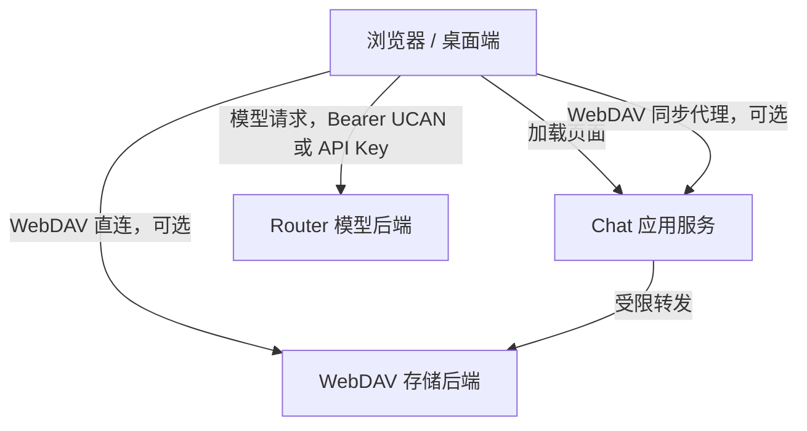

# 架构部署安全清单

> 登录和授权方案请先阅读 [用户登录方案](./用户登录方案.md)。  
> 数据同步方案请配合阅读 [数据同步方案](./数据同步方案.md)。  
> 本文档从部署视角说明系统对象、网络边界、配置项和安全风险控制。

## 1. 文档目标

本文档回答 4 个部署问题：

1. Chat 应用部署后有哪些运行对象。
2. 浏览器、应用服务、Router 和 WebDAV 之间的边界在哪里。
3. 生产环境必须配置哪些变量和访问控制。
4. 上线前需要检查哪些安全风险。

它不是功能说明，也不是登录机制说明，而是部署和运维视角的安全边界文档。

## 2. 部署对象

### 2.1 浏览器 / 桌面端

浏览器或桌面端承载用户界面。

它负责：

1. 发起登录和授权
2. 发起模型请求
3. 发起数据同步
4. 保存本地应用状态

它不应该被视为可信后端。所有来自浏览器的请求都需要在服务端或目标后端继续校验。

### 2.2 Chat 应用服务

Chat 应用服务是 Next.js 运行时。

它负责：

1. 提供前端页面
2. 提供必要的 API 代理
3. 承接部分服务端配置
4. 限制 WebDAV 代理访问范围

它不是完整认证中心，也不应无条件代理任意外部地址。

### 2.3 Router

Router 是模型调用后端。

它负责：

1. 模型请求
2. 模型列表
3. 用量和计费相关能力
4. 校验访问凭证

Router 的风险主要来自模型调用滥用、凭证泄露和跨域暴露。

### 2.4 WebDAV

WebDAV 是同步和媒体存储后端。

它负责：

1. 状态同步文件
2. 媒体文件
3. 配额查询
4. WebDAV 协议访问控制

WebDAV 的风险主要来自路径越权、目录暴露、错误 CORS 和大文件滥用。

## 3. 网络拓扑

这张图里的关键边界是：

1. 浏览器到 Router 通常是直连。
2. 浏览器到 WebDAV 可以直连，也可以走 Chat 应用代理。
3. Chat 应用只代理被允许的 WebDAV 路径，不是通用转发网关。
4. Router 和 WebDAV 各自校验自己的访问凭证。

## 4. 部署模式

### 4.1 Web 生产部署

Web 生产部署适合公网访问。

要求：

1. 使用 HTTPS
2. 正确配置 Router 地址
3. 正确配置 WebDAV 地址
4. WebDAV 服务端允许必要 CORS
5. Router 和 WebDAV 都校验访问凭证

### 4.2 桌面端部署

桌面端使用本地安装包运行前端体验。

它仍然需要访问远端服务：

1. Router
2. WebDAV
3. 中心化 UCAN 服务，如果启用

因此桌面端不是“离线版后端”。它只是把前端交付形态从 Web 页面变成原生安装包。

### 4.3 WebDAV 直连模式

直连模式下，浏览器直接访问 WebDAV。

优点：

1. 链路短
2. 不依赖 Chat 应用代理
3. 更接近标准 WebDAV 客户端访问

要求：

1. WebDAV 服务端必须配置 CORS
2. 必须允许必要请求头
3. 必须限制来源
4. 必须正确校验 UCAN 或 Basic Auth

### 4.4 WebDAV 代理模式

代理模式下，浏览器请求 Chat 应用，Chat 应用再转发到 WebDAV。

优点：

1. 可以减少浏览器跨域问题
2. 可以集中限制可访问路径
3. 可以约束允许的方法

风险：

1. 如果 endpoint 白名单不严格，可能变成 SSRF 入口
2. 如果路径检查不严格，可能越权访问 WebDAV 目录
3. 如果方法限制不严格，可能误删或改写不该操作的资源

## 5. 必要配置

### 5.1 Router

必须明确 Router 后端地址。

部署时要确认：

1. 浏览器能访问该地址
2. Router 的 HTTPS / 域名配置正确
3. Router 的 UCAN audience 与前端推导结果一致
4. 如允许 API Key / Access Code，服务端策略明确

### 5.2 WebDAV

必须明确 WebDAV 后端基础地址。

部署时要确认：

1. WebDAV 基础地址不包含业务路径以外的错误前缀
2. 如服务挂载在子路径，需要明确路径前缀
3. WebDAV 对同步目录做访问控制
4. 媒体目录和状态目录都在授权范围内
5. 直连模式下 CORS 配置完整

### 5.3 中心化 UCAN

如果启用中心化 UCAN，需要明确：

1. 中心化认证服务地址
2. 应用 AppId
3. 登录回调地址
4. Router 和 WebDAV 的目标受众配置

中心化 UCAN 的作用是让无钱包插件环境也能走统一授权模型，不是绕过后端校验。

## 6. 授权边界

### 6.1 Router 边界

Router 只应该接受满足其规则的模型调用凭证。

上线前要确认：

1. UCAN 的目标受众匹配 Router
2. 能力动作匹配模型调用
3. API Key / Access Code 策略符合预期
4. 不把 WebDAV 凭证当成 Router 凭证

### 6.2 WebDAV 边界

WebDAV 只应该允许访问当前应用授权范围内的目录。

上线前要确认：

1. 用户不能通过路径穿越访问其他目录
2. 用户不能删除根同步目录
3. 用户不能通过代理访问任意 endpoint
4. 媒体文件目录受同样授权约束

### 6.3 Chat 应用代理边界

Chat 应用代理只应该是受限代理。

它应该限制：

1. 目标 endpoint
2. 可访问路径
3. 请求方法
4. 是否允许 public API 路径

它不应该：

1. 作为通用 CORS 代理
2. 代理任意内网地址
3. 透传不必要的敏感头

## 7. 风险控制

### 7.1 SSRF

风险：

1. 攻击者构造 endpoint，让应用服务访问内网地址
2. 攻击者借代理访问未授权服务

控制：

1. endpoint 必须命中白名单
2. 生产环境不要默认允许本地地址
3. 不允许用户任意指定代理目标

### 7.2 路径越权

风险：

1. 通过 `..` 访问同步目录外资源
2. 通过构造路径删除根目录
3. 访问其他应用或用户目录

控制：

1. 标准化路径
2. 禁止路径穿越
3. 限制在应用同步目录内
4. 禁止删除根同步目录

### 7.3 凭证泄露

风险：

1. API Key 被同步到远端
2. Basic Auth 泄露
3. Bearer token 被日志记录

控制：

1. 明确告知 Access / Config 属于同步范围
2. 日志不要打印完整 Authorization
3. 生产环境不要开启过度详细的请求日志
4. 对远端同步存储设置最小访问权限

### 7.4 CORS 过宽

风险：

1. 任意来源网页可调用 Router 或 WebDAV
2. 授权头被不可信页面滥用

控制：

1. 限制允许来源
2. 只允许必要请求头
3. 只允许必要方法
4. 对预检请求和实际请求保持一致策略

### 7.5 过期授权继续可用

风险：

1. Root 或 Invocation 过期后仍被接受
2. 服务端只看格式不看时间

控制：

1. Router 和 WebDAV 必须校验过期时间
2. audience 必须匹配当前服务
3. 能力必须匹配当前操作
4. 失效后要求重新授权

## 8. 上线检查清单

### 8.1 基础部署

- [ ] Web 入口使用 HTTPS
- [ ] Router 地址配置正确
- [ ] WebDAV 地址配置正确
- [ ] WebDAV 路径前缀配置正确
- [ ] 中心化 UCAN 地址和 AppId 配置正确，如启用

### 8.2 网络边界

- [ ] Router 不暴露非必要管理接口
- [ ] WebDAV 不暴露非授权目录
- [ ] 生产环境代理不允许任意 endpoint
- [ ] 生产环境代理不默认允许本地地址
- [ ] CORS 来源、方法、请求头已收紧

### 8.3 授权校验

- [ ] Router 校验 audience
- [ ] Router 校验能力动作
- [ ] WebDAV 校验 audience
- [ ] WebDAV 校验写入能力
- [ ] 过期 UCAN 会被拒绝
- [ ] Access Code / API Key 策略符合预期

### 8.4 同步安全

- [ ] WebDAV 同步目录不可越权访问
- [ ] WebDAV 根同步目录不可通过代理删除
- [ ] 媒体目录与状态目录权限一致
- [ ] 大文件或异常写入有服务端限制
- [ ] 远端同步存储权限最小化

### 8.5 日志与排障

- [ ] 日志不打印完整 Authorization
- [ ] 鉴权失败有足够排查信息
- [ ] 同步失败能区分状态失败和媒体失败
- [ ] 生产环境日志级别已收敛

## 9. 扩展性建议

### 9.1 新增后端服务

新增后端时，不要直接复用 Router 或 WebDAV 的授权语义。

应该先定义：

1. 服务对象
2. 资源边界
3. 允许动作
4. audience
5. CORS 与代理策略

### 9.2 新增代理能力

新增代理能力时，必须先回答：

1. 目标 endpoint 是否固定
2. 路径是否可控
3. 方法是否有限
4. 是否需要转发 Authorization
5. 是否可能访问内网资源

只要其中任何一项不清晰，就不应该上线为通用代理。

### 9.3 新增部署形态

无论新增 Web、桌面端、内网版还是私有化部署，都应该复用同一套边界判断：

1. 前端不是可信后端
2. Router 和 WebDAV 独立校验
3. 代理必须受限
4. 同步存储权限最小化

## 10. 相关文档

1. 用户登录方案：`docs/用户登录方案.md`
2. 数据同步方案：`docs/数据同步方案.md`
3. 模型端点选择与支持机制：`docs/模型端点选择与支持机制.md`
4. MCP 启用机制与演进：`docs/MCP启用机制与演进.md`
