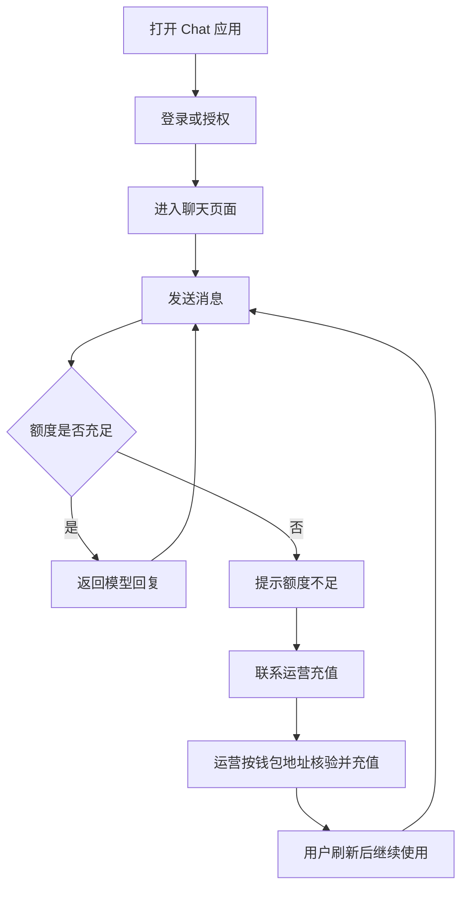

# 用户使用手册

> 本文档面向 Chat 的普通用户和运营支持人员，说明从首次进入、登录、对话、设置、同步到充值续用的完整使用流程。  
> 登录和授权机制的详细设计请阅读 [用户登录方案](./用户登录方案.md)。

## 1. 手册范围

本文档回答这些问题：

1. 新用户第一次进入后应该怎么开始使用。
2. 钱包地址和账号是什么关系。
3. 如何发起对话、选择模型、使用面具和提示词。
4. 如何理解全局设置和对话内设置。
5. 额度不足时如何联系运营充值。
6. 常见异常如何处理。

本文档不展开底层 UCAN、Router、WebDAV 的实现细节。

## 2. 新用户快速开始

### 2.1 首次进入

第一次使用时，建议按下面顺序操作：

1. 打开 Chat 应用。
2. 进入登录页。
3. 选择钱包登录或中心化 UCAN 登录。
4. 登录成功后进入聊天页面。
5. 直接发送第一条消息，确认模型可用。

如果系统为新用户发放体验额度，首次登录后可以直接开始体验。额度消耗完后，需要联系运营充值或调整套餐。

### 2.2 钱包地址就是账号标识

在钱包登录场景下，钱包地址就是系统识别用户的核心标识。

这意味着：

1. 换钱包通常等于切换账号。
2. 充值、查账、问题排查都应提供完整钱包地址。
3. 不要只提供地址后几位，容易匹配错误。

对用户来说，可以把钱包地址理解为“账号 ID”。  
对运营来说，钱包地址是检索用户账户和充值记录的主键。

## 3. 主使用流程



## 4. 聊天使用

### 4.1 发起对话

进入聊天页面后，在输入框输入问题并发送即可开始对话。

建议：

1. 一个主题尽量放在同一个对话里。
2. 不同任务新建不同对话，方便后续查找。
3. 如果上下文已经很长，可以新建对话或使用清除上下文功能。

### 4.2 对话顶部常用按钮

对话顶部常见功能包括：

1. 对话设置：调整当前对话的人设、上下文和模型参数。
2. 颜色主题：在自动、暗色、浅色之间切换。
3. 快捷指令：快速插入常用提示词。
4. 所有面具：进入面具列表。
5. 清除聊天：插入清除标记，后续请求不再携带标记前的上下文。
6. 模型设置：只修改当前对话使用的模型参数。

按钮含义通常可以通过悬停提示查看。

### 4.3 发送消息时会带上哪些上下文

一次模型请求通常会包含：

1. 系统级提示信息
2. 当前对话的预设提示词
3. 历史摘要
4. 最近若干条对话消息
5. 用户当前输入内容

这些内容共同决定模型回复质量。  
如果你希望模型只处理当前输入，不参考历史，可以减少历史消息数量，或新建对话。

## 5. 面具和提示词

### 5.1 什么是面具

面具是一组可复用的对话模板。

一个面具通常包括：

1. 角色名称和头像
2. 预设上下文
3. 模型参数
4. 开场白或示例问题

适合把常用场景做成面具，例如：

1. 翻译助手
2. 代码审查助手
3. 写作助手
4. 客服话术助手

### 5.2 面具和提示词的区别

提示词是一段可复用文本。  
面具是一整套对话配置。

可以这样理解：

1. 提示词适合快速插入一段指令。
2. 面具适合固定一个长期使用的角色和模型配置。

### 5.3 如何使用面具

常见方式：

1. 进入面具页面。
2. 选择一个面具。
3. 基于该面具创建对话。
4. 在新对话里继续提问。

如果面具自带预设上下文，模型会按照该上下文理解你的任务。

## 6. 设置说明

### 6.1 全局设置

全局设置影响新建对话的默认行为。

常见设置包括：

1. 默认模型
2. 温度、top_p、max_tokens 等模型参数
3. 历史消息数量
4. 历史摘要阈值
5. 主题、字体、侧边栏等界面设置
6. TTS / Realtime 等能力开关

全局设置适合配置“我平时默认怎么用”。

### 6.2 对话内设置

对话内设置只影响当前对话。

新建对话默认跟随全局设置。  
如果你手动修改了当前对话设置，该对话会和全局设置断开同步。

如果想恢复同步，可以在对话设置中重新启用“使用全局设置”。

### 6.3 模型参数怎么理解

常见参数可以这样理解：

1. `model`：使用哪个模型。
2. `temperature`：回复随机性，越高越发散。
3. `top_p`：采样范围，通常不需要频繁调整。
4. `max_tokens`：单次回复最大长度。
5. `presence_penalty` / `frequency_penalty`：影响重复和话题扩展。
6. `historyMessageCount`：请求时携带多少条最近对话。

普通用户一般只需要关注模型、回复长度和历史消息数量。

## 7. 历史摘要和上下文

### 7.1 什么是历史摘要

历史摘要用于压缩较长对话，让模型在长对话中保留大概上下文。

当对话内容超过阈值后，系统会把较早的消息总结成一段摘要。  
这样可以减少 token 消耗，同时保留主要信息。

### 7.2 什么时候适合开启

适合开启：

1. 长期连续讨论
2. 需要保留前文背景的项目
3. 多轮写作或分析任务

### 7.3 什么时候建议关闭

建议关闭或减少历史上下文：

1. 翻译
2. 信息抽取
3. 一次性问答
4. 不希望模型参考前文的场景

这类任务通常更适合新建对话，并把历史消息数量调低。

## 8. 数据同步

如果开启云同步，应用会同步聊天、配置、面具和提示词等核心资产。

需要注意：

1. 同步不是实时协作，而是多端快照合并。
2. 同步可能包含模型服务配置和秘钥。
3. WebDAV 场景下，图片和音频会作为媒体文件单独同步。
4. 如果不同设备同时修改，系统会尽量合并，但不等同多人协作编辑。

详细机制请阅读 [数据同步方案](./数据同步方案.md)。

## 9. 额度、充值和运营协同

### 9.1 体验额度

如果系统为新用户发放体验额度，用户可以先直接试用。

体验期间建议：

1. 先测试常用问题。
2. 确认模型回复质量。
3. 观察额度消耗是否符合预期。

### 9.2 额度不足怎么办

当额度不足时，通常会出现请求失败或余额不足提示。

处理方式：

1. 保留当前页面截图。
2. 复制完整钱包地址。
3. 联系运营充值或调整套餐。
4. 充值完成后刷新页面继续使用。

### 9.3 联系运营时应提供什么

最低需要提供：

1. 完整钱包地址
2. 额度不足截图
3. 期望充值金额或套餐

建议同时提供：

1. 支付凭证
2. 首次登录或出错的大致时间
3. 联系方式

可直接复制下面模板：

```text
你好，我的钱包地址是：0x__________。
我的额度已经用完，想充值：____。
我附上了额度不足截图和支付凭证，请帮我加额度并通知我刷新。谢谢。
```

### 9.4 运营核验流程

运营处理充值时，建议按以下顺序：

1. 用钱包地址检索账户。
2. 校验账户状态。
3. 核对支付信息和金额。
4. 充值或调整套餐。
5. 记录操作日志。
6. 通知用户刷新并确认到账。

## 10. 常见问题

### 10.1 换钱包后余额还在吗

通常不在。

钱包地址是账号标识，换钱包会被识别为新账号。  
如果确实需要迁移余额，需要联系运营按规则人工处理。

### 10.2 为什么登录了但还是不能同步

可能原因：

1. 同步配置没有开启。
2. WebDAV 地址、用户名、密码或 UCAN 授权不可用。
3. 当前网络无法访问同步后端。
4. 浏览器缓存或媒体文件回填失败。

可以先检查同步设置，再查看是否有错误提示。

### 10.3 为什么模型回复变差了

可能原因：

1. 上下文过长。
2. 历史摘要丢失了部分细节。
3. 当前对话设置覆盖了全局设置。
4. temperature 设置过高。
5. 使用了不适合当前任务的面具。

建议新建对话，用默认设置重新测试。

### 10.4 为什么充值后页面没变化

可以按顺序处理：

1. 刷新页面。
2. 确认当前登录的钱包地址是否和充值地址一致。
3. 把钱包地址、支付凭证和截图发给运营核验。

## 11. 用户和运营的一句话原则

对用户：

1. 钱包地址就是账号，充值和排障时一定提供完整地址。

对运营：

1. 所有充值和排障动作都围绕钱包地址核验、记录和回传确认。
