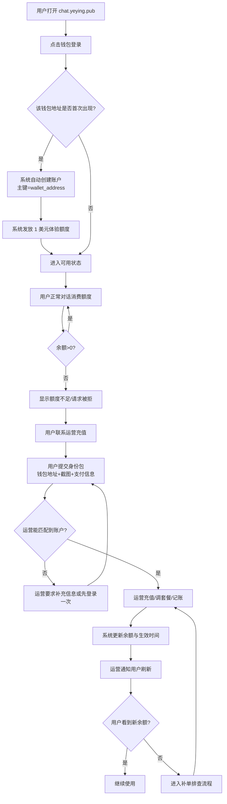
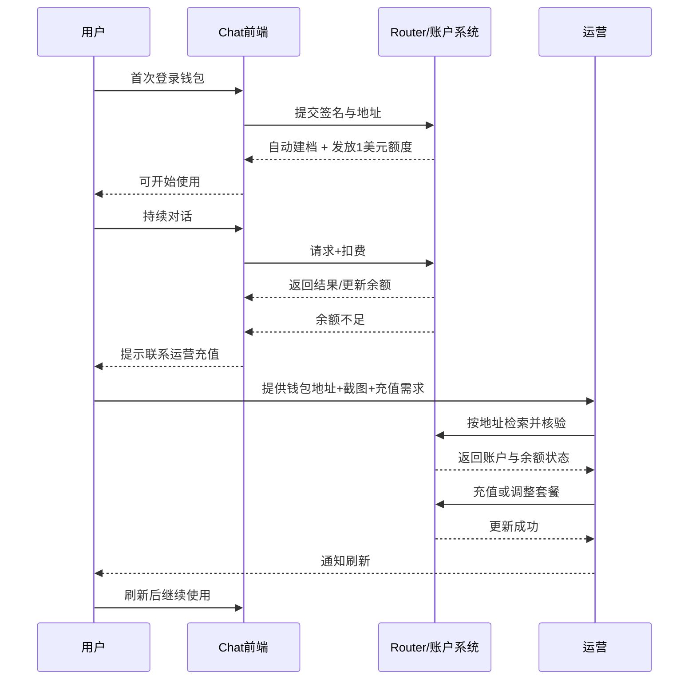
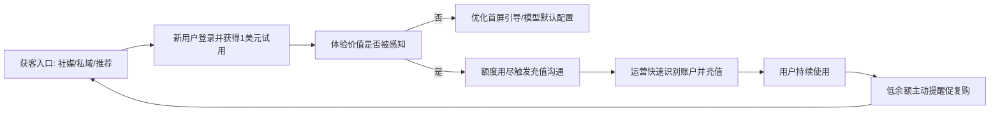

# 新用户从首次使用到联系运营充值的完整流程（用户视角优先）

> 目标：模拟一个“完全新用户”（不懂技术）的真实行为与心理路径，覆盖：登录、体验额度消耗、联系运营充值、到账继续使用。并说明“自动创建钱包账户后，运营如何准确识别用户”。

## 1. 适用范围与边界

- 适用对象：第一次接触产品的普通用户（手机/电脑都可，默认不懂区块链细节）。
- 当前前提：新钱包首次登录后，系统自动创建账户并发放 1 美元体验额度。
- 本文重点：用户路径 + 运营协同路径（不涉及钱包插件安装教学细节）。

## 2. 角色与唯一标识（先讲清“谁是谁”）

| 角色 | 用户看见的名字 | 系统内部主键 | 说明 |
|---|---|---|---|
| 新用户 | “我” | `wallet_address`（如 `0x...`） | 账户唯一身份；换钱包=新账户 |
| 系统 | Chat/Router | `wallet_address + quota/balance` | 首登时自动建档并发体验额度 |
| 运营 | 客服/商务 | 通过地址检索用户 | 充值、套餐调整、活动触达 |

结论（必须记住）：**运营识别用户，不靠昵称，不靠手机号，靠钱包地址（`0x...`）**。

## 3. 用户主流程（人话版）

### 阶段 A：首次进入
- 用户心理：先试试，看看能不能直接用。
- 用户动作：打开站点，点击登录钱包。
- 系统动作：
  1) 校验钱包签名；
  2) 若是新地址，自动创建账户；
  3) 发放 1 美元体验额度；
  4) 返回可用状态（可开始对话）。

### 阶段 B：体验使用
- 用户心理：先“有感知”地试几轮对话，看速度/质量。
- 用户动作：正常发问。
- 系统动作：按模型计费扣减额度，余额实时变化。

### 阶段 C：额度用完
- 用户心理：产品可用，但被额度拦住，决定要不要继续。
- 用户动作：看到“余额不足/额度不足”后，选择联系运营。
- 系统动作：拒绝新请求（或提示充值入口），保留历史会话。

### 阶段 D：联系运营充值
- 用户心理：希望“快、确定、别折腾”。
- 用户动作：把关键信息发给运营（见第 5 节模板）。
- 运营动作：核对地址 -> 匹配账户 -> 充值/改套餐 -> 通知用户刷新。

### 阶段 E：到账继续使用
- 用户动作：刷新页面，继续提问。
- 系统动作：显示新余额，恢复可用。

---

## 4. 用户侧主流程图（GitHub/Typora 可渲染）

---

## 5. 运营“如何知道是哪个用户”——最小识别包

### 用户必须提供（最低要求）
1. **钱包地址**（完整 `0x...`，不可只给后四位）
2. **额度不足截图**（证明当前使用账号）
3. **期望充值金额/套餐**（避免反复沟通）

### 用户最好再提供（提升一次通过率）
4. 首次登录大概时间（如“今天上午 10:20 左右”）
5. 支付凭证（订单号/转账截图）
6. 联系方式（用于到账通知）

### 运营后台核验顺序（严密版）
1. 用 `wallet_address` 检索账户是否存在；
2. 校验账户状态（是否冻结、是否风控）；
3. 核对支付信息与金额；
4. 充值/调套餐后写入操作日志（操作者、时间、金额、原因）；
5. 通知用户刷新并二次确认到账。

---

## 6. 用户与运营交互时序图（把责任边界讲清）

---

## 7. 非技术用户可直接复制的“联系运营模板”

> 你好，我是新用户，我的钱包地址是：`0x__________`。  
> 我的 1 美元体验额度已经用完，想充值：`____`。  
> 我附上了额度不足截图和支付凭证，请帮我加额度并通知我刷新。谢谢。

---

## 8. 异常分支（提前说清，减少扯皮）

### 8.1 用户换了钱包
- 结果：系统会识别为新账户，不会自动继承旧余额。
- 处理：运营按规则做“人工迁移”或“不迁移说明”。

### 8.2 用户说“我付了但没到账”
- 必要材料：地址、付款凭证、时间、金额。
- 处理顺序：先查订单 -> 再查账户日志 -> 最后补单。

### 8.3 用户不会复制地址
- 处理：让用户发“钱包账户页截图 + 额度不足截图”，运营人工提取地址后回传确认（避免充错）。

---

## 9. 运营获客与转化设置（围绕这条用户链路）

> 目标：让“试用 -> 充值 -> 复购”尽量顺滑。

1. **试用策略**：1 美元额度要保证“能明显感受到效果”，否则转化率低。  
2. **触发文案**：额度不足提示页要直接给“联系运营”入口，不要让用户自己找。  
3. **充值档位**：提供 2~3 个清晰套餐（低门槛/标准/高频），减少选择疲劳。  
4. **到账承诺**：明确“预计到账时间 + 超时补偿策略”，提升信任。  
5. **复购触发**：余额低于阈值时主动提醒，避免用户再次中断。

---

## 10. 一句话总收口

- 对用户：**你只要记住一个东西——钱包地址就是你的账号。**
- 对运营：**所有充值与获客动作都应围绕“地址可识别、到账可追踪、沟通可复制”。**
