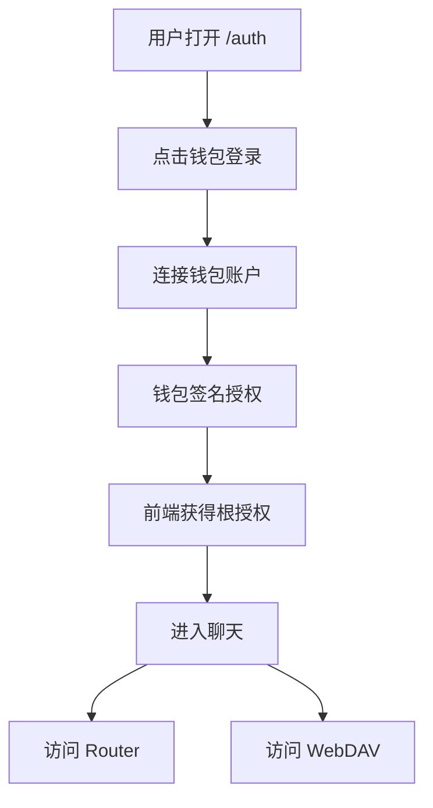
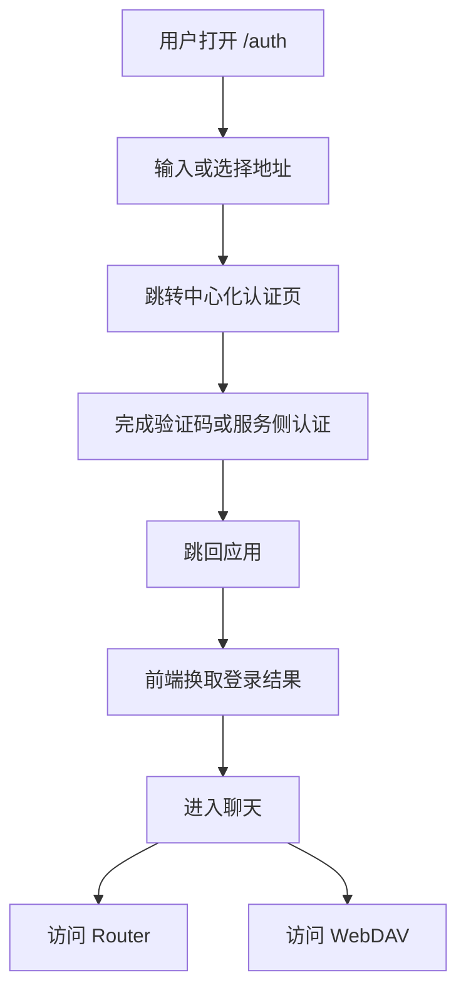
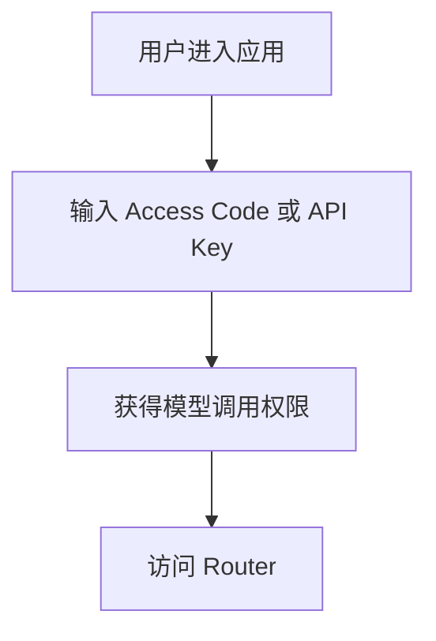
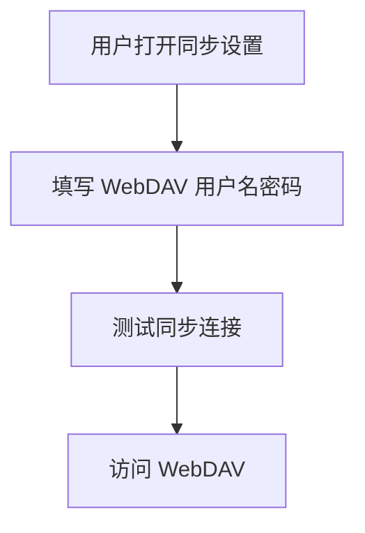

# 用户登录方案

> 本文档描述当前 Chat 应用的登录与授权方案，重点解释对象、流程、交互、边界，以及为什么这样设计。  
> 它不是逐段代码注释，也不是未来愿景文档，而是一份面向产品、前端、后端和运维都能共同阅读的方案说明。

## 1. 设计目标

登录方案要同时解决 4 个问题：

1. 用户如何进入系统并开始使用。
2. 系统如何识别“当前是谁”。
3. 前端如何代表用户访问多个后端。
4. 在桌面浏览器、移动端、钱包可用和钱包不可用等不同场景下，如何保持可用。

当前方案不是追求“形式上的统一登录”，而是优先满足以下约束：

1. 让钱包用户可以一次授权后访问 Router 和 WebDAV。
2. 让没有钱包插件的环境仍然能工作。
3. 让模型调用和数据同步这两类后端能力保持清晰边界。
4. 尽量减少请求时频繁打断用户的签名交互。

## 2. 先讲结论

当前系统不是单一登录体系，而是两层结构叠加：

1. 用户进入系统的方式
   - 钱包登录
   - 中心化 UCAN 登录
   - Access Code / API Key 输入

2. 前端访问后端的授权方式
   - UCAN
   - Access Code / API Key
   - WebDAV Basic Auth

这意味着：

1. `/auth` 是当前登录入口，但不是传统意义上的 SSO 中心。
2. 钱包 UCAN 和中心化 UCAN，是当前唯一能同时覆盖 Router 和 WebDAV 的统一授权方式。
3. Access Code / API Key 主要服务于 Router。
4. WebDAV Basic Auth 主要服务于同步。
5. 当前并不存在“一套用户名密码直接统一登录所有后端”的实现。

## 3. 方案里的核心对象

如果不先把对象讲清楚，后面所有流程都会混。

### 3.1 用户

用户是发起登录动作的人。

在钱包登录场景下，系统内部识别用户的核心标识是：

1. 钱包地址

这也是为什么：

1. 换钱包，通常就等于切换账户。
2. 运营识别用户时，最可靠的也是钱包地址，而不是昵称。

### 3.2 登录入口

当前登录入口是 `/auth` 页面。

它负责：

1. 呈现当前授权状态
2. 提供钱包登录入口
3. 提供中心化 UCAN 登录入口
4. 承接一部分 Access Code / API Key 的进入路径

它不负责：

1. 统一代理所有后端请求
2. 统一保存所有凭证
3. 在当前实现里充当全站路由守卫

### 3.3 Router

Router 是模型调用后端。

它承载的主要能力是：

1. 模型列表
2. 对话请求
3. 推理相关接口

它更接近“服务调用”对象，而不是“文件存储”对象。

### 3.4 WebDAV

WebDAV 是同步和媒体存储后端。

它承载的主要能力是：

1. 聊天状态同步
2. 媒体文件同步
3. 配额查询

它更接近“存储”对象，而不是“模型调用”对象。

### 3.5 UCAN Root

Root 可以理解为：

1. 用户对当前应用的根级授权证明

它表达的是：

1. 谁授权了
2. 授权给谁
3. 可以访问哪些服务
4. 允许做哪些动作
5. 授权什么时候过期

### 3.6 Invocation

Invocation 可以理解为：

1. 面向某个具体后端请求的短期通行证

它不是“全局万能票”，而是“针对目标服务单独签发的临时票据”。

### 3.7 中心化 UCAN 会话

当钱包不可用时，系统会走中心化 UCAN。

这里会出现两类对象：

1. 登录成功后的 access token
2. 按目标后端签发出来的 UCAN token

前者负责“这个用户已通过中心化登录”，后者负责“这个用户可以访问 Router 或 WebDAV 的某种能力”。

## 4. 当前支持的进入方式

| 进入方式 | 用户感知 | 作用范围 | 是否统一覆盖 Router / WebDAV |
|---|---|---|---|
| 钱包登录 | 连接钱包并授权 | Router + WebDAV | 是 |
| 中心化 UCAN 登录 | 输入地址并完成中心化认证 | Router + WebDAV | 是 |
| Access Code / API Key | 填码或填 key 后可开始请求模型 | 主要是 Router | 否 |
| WebDAV Basic Auth | 在同步配置里填用户名密码 | 仅 WebDAV | 否 |

这里最重要的不是“入口有几个”，而是它们的边界：

1. 钱包 UCAN 是跨后端授权。
2. 中心化 UCAN 也是跨后端授权。
3. Access Code / API Key 不是跨后端授权。
4. WebDAV Basic Auth 也不是跨后端授权。

## 5. 用户交互流程

### 5.1 流程 A：钱包登录

这是当前最完整、最自然的一条链路。

用户感知上是：

1. 我只登录了一次
2. 后续聊天和同步都能用

系统内部实际是：

1. 先建立根授权
2. 后续访问 Router 和 WebDAV 时，再分别生成各自请求所需的短期凭证

### 5.2 流程 B：中心化 UCAN 登录

这是为“没有钱包插件”准备的正式路径。

用户感知上，它更像一个常规网页登录流程。  
系统内部则会在真正访问不同后端时，分别换取面向对应后端的 UCAN。

### 5.3 流程 C：Access Code / API Key

这条链路更像“获取模型调用资格”，而不是完整意义上的全系统登录。

它的特点是：

1. 能让模型调用工作起来
2. 但不会天然让 WebDAV 同步也一起可用

### 5.4 流程 D：WebDAV Basic Auth

这条链路只为同步配置服务。

它的特点是：

1. 能让同步工作起来
2. 但不会天然让 Router 请求也一起可用

## 6. 为什么钱包 UCAN / 中心化 UCAN 能“一次登录，多后端可用”

这是当前方案最核心的设计点。

原因不是“所有后端共用一个万能 token”，而是：

1. 用户先完成一次统一身份授权
2. 前端再按目标后端分别拿到对应请求凭证

也就是说：

1. 统一的是“身份起点”
2. 拆开的是“后端访问凭证”

这样设计的好处是：

1. Router 和 WebDAV 保持独立边界
2. 不会出现把一个后端的 token 误拿去访问另一个后端的问题
3. 每个后端都只拿到它自己需要的最小权限

## 7. 为什么 Access Code / API Key 和 WebDAV Basic Auth 不能算统一登录

因为它们本质上是两套不同问题的解法：

1. Access Code / API Key 解决的是“模型接口是否允许调用”
2. WebDAV Basic Auth 解决的是“存储服务是否允许访问”

如果把它们硬说成同一种登录，会带来三个问题：

1. 用户会误以为配了一个地方，所有地方都能用
2. 文档会把模型鉴权和存储鉴权混在一起
3. 后续做统一登录升级时，边界会更加模糊

所以当前文档里必须坚持这条原则：

1. 统一身份授权，和后端专用凭证，是两件不同的事

## 8. 当前方案的合理性

### 8.1 为什么不是一开始就做统一用户名密码登录

因为当前系统天然面对的是两个不同后端：

1. Router
2. WebDAV

它们的职责不同、协议不同、能力不同。  
在这种前提下，先通过 UCAN 把“身份授权”统一起来，比先强行做一层传统账号系统更自然，也更贴近钱包场景。

### 8.2 为什么要保留中心化 UCAN

因为钱包插件并不总是存在：

1. 移动端常常没有桌面浏览器钱包体验
2. 某些 PC 调试环境也可能不方便装钱包
3. 业务上不能把“有钱包插件”当成唯一前提

所以中心化 UCAN 的价值不是“备用”，而是：

1. 让统一授权模型从“钱包专属能力”变成“多端可落地能力”

### 8.3 为什么要把 Router 和 WebDAV 分开授权

因为它们不是同一种资源：

1. 一个是调用模型
2. 一个是读写存储

分开授权的好处是：

1. 更容易做最小权限
2. 更容易排查问题
3. 更容易在以后扩展更多后端

### 8.4 为什么当前没有全局登录守卫

这不是说它不需要，而是当前实现优先级更偏向：

1. 先把授权链路打通
2. 再考虑是否强制所有页面前置登录

这也是当前方案的一个明确边界：

1. 已有登录入口
2. 但还没有把“未登录即不可浏览页面”做成统一框架规则

## 9. 当前方案的扩展性

### 9.1 新增后端服务

如果以后除了 Router / WebDAV，还要接入新的服务，例如：

1. Profile 服务
2. 插件市场
3. 文件检索服务

当前模型是可扩展的，因为它已经把问题拆成两层：

1. 统一身份授权
2. 面向目标服务的请求凭证

所以理论上只需要为新服务增加：

1. 新的服务对象定义
2. 新的访问动作
3. 新的目标受众

而不必重做整套登录体验。

### 9.2 移动端演进

移动端未来有三条演进方向：

1. 继续使用中心化 UCAN，保持统一授权模型
2. 如果有移动钱包能力，再接入移动钱包登录
3. 如果业务需要传统账号体系，再在统一身份层之上加账号系统

当前方案没有把自己锁死在某一种终端能力上，这一点是好的。

### 9.3 向统一登录中心演进

如果未来要做真正意义上的统一登录中心，当前方案依然有迁移价值，因为：

1. “用户身份”与“后端能力”已经被分开理解
2. “统一登录”与“后端访问凭证”已经不是一回事
3. Router / WebDAV 的边界已经被文档化

这意味着后续即使换成：

1. 统一账号体系
2. SSO
3. OAuth2 / JWT / 服务端会话

也只是在“身份入口”这一层替换，不必把所有后端边界推倒重来。

## 10. 当前方案的局限

任何方案文档都不该只讲优点。

当前局限主要有 4 个：

1. 用户视角下仍然不够“单一入口”
   - 因为 Access Code / API Key 和同步凭证仍然是分开的

2. 钱包路径对浏览器环境有依赖
   - 某些移动端或受限环境下不够稳定

3. 全局登录守卫还没落地
   - 未登录时的页面行为还不是统一治理

4. 用户心智仍然容易混淆
   - “登录成功”
   - “模型可调用”
   - “同步可用”
   这三个状态当前还不是完全等价

## 11. 推荐的阅读方式

如果你是产品或运营，建议重点看：

1. 第 2 节结论
2. 第 4 节进入方式
3. 第 5 节用户交互流程
4. 第 10 节当前局限

如果你是研发或架构，建议重点看：

1. 第 3 节核心对象
2. 第 6 节统一授权原理
3. 第 8 节合理性
4. 第 9 节扩展性

## 12. 实现映射

为了后续维护方便，这里只保留最少量实现映射，不在正文展开代码细节：

1. 登录页：`app/components/auth.tsx`
2. 钱包授权：`app/plugins/wallet.ts`
3. 中心化 UCAN：`app/plugins/central-ucan.ts`
4. UCAN 会话与能力：`app/plugins/ucan-session.ts`、`app/plugins/ucan.ts`
5. Router 请求鉴权：`app/client/platforms/router.ts`、`app/client/platforms/openai.ts`
6. WebDAV 访问与代理：`app/plugins/webdav.ts`、`app/utils/cloud/webdav.ts`、`app/api/webdav/[...path]/route.ts`
