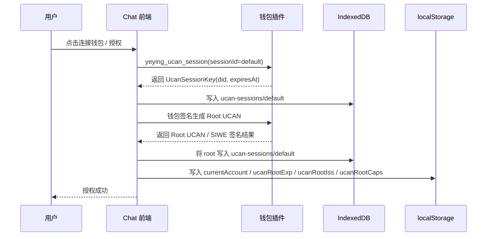
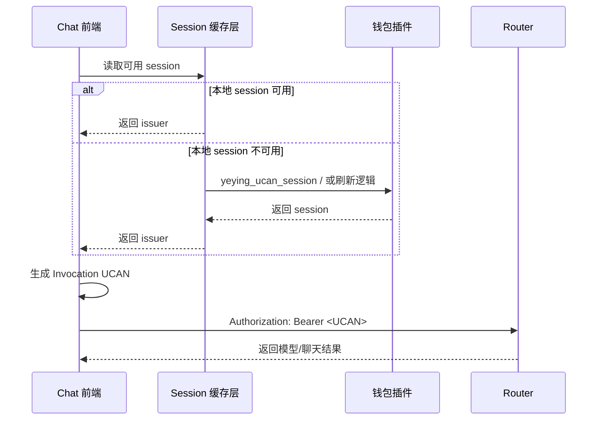

# 用户登录

> 本文档是 Chat 当前“用户登录/授权/钱包/UCAN/移动端差异”的统一说明。  
> 目的不是讨论单一代码点，而是把分散在多个文档里的登录相关信息收口成一份可读、可维护、可引用的总文档。

## 1. 文档范围

本文档统一回答以下问题：

- 当前系统到底有哪些“登录/授权”方式？
- 钱包登录和 Access Code / API Key 是什么关系？
- Router 与 WebDAV 为什么可以“一次钱包授权，多后端访问”？
- 我一直看到的 `UCAN Root`、`session`、`Invocation` 分别是什么？
- 这些信息到底存在哪里？
- 为什么有时会提示“解锁钱包”？什么时候只是解锁，什么时候必须重新授权？
- 移动端为什么不能直接复用 PC 端的钱包登录体验？
- 如果未来要做“统一登录页 / SSO”，边界应该怎么划分？

如果你已经理解整体机制，需要继续看专题实现，请直接跳到这些配套文档：

- [登录页前置方案评估（UCAN / Access Code）](./login-gate-plan-cn.md)：在现有授权体系上增加前置登录页、路由守卫和过期跳转。
- [移动端登录与双后端鉴权问题分析与方案](./mobile-login-auth-plan-cn.md)：解释移动端为什么不能直接复用 PC 端钱包登录，并给出分阶段方案。
- [Router 与 WebDAV 集成说明](./router-webdav-integration-cn.md)：聚焦 Router / WebDAV 的请求链路、`audience`、代理边界和 CORS 约束。
- [新用户从首次使用到联系运营充值的完整流程](./用户使用流程.md)：从用户和运营视角说明钱包地址识别、试用额度与充值协同。
- [用户手册](./user-manual-cn.md)：聚焦面具、对话、模型设置与日常使用说明。

## 2. 当前支持的登录方式

当前不是单一登录体系，而是三套能力并存：

| 场景 | 用户看到的方式 | 作用范围 | 当前是否统一 |
|---|---|---|---|
| 钱包授权 | 连接 YeYing Wallet，生成 UCAN | Router + WebDAV | 是，一次授权可多后端复用 |
| Access Code / API Key | 在 `/auth` 或设置页输入 | 主要用于 Router / 模型请求 | 否，不等于 WebDAV 登录 |
| WebDAV Basic Auth | 用户名 + 密码 | 仅用于 WebDAV 同步 | 否，不等于 Router 登录 |

结论：

- **PC 端“钱包登录”是跨后端授权方式。**
- **用户名/密码并不是统一登录。** 当前它只适用于 WebDAV Basic Auth。
- **Access Code / API Key 也不是统一登录。** 它主要作用于 Router / 模型请求。

## 3. 当前系统里，“用户是谁”

如果是钱包登录场景，系统内部真正识别用户的主键是：

- `wallet_address` / 当前钱包地址

这也是为什么：

- 换钱包 = 新账户
- 运营识别用户，最可靠的方式是看钱包地址，而不是昵称、手机号、浏览器昵称

这部分与用户充值、账户识别、后端额度归属直接相关。

## 4. UCAN 授权模型

当前钱包登录并不是“登录后拿到一个传统 JWT”这么简单，而是三层结构：

### 4.1 Root UCAN

Root UCAN 可以理解为“根授权证明”。

它表达的是：

- 谁授权：`iss`
- 授权给谁：`aud`
- 授权哪些能力：`cap`
- 什么时候过期：`exp`
- 这次授权基于哪次钱包签名：`siwe.message` + `siwe.signature`

SDK 类型定义：

- `UcanRootProof`
- 位置：`node_modules/@yeying-community/web3-bs/dist/auth/ucan.d.ts`

默认有效期：

- **24 小时**

### 4.2 UCAN Session

这里说的 `session`，不是聊天会话 `ChatSession`，而是：

- **钱包侧提供的 UCAN 会话能力**
- 前端后续创建 Invocation / Delegation UCAN 时，需要它作为 `issuer`

它的核心字段包括：

- `id`
- `did`
- `createdAt`
- `expiresAt`
- `signer` 或 `privateKey`

SDK 类型定义：

- `UcanSessionKey`
- 位置：`node_modules/@yeying-community/web3-bs/dist/auth/ucan.d.ts`

默认 session id：

- `default`
- 当前项目常量：`UCAN_SESSION_ID = "default"`

文件位置：

- `app/plugins/ucan.ts`

### 4.3 Invocation UCAN

Invocation UCAN 是每次请求前，为某个具体后端临时签发的短期令牌。

它的特点：

- 面向单次或短时请求
- 需要带正确的 `audience`
- 需要带当前目标后端所需的 `capabilities`
- 最终以 `Authorization: Bearer <UCAN>` 的形式发给 Router 或 WebDAV

默认有效期：

- **5 分钟**

## 5. 一次钱包授权，为什么能访问多个后端

原因是当前实现把“根授权”和“请求级令牌”分开了：

1. 用户连接钱包
2. 前端向钱包申请 UCAN session
3. 前端再基于钱包签名生成 Root UCAN
4. 后续访问不同后端时：
   - 对 Router 生成一份面向 Router 的 Invocation UCAN
   - 对 WebDAV 生成一份面向 WebDAV 的 Invocation UCAN

所以用户体验上看起来像：

- “登录一次，全都能用”

本质上其实是：

- **Root 复用**
- **Invocation 按后端分发**

## 6. Router 与 WebDAV 的关系

当前系统里 Router 和 WebDAV 是两个独立后端：

- **Router**：OpenAI-compatible，大模型接口、模型列表、聊天请求、用量接口等
- **WebDAV**：文件同步、媒体文件、配额查询等

钱包登录为什么能跨它们？

- 因为 UCAN 的 `audience` 是按目标后端生成的
- 前端会针对不同后端分别生成 Invocation UCAN

但如果不用钱包，而改成传统用户名密码：

- Router 与 WebDAV 默认并不共享一套凭证体系
- 所以“用户名密码统一登录”在当前架构下并不存在

## 7. 本地存储到底存了什么

这一块最容易混淆，必须分三层看。

### 7.1 内存缓存

前端运行时自己会缓存一份 session：

- `cachedSession`
- `cachedAt`
- `sessionPromise`

文件：

- `app/plugins/ucan-session.ts`

特点：

- 只在当前页面进程里有效
- 刷新页面、重新打开标签、热更新后都可能丢失
- 不能作为持久化来源

### 7.2 localStorage

前端会把 Root 授权的摘要信息写到 `localStorage`，用于快速判断授权状态：

- `currentAccount`：当前钱包地址
- `ucanRootExp`：Root 过期时间
- `ucanRootIss`：Root issuer
- `ucanRootCaps`：Root capabilities 摘要

这些不是完整 Root，也不是 session 本体，而是：

- 用于 UI 层快速判断“当前是否看起来已授权”

### 7.3 IndexedDB

SDK 会在浏览器 IndexedDB 持久化 UCAN 相关记录：

- DB 名：`yeying-web3`
- Store：`ucan-sessions`

这里会保存：

- `id`
- `did`
- `createdAt`
- `expiresAt`
- `root`

也就是说：

- Root Proof
- Session 元信息

都会写进 IndexedDB。

### 7.4 钱包侧状态

还有一层非常关键：

- 真正的“可签名能力”并不完全属于前端本地存储
- SDK 仍然需要通过钱包 provider 请求：
  - `yeying_ucan_session`
  - `yeying_ucan_sign`

这意味着：

- 浏览器本地有记录，不等于一定能完全脱离钱包继续签
- 如果钱包已锁定、插件状态异常、session 已由钱包侧失效，仍可能需要解锁钱包或重新申请 session

## 8. 当前登录时序图

### 8.1 钱包登录 + 生成 Root UCAN

### 8.2 发起 Router 请求

## 9. 为什么会偶尔提示“解锁钱包”

这件事不能简单理解成“系统坏了”，而要看是哪一层过期了。

常见原因：

1. **钱包插件自动锁定**
   - 长时间无操作
   - 浏览器切后台
   - 钱包本身有自动锁策略

2. **UCAN session 过期或不可用**
   - `expiresAt` 到期
   - 内存缓存丢失后，前端需要重新从钱包侧恢复 session
   - 钱包侧已经不再接受静默恢复

3. **需要新的签名能力**
   - 比如重建 Root UCAN
   - 或重新签发会话相关能力

4. **钱包账户变化**
   - 当前账户与 Root Issuer 不一致
   - 前端会清空旧 session / root 状态，要求重新授权

## 10. 什么时候只需要解锁，什么时候必须重新授权

### 10.1 只需要解锁钱包

满足这些条件时，一般只需要解锁：

- Root UCAN 仍然有效
- 当前钱包账户没变
- capabilities 没变
- 只是钱包当前处于锁定状态，无法继续提供签名能力

### 10.2 必须重新授权

出现以下情况，解锁还不够，必须重新授权：

- `ucanRootExp` 已过期
- `currentAccount` 与 Root 的 `iss` 不一致
- Root 对应的 capabilities 已经变化
- Wallet session 的 `did` 与 Root 的 `aud` 不再一致

## 11. 为什么“UCAN 未过期”仍然可能弹钱包

这个问题最容易误解。

如果你说的“UCAN 未过期”指的是 **Root UCAN**，那只能说明：

- 根授权还有效

但这不等于：

- 当前请求一定还能静默拿到可用的 session
- 当前请求一定不用再和钱包交互

所以真正决定“会不会弹钱包”的不是 Root 单独一层，而是：

- Root 是否有效
- Session 是否可用
- 当前请求链路是不是错误地主动刷新 session

也正因为这个原因，前端实现必须遵守一个原则：

- **非交互请求优先静默复用已有 session**
- **不要在普通请求路径里无意义地唤醒钱包**

## 12. 当前实现中的移动端问题

PC 端钱包登录之所以体验好，是因为：

- UCAN 是跨后端授权
- 一次授权后，Router / WebDAV 都能复用

移动端当前的问题是：

- 没有同等的钱包插件环境
- 无法稳定复用 PC 端的 UCAN 授权链路
- 如果改成“用户名 + 密码”，就会遇到 Router 和 WebDAV 凭证分裂

当前真实结论：

- Router：走 UCAN 或 Access Code / API Key
- WebDAV：走 UCAN 或 Basic Auth
- **不存在一套天然统一的用户名/密码登录**

## 13. 如果以后要做“统一登录”，有哪些方案

### 13.1 短期方案：双凭证明确化

- Router 继续使用 Access Code / API Key
- WebDAV 使用 Basic Auth
- 文案上明确告知这是两套凭证体系

优点：

- 改动最小

缺点：

- 用户体验差

### 13.2 中期方案：服务端代理 + 统一登录入口

- Next.js 新增用户名/密码登录
- 登录后服务端维护会话
- Router 和 WebDAV 请求都走服务端代理，由代理注入对应凭证

优点：

- 移动端体验统一

缺点：

- 服务端状态、代理安全、凭证托管都会更复杂

### 13.3 长期方案：真正的 SSO / Auth Center

- 引入独立认证服务
- 登录后下发统一 Token（JWT / OAuth2 Token / Bearer）
- Router 与 WebDAV 都统一验证这套 Token

优点：

- 真正统一登录

缺点：

- 需要后端体系整体改造

## 14. 用户视角的真实流程

如果是普通新用户，路径其实是：

1. 打开站点
2. 连接钱包
3. 系统识别钱包地址，必要时创建账户
4. 生成 UCAN Root / Session
5. 开始对话
6. 后续 Router / WebDAV 请求都复用同一套授权体系

这也是为什么从运营视角看：

- 钱包地址才是最可靠的用户身份标识

## 15. FAQ

### Q1：当前“登录”到底是钱包登录，还是输入密码登录？

都支持，但作用域不同：

- 钱包登录：跨 Router + WebDAV
- Access Code / API Key：主要是 Router
- WebDAV 用户名密码：只用于同步

### Q2：session 是不是聊天会话？

不是。

这里说的 `session` 是：

- UCAN session
- 钱包提供给前端的“继续签 UCAN”的会话能力

不是 `ChatSession`。

### Q3：session 存在浏览器哪里？

分三层：

- 内存缓存：前端运行时变量
- `localStorage`：只存 root 摘要和当前账户
- `IndexedDB`：`yeying-web3 / ucan-sessions`

### Q4：有 IndexedDB 了，为什么还会弹钱包？

因为 IndexedDB 里存的是记录和证明，不代表可以永远离线签名。  
真正的签名能力仍然和钱包 provider 状态有关。

### Q5：为什么换钱包后要重新授权？

因为当前账户变了：

- Root 的 `iss`
- Session 的 `did`
- 当前 `currentAccount`

三者必须一致，否则旧授权不再成立。

## 16. 推荐阅读顺序

如果你只想快速理解：

1. 先看第 2 节：当前有哪些登录方式
2. 再看第 4 节：Root / Session / Invocation 的区别
3. 再看第 7 节：它们到底存在哪里
4. 最后看第 9、10、11 节：为什么会弹钱包，以及何时必须重授权

如果你要做实现改造：

1. 第 6 节：时序图
2. 第 12、13 节：移动端与统一登录方案
3. 第 15 节：FAQ 里的边界判断
